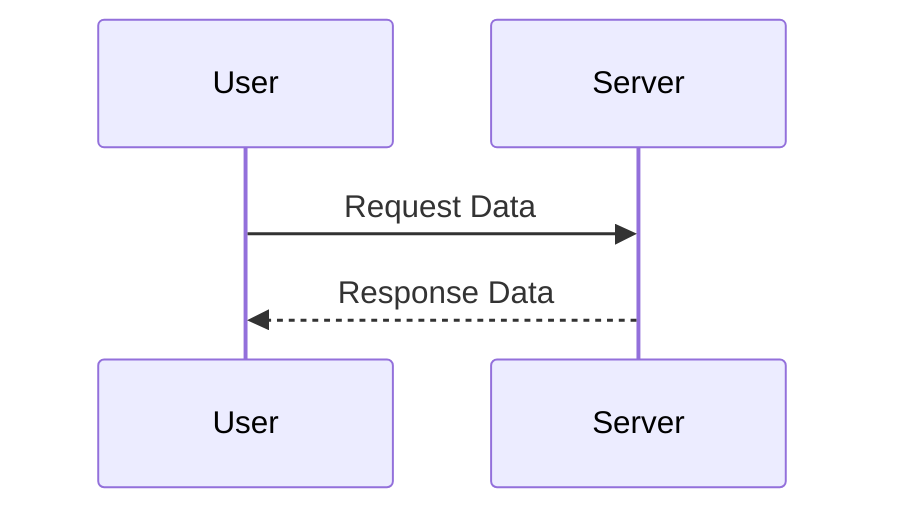

## 【完全無料】Obsidianと個人ナレッジマネジメント：エンジニアが陥る罠と脱出戦略

エンジニアとして、日々大量の情報を処理し、それをアウトプットしていくことは不可欠です。しかし、その情報がどこにあるのか、どのように繋がっているのかが分からなくなり、結局は「またゼロから…」という状況に陥りがちではありませんか？ 私はまさにそうでした。情報過多と先延ばし癖に苦しみ、生産性を著しく低下させていたのです。

先日、Zennの記事を読んで衝撃を受けました。新卒エンジニアの方がObsidianというノートアプリで日常を記録することで、先延ばし癖を改善し、自己理解を深めたという体験談です。
> Obsidianで日常の記録を取るようになってから変わったこと - 人生をハックする
> https://zenn.dev/dip_techblog/articles/d8d58c0f35708a
> (取得日: 2024年05月11日)

この記事を読んで、「もしかしたら、自分も試してみる価値があるかもしれない」と考えました。Obsidianは、Markdown記法で記述し、双方向リンクを自由に設定できるノートアプリです。情報整理に苦戦しているエンジニアにとって、強力な武器になる可能性を秘めていると感じたのです。

### 1. Zennの記事概要：Obsidianで人生をハックする

Zennの記事では、筆者がObsidianを導入したきっかけや、具体的な使い方、そしてそれによって得られた効果が紹介されています。Obsidianの魅力は、その柔軟性と拡張性です。Markdownで記述されたノートは、ローカルに保存されるため、オフライン環境でも利用できます。また、プラグインを利用することで、様々な機能を追加できます。例えば、カレンダー表示、タスク管理、グラフ表示など、自分好みにカスタマイズできるのです。

筆者は、Obsidianを使って、日々のタスク管理、アイデアの整理、学習ノートの作成などを行っています。そして、これらのノートを双方向リンクで繋ぐことで、知識のネットワークを構築し、新たな発見を生み出しているのです。まさに、ナレッジマネジメントの強力なツールと言えるでしょう。

### 2. Obsidian導入の罠：初期設定と継続の難しさ

しかし、Obsidianを導入しても、すぐに効果が得られるわけではありません。初期設定やノートの作成、そして継続的な運用には、ある程度の時間と労力が必要です。特に、エンジニアのように、日々多忙な生活を送っている人にとっては、継続が難しいという現実があります。

私がObsidianを導入した当初は、ノートの作成自体が苦痛でした。何から始めればいいのか、どのようにノートを構成すればいいのか、全く見当がつきませんでした。また、ノートを毎日更新していくのも、なかなか難しいものでした。気づけば、数週間後には、Obsidianを起動する気力さえ失ってしまったのです。

### 3. エンジニアのためのObsidian活用戦略：テンプレートとワークフロー

Obsidianを継続的に活用するためには、自分に合ったテンプレートとワークフローを構築することが重要です。テンプレートは、ノートの構成を固定化し、作成時間を短縮するのに役立ちます。ワークフローは、ノートの作成、整理、更新を効率化するための手順です。

私が実践しているのは、以下の3つの戦略です。

1. **テンプレートの活用:**
   - 日報テンプレート：タスク、成果、課題、学びを簡単に記録
   - 会議議事録テンプレート：参加者、議題、決定事項、アクションアイテムを構造化
   - 学習ノートテンプレート：タイトル、概要、詳細、参考文献、感想をまとめて記録
2. **ワークフローの自動化:**
   - 定期的なノートの整理：不要なノートの削除、リンクの修正、タグの整理
   - ノートのバックアップ：定期的にノートをバックアップし、データ消失のリスクを軽減
   - プラグインの活用：Zoteroとの連携で参考文献管理を自動化
3. **双方向リンクの徹底:**
   - 関連するノートを積極的にリンクで繋ぐ
   - グラフ表示で知識のネットワークを可視化し、新たな発見を促す

例えば、日報テンプレートを使用することで、日々のタスクや成果を簡単に記録できます。会議議事録テンプレートを使用することで、会議の内容を構造化し、後で振り返りやすくすることができます。学習ノートテンプレートを使用することで、学習内容を体系的に整理し、知識の定着を促進できます。

### 4. 実践への示唆：Mermaid記法によるアーキテクチャ図の自動生成

Obsidianの強力な機能の一つに、Mermaid記法によるアーキテクチャ図の自動生成があります。Mermaidは、テキストベースで図を記述できるマークアップ言語です。ObsidianにMermaidプラグインを導入することで、テキストで記述した図を自動的に画像に変換できます。

例えば、以下のようなMermaid記法で、簡単なシーケンス図を記述できます。

このコードをObsidianのノートに記述すると、自動的にシーケンス図が生成されます。これにより、システムの動作を視覚的に理解しやすくなり、ドキュメント作成の効率を向上させることができます。

また、アーキテクチャ図をノートに埋め込むことで、システムの全体像を把握しやすくなり、開発効率を向上させることができます。

### 5. まとめ：Obsidianで知識を繋ぎ、未来を創造する

Obsidianは、単なるノートアプリではありません。それは、あなたの知識を繋ぎ、新たな発見を生み出すための強力なツールです。初期設定や継続には労力が必要ですが、それを乗り越えた先には、生産性の向上、自己理解の深化、そして未来を創造する力があるはずです。

今日からあなたもObsidianを使い始め、知識のネットワークを構築し、未来を切り開いていきましょう。

## 参考文献

*   [Obsidian 公式サイト](https://obsidian.md/)
*   [Obsidian 使い方入門 - Qiita](https://qiita.com/t-u-m/items/204621e4074e6871b2b8)
*   [Mermaid記法](https://mermaid-js.github.io/mermaid/#/)
*   Zenn記事：[Obsidianで日常の記録を取るようになってから変わったこと - 人生をハックする](https://zenn.dev/dip_techblog/articles/d8d58c0f35708a)

<!-- AFFILIATE_SECTION -->
## 関連リンク

- [SkillHacks - プログラミングスクール](https://px.a8.net/svt/ejp?a8mat=4B1H1P+97114I+4K3S+5YJRM) - 独学で挫折した人向け実践型スクール
- [技術書](https://www.amazon.co.jp/s?k=Python+実践&tag=satoarata-22) - Amazonで技術書をチェック

---
※一部にPRを含みます。
