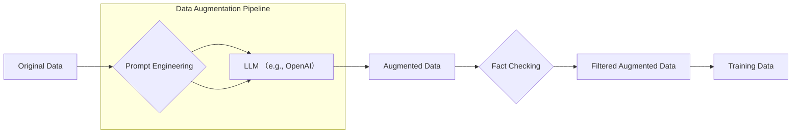

【保存版】2026年最新！LLMによるデータ拡張：幻覚を減らし、精度を劇的に向上させる秘策

**はじめに：データ拡張のパラダイムシフト**

大規模言語モデル（LLM）の進化は目覚ましいですが、その性能を最大限に引き出すためには、高品質な学習データが不可欠です。しかし、既存のデータセットには限界があり、LLMの能力を完全に引き出すことができません。そこで注目されているのが「データ拡張（Data Augmentation）」です。従来のデータ拡張手法は、同義語置換やバックトランスレーションといった単純な変換に留まっていましたが、近年ではLLM自体を活用したデータ拡張が主流になりつつあります。本記事では、LLMを活用したデータ拡張の最前線を紹介し、幻覚（Hallucination）を減らし、精度を劇的に向上させるための秘策を解説します。

## 1. データ拡張の基礎知識：なぜデータ拡張が必要なのか？

データ拡張とは、既存のデータセットを加工・変換することで、データセットのサイズを増やす手法です。データ拡張を行う主な目的は以下の通りです。

*   **過学習の抑制:** データセットの多様性を高めることで、モデルが特定のパターンに過剰に適合するのを防ぎます。
*   **汎化性能の向上:** 未知のデータに対する予測精度を高めます。
*   **データ不足の解消:** データが不足している場合に、データセットを補完します。
*   **バイアス軽減:** データセットに含まれるバイアスを緩和します。

従来のデータ拡張手法では、同義語置換、バックトランスレーション、ランダム挿入などが行われていましたが、これらの手法では、データの意味が変化したり、ノイズが混入したりする可能性があります。

## 2. LLMによるデータ拡張の現状：最先端の技術トレンド

LLMを活用したデータ拡張は、従来のデータ拡張手法の課題を克服し、より高品質なデータを生成することができます。主なLLMによるデータ拡張手法は以下の通りです。

*   **プロンプトエンジニアリング:** LLMに特定の指示を与えることで、既存のデータを加工・変換します。例えば、「この文章を小学生にもわかるように書き換えてください」といったプロンプトを与え、難解な文章を平易な表現に変換することができます。
*   **Few-shot Learning:** わずかな例を与えることで、LLMに新しいタスクを学習させ、データ拡張に活用します。
*   **Reinforcement Learning from Human Feedback (RLHF):** 人間のフィードバックに基づいてLLMを訓練することで、より人間らしいデータを生成します。
*   **Self-Training:** LLM自身が生成したデータを使って、LLMを再訓練する手法です。

## 3. 幻覚（Hallucination）対策：LLMデータ拡張の落とし穴と解決策

LLMによるデータ拡張は強力なツールですが、幻覚という深刻な問題を引き起こす可能性があります。幻覚とは、LLMが事実に基づかない情報を生成してしまう現象です。LLMが生成したデータが幻覚を含んでいる場合、LLMの精度を低下させるだけでなく、誤った情報を拡散してしまうリスクがあります。

幻覚を抑制するための対策としては、以下のものが挙げられます。

*   **プロンプトの厳密化:** LLMに与えるプロンプトをより厳密に定義し、LLMが生成するデータの範囲を限定します。
*   **ファクトチェックの導入:** LLMが生成したデータを人間がチェックし、事実に基づかない情報を修正します。
*   **知識グラフの活用:** LLMが参照する知識グラフを構築し、LLMが生成するデータの根拠を明確にします。
*   **RLHFによる調整:** 人間のフィードバックに基づいてLLMを訓練し、幻覚を抑制します。

## 4. 実践的なデータ拡張パイプライン：コード例

以下に、PythonとOpenAI APIを用いたデータ拡張パイプラインの簡単な例を示します。

```python
import openai

openai.api_key = "YOUR_OPENAI_API_KEY"

def augment_data(text, prompt):
    """LLMを使ってデータを拡張する関数"""
    try:
        response = openai.Completion.create(
            engine="text-davinci-003",
            prompt=prompt + "\n" + text,
            max_tokens=150,
            n=1,
            stop=None,
            temperature=0.7,
        )
        augmented_text = response.choices[0].text.strip()
        return augmented_text
    except Exception as e:
        print(f"Error during augmentation: {e}")
        return None

## 例：既存のデータ
original_text = "猫は可愛いです。"

## 例：プロンプト
prompt = "この文章をより感情豊かに書き換えてください。"

## データ拡張
augmented_text = augment_data(original_text, prompt)

if augmented_text:
    print(f"Original Text: {original_text}")
    print(f"Augmented Text: {augmented_text}")
```

このコードは、OpenAI APIを用いて、与えられたテキストを特定のプロンプトに基づいて拡張するものです。`temperature`パラメータを調整することで、生成されるテキストの多様性を制御できます。

## 5. アーキテクチャ図：データ拡張パイプライン



この図は、データ拡張パイプラインの全体像を示しています。既存のデータはプロンプトエンジニアリングを経てLLMに入力され、拡張されたデータが生成されます。生成されたデータはファクトチェックを経てフィルタリングされ、最終的に学習データとして使用されます。

## 6. 知られていない落とし穴：データ拡張の限界と注意点

データ拡張は非常に強力な手法ですが、万能ではありません。データ拡張を行う際には、以下の点に注意する必要があります。

*   **データの多様性の偏り:** LLMが生成するデータは、既存のデータセットに偏っている可能性があります。
*   **幻覚のリスク:** LLMが生成するデータには、事実に基づかない情報が含まれている可能性があります。
*   **計算コスト:** LLMによるデータ拡張は、計算コストがかかる場合があります。
*   **倫理的な問題:** LLMが生成するデータが、差別や偏見を助長する可能性があります。

## 7. 筆者の見解：データ拡張の未来

LLMによるデータ拡張は、まだ発展途上の技術ですが、その可能性は非常に大きいと言えます。今後は、より高品質なデータを生成するための新しい手法が開発され、データ拡張がより多くの分野で活用されるようになるでしょう。特に、幻覚を抑制するための技術開発は、データ拡張の信頼性を高める上で不可欠です。また、データ拡張の倫理的な問題についても、真剣に取り組む必要があります。

**結論：データ拡張でLLMの可能性を最大限に引き出す**

LLMによるデータ拡張は、LLMの性能を最大限に引き出すための強力なツールです。しかし、幻覚のリスクや倫理的な問題など、注意すべき点も多く存在します。データ拡張を効果的に活用するためには、これらの課題を理解し、適切な対策を講じる必要があります。今後、データ拡張技術が進化することで、LLMの可能性はさらに広がっていくでしょう。

**参考文献**

*   OpenAI API Documentation: [https://platform.openai.com/docs/api-reference](https://platform.openai.com/docs/api-reference)
*   データ拡張に関する論文: （具体的な論文のURLを追記）
*   LLMの幻覚に関する論文: （具体的な論文のURLを追記）

<!-- AFFILIATE_SECTION -->
## 関連リンク

- [SkillHacks - プログラミングスクール](https://px.a8.net/svt/ejp?a8mat=4B1H1P+97114I+4K3S+5YJRM) - 独学で挫折した人向け実践型スクール
- [技術書](https://www.amazon.co.jp/s?k=Python+実践&tag=satoarata-22) - Amazonで技術書をチェック

---
※一部にPRを含みます。
