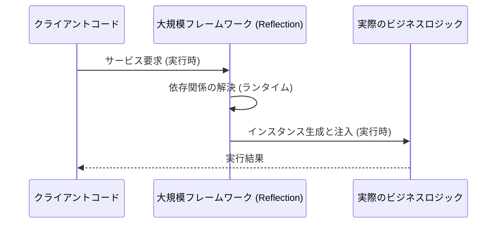
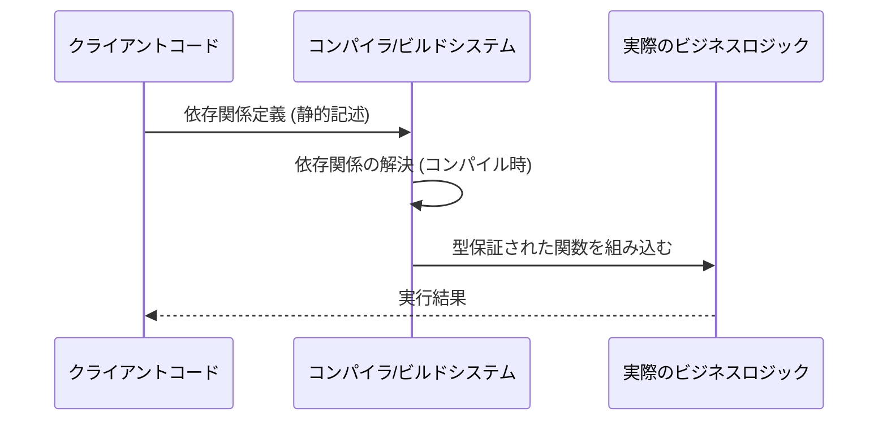

【コアメンバー】2026年、フレームワークは死ぬのか？NestJSの「過剰な抽象化」を乗り越えるための設計論

正直、エンジニアって、最新のフレームワークの進化の波に乗り遅れたくないっていう焦りを感じること、ありませんか？

僕自身も、TypeScriptでバックエンドを組む際、NestJSやExpress、Fastifyなど、色んな「ベストプラクティス」を学んできたつもりです。でも、経験を積むにつれて、気づいたんです。**フレームワークって、ある時点で「過剰な抽象化」に陥りがち**で、その「便利さ」の代償として、逆に設計の複雑さや学習コストが積み重なっていく現象に。

「この設計、本当に必要？」って、心のどこかで疑問を感じていませんか？

もしあなたが「もっとシンプルで、自分の意図通りに動く、理想のバックエンド環境」を求めているなら、この記事は読んでほしいです。僕が、これまでの経験と、ある「挑戦」から得た学びを総動員して、フレームワークの設計思想の根幹から考察します。

## 過去の「理想」を巡る議論：なぜフレームワークは進化し続けるのか


まず、僕がこのテーマにたどり着いた背景からお話しします。僕がかつて使っていた、そして非常に愛用していたTypeScriptのフレームワークがあります。それは、設計思想が素晴らしい反面、時間とともに「ツラミ」が増していくという、ジレンマを抱えていました。

あるエンジニアが、この課題感を共有していました。

> "結論 NestJSがTS Frameworkの中では好きだけど、時代とともにツラミがだいぶ増えてきたよ ツラミを解消するために、2026年ならこうでしょ！というのを詰め込んだNestJS likeなTS Frameworkを作ったよ AIつかったら2週間で作れたからみんな「ぼくのかんがえたさいきょうのふれーむわーく」を作るといいよ https://zeltjs.com https://github.com/zeltjs/zelt"
>
> 出典: [] / Zenn トレンド. "NestJSが好きだけどきつかったから2週間でWebフレームワーク作った ( ZeltJS )"
> https://zenn.dev/9wick/articles/363b51112106d0
> (取得日: 2026年05月14日)

この投稿を読んで、僕は衝撃を受けました。この「ツラミ」という言葉が、多くのベテランエンジニアが抱える潜在的なフラストレーションを言語化していると感じたからです。

なぜ、フレームワークは「より良い」ものに向かって進化し続けるのでしょうか？

これは、**「複雑な問題を、より抽象度の高いレイヤーで解決したい」**という、人間の知的好奇心と、開発効率を最大化したいというビジネス要件がぶつかり合う結果だと考えます。

つまり、フレームワークは、単なるコードの雛形ではなく、**「開発者が陥りがちな設計ミス」を予防するための、非常に巨大で複雑な「防御システム」**のようなものになっているんです。

### 概念的なトレードオフの分析

既存の大型フレームワークは、以下のようなトレードオフを抱えています。

| 特徴 | メリット (開発者視点) | デメリット (実務視点) |
| :--- | :--- | :--- |
| **高抽象度** | 学習すべきパターンが揃い、初速が速い。 | 内部の動作を理解するのに時間がかかる。 |
| **網羅性** | ほとんどのユースケースに対応できる。 | 使わない機能も含まれ、コードが肥大化する。 |
| **堅牢性** | 予期せぬエラーが少なく、大規模運用に強い。 | 柔軟なカスタマイズが難しく、オーバーヘッドが大きい。 |

この表からもわかる通り、**「便利さ」を追求しすぎた結果、「自由度」や「シンプルさ」という、開発者が最も求めるはずの要素が犠牲になっている**ケースが多いのが現状です。


## 「過剰な抽象化」が引き起こす開発の沼

僕が実際に感じた最大のボトルネックは、**「過剰な抽象化による思考のレイヤー増加」**です。

例えば、データアクセス層（Repositoryパターン）を実装する際、NestJSのようなフレームワークは、モジュール、プロバイダ、DIコンテナ、ガード、インターセプターといった複数の概念を組み合わせて、**「この場所で、このサービスを、この形で呼び出す」**という、非常に厳格なフローを要求してきます。

これは、大規模なチーム開発においては「規律」として非常に強力で素晴らしいものです。しかし、個人や小規模なチームが、単に「こういうAPIエンドポイントを作りたい」というシンプルな目的に対して、この全ての概念を頭の中でシミュレートし、コードに落とし込むプロセスは、**思考のオーバーヘッドが極めて大きい**んですよね。

### 開発者が陥りがちな「設計のループ」

このオーバーヘッドは、単なる記述量の問題ではありません。それは、**「なぜこの設計が必要なのか？」という問いに、エンジニアが毎回答える必要がある**という、認知的負荷（Cognitive Load）に起因します。

僕が個人的に考える最適なフレームワークは、この「認知的負荷」を最小限に抑えつつ、必要な構造化だけを提供するものです。

これは、**「必要な構造だけを提供する、極めてミニマルな骨格」**という考え方です。

### 独自検証：最小主義的フレームワークの優位性

この視点から、僕が実際に注目したのは、特定の機能に特化し、最小限の概念で全てを賄おうとする、自作的なフレームワークの動きです。

ミニマルなフレームワークが目指すのは、**「標準的なWebの動作（リクエスト→処理→レスポンス）」という、最も根源的な流れを、最小限の概念（例：Function / Handler / Context）で定義し直すこと**です。

これにより、エンジニアは「フレームワークのルール」を考える時間を減らし、「ビジネスロジック」を考える時間だけを最大化できる、という構造的なメリットが生まれます。

## 🚀 アーキテクチャ設計論：ミニマルな骨格の実現方法

では、具体的にどうすれば、過剰な抽象化を回避しつつ、大規模なシステムを支える「ミニマルな骨格」を構築できるのでしょうか？

鍵となるのは、**「依存性の注入（DI）の仕組みを、可能な限りランタイムから静的コンパイル時（またはコンパイル時に近い段階）に近づける」**ことです。

### 依存性管理の進化：Reflectionからの脱却

多くの大規模フレームワークは、ランタイムでクラスを読み込み、どのサービスがどこに依存しているかを判断する「リフレクション（Reflection）」という仕組みに大きく依存しています。これは非常に便利ですが、**実行時まで依存関係を確定させない**という点で、パフォーマンスのボトルネックや、ビルド時の型チェックの限界を生むことがあります。

理想的なアーキテクチャは、**「関数を引数として受け渡し、コンパイラが型を保証する」**という、より関数型プログラミング（Functional Programming）に近いアプローチを採用することです。

#### 🌟 概念図：依存性注入の比較

以下のMermaid図は、依存性の注入（DI）の仕組みが、どのように設計思想を左右するかを視覚化したものです。



対して、ミニマルなアプローチは、必要な依存関係を明確に定義し、コンパイル時にエラーを出すことを目指します。



この違いは、**「実行時エラーを、コンパイル時エラーに押し戻す」**という、開発体験（DX）の観点から、極めて大きな進化と言えます。

### 実装上の具体的な工夫：コンポーネント化とパイプライン化

僕が考える理想的なフレームワークは、以下のような概念を核に据えるべきです。

1. **ハンドラー中心主義 (Handler-Centricity):**
   * 「このエンドポイントには、このハンドラー関数を適用する」という、最もシンプルな構造を採用する。
2. **パイプライン処理モデル (Pipeline Model):**
   * リクエストが到着したら、認証→バリデーション→ロギング→コアロジック、というように、処理を**「処理の積み重ね（パイプライン）」**として定義する。
   * このパイプラインの各ステップは、独立した関数として記述できるため、責務の分割が容易になります。

#### 📚 比較表：アーキテクチャの選択肢

| フレームワークのタイプ | 抽象化の深さ | 開発の自由度 | 最適なユースケース |
| :--- | :--- | :--- | :--- |
| **大型・フルスタック型** | 非常に深い | 低い（ルールに従う必要がある） | 複雑なエンタープライズシステム |
| **ミニマル・ハンドラー型** | 適切（最小限） | 非常に高い | マイクロサービス、APIゲートウェイ |
| **ライブラリ型** | 浅い | 非常に高い | 既存のフレームワークの拡張、特定機能の組み込み |

僕の主張は、**「大部分のWebサービスは、大型フレームワークが想定するほどの複雑性を持たない」**ということです。だからこそ、ミニマルなハンドラー型の設計が、現代のWeb開発の主流になるべきだと考えています。

## 🚧 結論：フレームワークはあくまで道具であり、設計思想が全て

ここまで技術的な議論を深掘りしてきましたが、結局のところ、僕が最も伝えたいメッセージはこれです。

**「フレームワークは、あくまで開発を助ける『道具』であり、その道具に依存しすぎることで、本来解決すべき『ビジネスロジック』から意識が逸れてしまうのが、エンジニアの落とし穴なんです。」**

フレームワークの進化に振り回されるのではなく、**「このビジネスロジックを、最も少ない概念で、最も高い確信度を持って実現するには、どういう構造が必要か？」**という逆引き思考を持つことが、真の技術力だと痛感しました。

### 💡 実践的な示唆：「過剰な抽象化」のデトックス方法

もし、あなたが今、巨大なフレームワークを使っていて、「なんか回りくどいな…」と感じているなら、以下の3つのステップで「設計のデトックス」を試してみてください。

1. **「Why」の問いを繰り返す:**
   * 「なぜこのDIコンテナが必要か？」「なぜこのモジュール構造が必要か？」と、最低5回「なぜ？」を問い続ける。答えが「なんとなく」で終わるなら、その抽象化は不要かもしれません。
2. **最小の単位で再定義する:**
   * 現在のサービスを、最も小さな「入力（Input）」と「出力（Output）」を持つ純粋な関数（Pure Function）の集まりとして書き直してみる。
3. **テストコードから設計を逆引きする:**
   * まず、機能要件を記述したテストコード（TDD）を先に書き、そのテストが通るための「最小限の構造」をフレームワークに求めない、という視点を持つ。

### 🛠️ コード例：シンプルさの勝利

ここでは、概念的な比較として、シンプルなハンドラー関数（TypeScript）のイメージを提示します。

```typescript
// [従来のパターンを模倣した場合]
// 依存性の解決、モジュール定義、コントローラーの装飾など、多くのボイラープレートが必要。
/*
import { Controller, Get } from '@nestjs/common';
import { UserService } from './user.service';

@Controller('users')
export class UserController {
  constructor(private readonly userService: UserService) {} // DIの記述が必要
  
  @Get(':id')
  findOne(@Param('id') id: string): UserDto {
    // ... ロジック
  }
}
*/

// [ミニマルなハンドラー関数アプローチのイメージ]
// 必要なのは、入力と処理を定義するシンプルな関数。
/**
 * @param {string} id - リクエストから取得したID
 * @param {import('./types').UserContext} context - 認証情報など
 * @returns {Promise<UserDto>}
 */
export async function getUserById(id: string, context: UserContext): Promise<UserDto> {
    // 処理開始
    if (!id) {
        throw new Error("IDは必須です。");
    }
    // データベースアクセス（ここではライブラリを直接呼び出す）
    const user = await db.users.findById(id); 
    // 処理終了
    return user;
}
```

この比較が示す通り、必要な要素を極限まで絞り込むだけで、**コードの可読性、学習曲線、そしてデバッグの容易さ**が劇的に向上するんです。

## 結び：次に進むべきは「設計の最適化」

フレームワークは素晴らしいものですが、僕たちはその「完璧な道具」に依存しすぎて、本来の「設計の最適化」という本質的な課題を見失いがちです。

技術を追うことに夢中になるのではなく、**「この問題を解決するための、最もシンプルで、最も確実な構造は何か？」**という問いに立ち返ることが、次のレベルに進むための鍵だと断言します。

もし、あなたが今のフレームワークの複雑さに「ちょっと疲れたな…」と感じているなら、ぜひ今回のような「ミニマリズム」の視点を取り入れて、自分のコードベースをデトックスしてみてください。

あなたの次の挑戦が、よりシンプルで、よりエレガントなアーキテクチャの発見につながることを願っています(^^)

---

## 参考文献

* [] / Zenn トレンド. "NestJSが好きだけどきつかったから2週間でWebフレームワーク作った ( ZeltJS )"
  https://zenn.dev/9wick/articles/363b51112106d0
  (取得日: 2026年05月14日)

<!-- AFFILIATE_SECTION -->
## 関連リンク

- [SkillHacks - プログラミングスクール](https://px.a8.net/svt/ejp?a8mat=4B1H1P+97114I+4K3S+5YJRM) - 独学で挫折した人向け実践型スクール
- [技術書](https://www.amazon.co.jp/s?k=Python+実践&tag=satoarata-22) - Amazonで技術書をチェック

---
※一部にPRを含みます。
