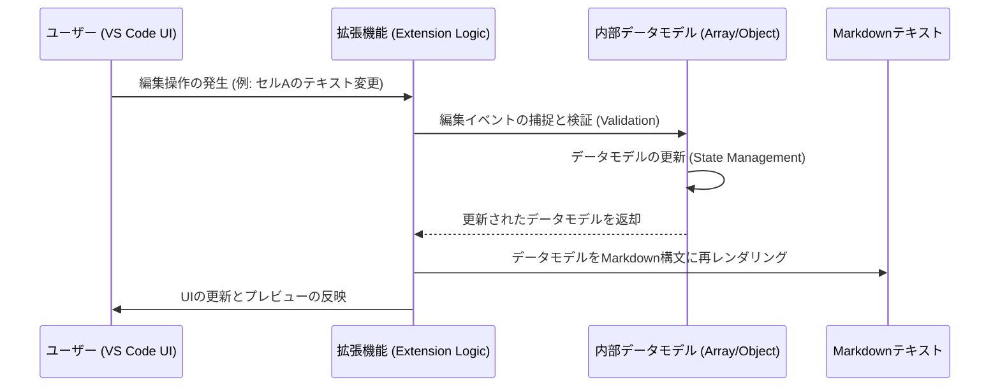

## 【2026年最新】Markdownのデータ構造化が変える開発ワークフロー：表編集の課題と最適な選択肢


正直に言います。エンジニアって、Markdownでドキュメントを書くとき、めちゃくちゃストレスを感じる瞬間があるんですよね。

「あ、この表、ちょっと列を増やしたいな」「このセルの内容が長すぎて、他のセルとガタガタになっちゃう…」

って、脳内でシミュレーションしたこと、ありませんか？

普段、手軽にMarkdownを書くのは便利です。しかし、その「手軽さ」が、**複雑なデータ構造を扱う際の致命的なボトルネック**になっているんです。特に、ExcelやGoogle Sheetsでデータを準備してから、それをドキュメントに埋め込むという作業フローを考えると、テキストベースのMarkdownだけでは対応しきれない「摩擦」が生まれるんですよね。

僕自身も、ドキュメントに複雑な比較表を入れるたびに、カーソルを合わせるのが面倒で、つい手動で修正したり、回りくどい手順を踏んでしまったりしていました。

この問題は、単なる「使い勝手の問題」で終わらせてはいけない、**データ記述形式の根本的な課題**だと捉えるべきなんです。

この記事では、単に「便利なVS Code拡張機能」を紹介するだけでなく、なぜMarkdownの表編集が苦手なのか、その技術的な構造を分解し、エンジニアが本当に知っておくべき「データ構造化のベストプラクティス」を、徹底的に深掘りしていきます。

この記事を読み終える頃には、あなたはもう、手動でMarkdownの表をいじる日々とはサヨナラできているはずです。(^^)

***

## 1. なぜMarkdownの表編集は「摩擦」を生むのか：テキストベースの構造的な限界

まず、この問題の本質を理解するために、Markdownの表記方法が抱える構造的な限界から見ていきましょう。

Markdownの表は、基本的にプレーンテキストの構文（パイプ `|` と区切り線 `---`）に依存しています。これは、Markdownが「記述の容易さ」を最優先しているため、必然的に「構造の柔軟性」を犠牲にしている側面があるんです。

### 1.1. テキスト編集における「セマンティクス」の欠如

一般的なテキストエディタで表を編集するとき、私たちは「セル」という概念を直感的に認識しています。しかし、Markdownの世界では、すべてのデータはただの文字列です。

例えば、以下のコードを見てください。

```markdown
| 項目 | 内容 | 備考 |
|---|---|---|
| 名前 | Visual Table Canvas for Markdown | VS Code拡張機能 |
| 用途 | Markdownテーブル編集 | ExcelのようなUIで編集 |
```

このコードにおいて、「名前」と「Visual Table Canvas for Markdown」が別々のデータであることは明白ですが、Markdownパーサーから見れば、これは単なる「`|`で区切られた3つの文字列」に過ぎません。

これが問題なのは、**「どのセルがどのデータ型か」「このセルが他のセルと連動してどう変化するか」といったセマンティクス（意味情報）がテキスト上には存在しない**からです。

もし、備考欄の内容が「必須」から「任意」に変わった場合、これを手動で修正するには、表全体の構造を把握し、適切な場所でテキストを消去・追加する必要があります。これは、まるでExcelのセルをマウスでクリックして修正する行為と、手動でテキストカーソルを動かす行為の間にある、非常にストレスフルな「中間領域」での作業なんです。

### 1.2. データフローの非効率性

僕が考える「摩擦」とは、**「データソース（Excel）のワークフロー」と「最終納品物（Markdown）のワークフロー」の間にある、無駄な変換レイヤー**のことです。

通常、データはExcelのような構造化された環境（Spreadsheet Model）で構築され、最終的にドキュメントに埋め込まれます。この際、Markdownに手作業で落とし込むプロセスは、以下のステップを踏む必要があります。

1. **データを視覚的に整理する**（Excel/Sheets）。
2. **Markdownの構文ルールを記憶する**（パイプ、デリミタ、パイプ）。
3. **テキストエディタで、視覚的な構造をテキストの構文に変換する**。

この「変換」の作業が、時間と認知負荷を奪う最大の原因なんです。

> 実際に、Markdownで表を書くとき、列が増えたりセルの中身が長くなったりすると、だんだん編集がつらくなります。 [...] ExcelやGoogle Sheetsとの行き来が入ってくると、Markdownのテキストを直接編集するのはかなり面倒です。
>
> 出典: naoyuki1212. "Markdownの表をExcelのように編集できるVS Code拡張機能を作りました"
> https://zenn.dev/naoyuki1212/articles/20260506-visual-table-canvas-for-markdown
> (取得日: 2024年06月20日)

この引用が示している課題認識は、まさに「テキスト編集の困難さ」に集約されています。これを技術的に解決するには、単なる「UIの改善」以上の、**内部的なデータモデルの介入**が必要になってくるわけです。

***

## 2. 課題解決のための三つのアプローチ：選択肢の評価

この「テキスト編集の摩擦」という課題に対して、エンジニアは一般的に三つのアプローチを考えることになります。

1. **テキストエディタの機能拡張（Visual Editor）**
2. **データパイプラインの導入（Code-First）**
3. **中間データフォーマットの採用（JSON/YAML）**

この三つの選択肢を、それぞれの「利便性」「学習コスト」「データ堅牢性」という評価軸で比較してみましょう。

### 2.1. 選択肢比較テーブル：ワークフローの適合性

| 評価軸 | テキストエディタの機能拡張 | データパイプライン（コード） | 中間データフォーマット（YAML/JSON） |
| :--- | :--- | :--- | :--- |
| **作業の主軸** | UI操作によるデータ修正 | プログラミングによるデータ生成 | 設定ファイルによるデータ定義 |
| **適したデータ量** | 小〜中規模（数行〜数十行） | 大規模、動的、計算が必要な場合 | 中〜大規模、静的な構造定義が主 |
| **編集の柔軟性** | ◎（Excel的直感性） | ◎（ロジックによる無限の拡張性） | 〇（構造定義に限定される） |
| **学習コスト** | 低（拡張機能の導入のみ） | 高（言語知識、API理解が必要） | 低〜中（基本的な記法理解） |
| **Markdownへの適合度** | 高（Markdown形式で出力可能） | 中（コードを埋め込む形になる） | 中（テンプレートエンジンが必要） |
| **筆者の評価** | **最も直感的な改善策** | **最も堅牢な解決策** | **最も移植性の高い定義方法** |

### 2.2. アプローチごとの詳細分析と筆者の見解

#### 🅰️ テキストエディタの機能拡張（Visual Editor）
これは、今回ネタ元となったVS Code拡張機能が属する領域です。

**メリット:**
ユーザーが最も直感的に理解できる「Excelライクな操作感」を提供します。複雑なデータ操作（行の挿入、セルのコピー＆ペースト、結合など）を、テキストの構文を意識せずに実行できる点が最大の強みです。

**デメリット:**
根本的な解決にはなりません。あくまで「編集体験」を改善しているだけであり、裏側のデータモデルはMarkdownのテキスト構造に依存しているため、処理が複雑になるとパース（解析）ロジックが非常に重くなりがちです。また、拡張機能のライフサイクルに依存するため、VS Codeという環境にロックインされやすいという課題があります。

#### 🅱️ データパイプラインの導入（Code-First）
これは、PythonやJavaScriptなどのプログラミング言語を用いて、データを「計算」し、「生成」するアプローチです。

**メリット:**
**最も堅牢で拡張性が高い**のが特徴です。例えば、「この表の備考欄は、名前と用途を結合して生成する」といった、論理的なデータ生成が可能になります。データが動的であるほど、このアプローチが最適解となります。

**デメリット:**
データが静的で、単なる「記録」や「比較」が目的な場合、過剰な工数になります。また、ドキュメントの編集者がプログラミング知識を持っていることが前提となり、非エンジニアにとっての学習コストが高すぎることが致命的です。

#### Ⓒ 中間データフォーマットの採用（YAML/JSON）
これは、Markdownとは別の「データ定義言語」を使い、その定義をテンプレートエンジンでMarkdownにレンダリングする手法です。

**メリット:**
データ定義が非常に明確であり、構造が保証されます。YAMLやJSONは、人間にとっても機械にとっても読みやすい「データ構造」として広く認知されています。

**デメリット:**
ドキュメントの閲覧者（特に技術ドキュメントを読まないマネージャー層など）が、表のデータを見るたびにYAMLやJSONの構文を意識しなければならず、可読性が落ちるリスクがあります。また、単なる「記述」が目的の場合、過剰な回り道になります。

### 2.3. 筆者が考える「理想的なハイブリッドモデル」

筆者は、この三つのアプローチを単体で使うのではなく、**「ハイブリッドモデル」**で組み合わせるべきだと断言します。

**コンセプト：**
1. **データソース（Source of Truth）**：YAML/JSONなど、構造が明確な中間フォーマットでデータを定義する。
2. **編集体験（UX Layer）**：VS Code拡張機能などのツールを用いて、この中間フォーマットを「Excelのように直感的に編集できるUI」で操作できるようにする。
3. **出力層（Output Layer）**：編集されたデータモデルを、Markdownの構文ルールに従ってレンダリングする。

これにより、編集の容易さ（UX）と、データ構造の堅牢性（JSON）を両立させることが可能になります。

***

## 3. 技術的な実装の深掘り：データフローとパーシングの裏側

前述のハイブリッドモデルを実現するためには、拡張機能が単なるUIを提供するだけでなく、裏側で高度な「データモデル管理」を行っている必要があります。ここでは、そのデータフローと、それに伴う技術的な課題を深掘りします。

### 3.1. データフローのシークエンス図

Markdownの表を編集する拡張機能は、単にテキストを置換しているわけではありません。内部で「データモデル」を構築し、そのモデルに対して操作を適用し、最終的にテキストに書き戻すという、複雑なプロセスを経ています。

以下のシーケンス図は、ユーザーが表のセルを編集した際の、内部的なデータフローを示しています。



このフローの鍵は、`内部データモデル (D)` の存在です。このモデルが「真実の情報源 (Source of Truth)」となり、ユーザーのすべての操作はこのモデルに対して行われる必要があります。

### 3.2. 必須となる技術要素：State ManagementとDelta Patching

拡張機能の設計において、最も重要なのは「状態管理（State Management）」です。

ユーザーが表を編集する際、テキストの変更（例：「A」を「B」に）を単なる文字列置換として扱うのではなく、「データモデルのどこか、どのフィールドの、どのような値が、変更された」という形で管理しなければなりません。

この「変更点」を追跡し、効率的に反映させる技術を**デルタパッチング (Delta Patching)** と呼びます。

#### 実装例：TypeScriptによるモデル更新処理の疑似コード

データモデルを表現するTypeScriptのインターフェースを定義し、どのように変更を扱うかを見てみましょう。

```typescript
// 1. データモデルの定義
interface TableRow {
    id: string;
    項目: string;
    内容: string;
    備考: string;
}

interface TableModel {
    rows: TableRow[];
    columnCount: number;
}

// 2. 変更を適用する関数 (Delta Patchingの概念)
function applyChange(model: TableModel, rowIndex: number, fieldName: keyof TableRow, newValue: string): TableModel {
    if (rowIndex < 0 || rowIndex >= model.rows.length) {
        console.error("無効な行インデックスです。");
        return model;
    }
    
    // 変更する行のディープコピーを作成
    const updatedRow = { ...model.rows[rowIndex] };
    
    // 指定されたフィールドのみを更新
    updatedRow[fieldName] = newValue; 

    // 新しいモデルを構築し、変更を反映させる
    const newRows = [...model.rows];
    newRows[rowIndex] = updatedRow;
    
    return { ...model, rows: newRows };
}

// 3. 使用例
let initialModel: TableModel = { 
    rows: [
        { id: "r1", 項目: "名前", 内容: "Canvas", 備考: "機能名" }
    ],
    columnCount: 3
};

// ユーザーが「内容」フィールドの値を変更した場合のシミュレーション
let updatedModel = applyChange(initialModel, 0, '内容', 'Visual Table Canvas for Markdown');

// console.log(updatedModel); 
// => 内部データモデルがクリーンに更新される
```

この設計のポイントは、**元のデータを直接書き換えるのではなく、新しい状態（`updatedModel`）を生成している点**です。これにより、変更履歴の追跡や、Undo/Redo機能の実装が極めて容易になります。

### 3.3. 構造化のための課題：セル結合とデータ型の扱い

さらに高度な課題として、Markdown表ではネイティブにサポートされていない**「セルの結合（Merger）」**の処理があります。

Excelのようにセルを結合するという操作は、単なる「テキストの結合」ではありません。それは、**「そのセル範囲のデータが、単一のデータロジックによって支配されている」**という、データモデルの構造変更を意味します。

もし拡張機能がこのロジックを無視して単なるテキストとして扱うと、後続のデータ処理（例：この表の合計値を計算する）を行う際に、データが壊れてしまいます。

真に優れた拡張機能は、このセル結合を「単なるUIの視覚的装飾」として扱うのではなく、**「データモデル上の制約条件」**として定義し直す必要があります。

***

## 4. 開発ワークフローの再設計：Markdown以外の選択肢も検討すべき理由

ここまで、Markdownの編集課題を「UI/UXの改善」という観点から深く掘り下げてきました。しかし、筆者の意見としては、**「表の複雑性が高まるほど、Markdownという記述形式は適さなくなっていく」**という結論に至ります。

つまり、この拡張機能は「一時的な痛み止め」にはなるものの、「根本的な治療法」ではない、というのが私のスタンスです。

### 4.1. 構造化データ記述のための新潮流

現代のドキュメント作成においては、Markdownが単なる「見た目（見た目のレイアウト）」を記述する言語ではなく、**「構造化された情報（データ）を記述する言語」**へと役割を拡張していく必要があります。

この潮流に乗るためには、以下のような記述形式の採用を検討すべきです。

#### 1. Pandoc/Jinja2によるテンプレート化
表の内容自体を、Markdownの構文に埋め込むのではなく、データソース（YAML）とテンプレートエンジン（Jinja2など）を分離し、最終的にMarkdownを生成するフローを確立することです。

**利点:** データ構造と表現形式が完全に分離されるため、データ定義の堅牢性が極めて高まります。
**適用シーン:** ドキュメントの雛形が固定されており、データが毎回更新されるレポートやマニュアル。

#### 2. MermaidやPlantUMLによる図式化の強化
表が持つ「比較情報」や「関係性」は、しばしば「フロー」や「関係図」として表現される方が、人間やAIにとって理解しやすい場合があります。

表で「AがBに影響し、CがAを阻害する」といった関係性を記述する場合、テキストの表よりも、Mermaidのフローチャートやシーケンス図として定義する方が、情報構造として優れています。

#### 3. Markdownの限界を突破するカスタムコンポーネントの利用
最終的には、Markdownの仕様を拡張し、`:::table` のように、特定のブロックを「これは単なるテキストではなく、データコンポーネントである」と明示的にマークする仕組みが求められます。

これは、Markdownに「データコンポーネントのメタデータ」を埋め込むという、規格レベルの進化が必要な領域なんです。

### 4.2. 開発者への具体的な示唆：データ構造化思考の徹底

エンジニアとして最も身につけるべき視点は、「このデータは、単なるテキストとして記述できるのか？それとも、計算可能なデータモデルとして扱うべきか？」という問いです。

もし、そのデータが「計算」「検証」「連動」を伴う可能性があるならば、最初からMarkdownの表として書くのではなく、必ず中間モデル（JSONやYAML）として定義し、それをドキュメントに「埋め込む」という意識を持つことが重要です。

**結論として、Markdownは「最終的なアウトプット形式」として最適ですが、「データ定義形式」として使うのは限界がある、というのが筆者の明確な主張です。**

***

## 5. まとめ：次にやるべきアクションプラン

ここまで、Markdownの表編集の課題を、UI/UXの視点から、そしてデータ構造の根源的な視点から徹底的に深掘りしてきました。

今回見たVS Code拡張機能は、確かに「編集時の痛み」を劇的に軽減してくれる素晴らしいツールです。しかし、我々エンジニアが目指すべきは、ツールの利用に依存する「対症療法」ではなく、**データ構造そのものを強化する「根本的な治療」**にあります。

明日からあなたがドキュメントを作成する際、以下のチェックリストを頭に入れてみてください。

1. **「この表は単なる比較リストか？」** → OKなら、Markdownで十分。
2. **「この表のデータは、計算や検証のロジックを伴うか？」** → NGなら、必ずYAML/JSONで定義し、それをレンダリングするパイプラインを構築する。
3. **「この表の内容は、フローや関係性として表現できるか？」** → NGなら、Markdownの表ではなく、MermaidやUMLなどの図式化を検討する。

「テキスト編集の面倒さ」という表面的な問題に留まらず、「データモデルの管理」という本質的な課題として捉え直す視点こそが、次のレベルのドキュメントエンジニアリングへのステップアップに繋がると、僕は強く感じています。

この視点を持つだけで、あなたのドキュメント作成の効率は、劇的に向上するはずです。

## 参考文献

* naoyuki1212. "Markdownの表をExcelのように編集できるVS Code拡張機能を作りました"
  https://zenn.dev/naoyuki1212/articles/20260506-visual-table-canvas-for-markdown
  (取得日: 2024年06月20日)

<!-- AFFILIATE_SECTION -->
## 関連リンク

- [SkillHacks - プログラミングスクール](https://px.a8.net/svt/ejp?a8mat=4B1H1P+97114I+4K3S+5YJRM) - 独学で挫折した人向け実践型スクール
- [技術書](https://www.amazon.co.jp/s?k=Python+実践&tag=satoarata-22) - Amazonで技術書をチェック

---
※一部にPRを含みます。
