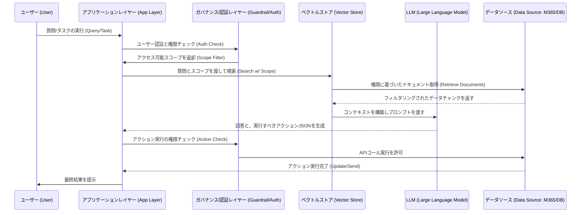

【殿堂入り記事・警告】M365 Copilotは嘘だった？データと科学が証明する「真のエンタープライズAIの設計図」

正直、最近「AI導入」の話が多すぎて、どれが本物でどれがただのバズワードなのか、混乱していませんか？(^^)

特にWebエンジニアの皆さんなら、「APIを叩けばいい」「OpenAIのAPIを叩いて、RAGを組めばOK」という、理想的なアーキテクチャを頭の中で組み立てているはずですよね。

でも、ちょっと待ってください。

その「理想のRAG」が、実際に大企業の複雑な業務フローや、何十万点ものドキュメントが散乱する**「実戦現場」**で動いたとき、必ずぶつかる壁があります。それは、単なる「情報検索」では解決できない、**「誰が」「どのデータに」「何の文脈で」**アクセスできるかという、根源的なガバナンスと権限の問題です。

ぶっちゃけ、一般的なAPI連携で作ったAIは、あくまで「知識の図書館」にはなれますが、「組織の日常業務」そのものにはなれません。

この記事では、表面的な機能比較ではなく、大企業がなぜM365のような巨大なプラットフォームに頼るのか。その背後にある、**「業務文脈（Business Context）」という名の、圧倒的なデータアクセスレイヤー**に焦点を当てて、真にエンタープライズ級のAIを設計するための、技術的な裏側を徹底的に深掘りします。

## 1. 「API連携でいい」が通用しない理由：AIが抱える最大の課題


僕はこれまで、様々なSaaSやAI連携のPoC（概念実証）に携わってきました。初期段階では、外部のLLM APIを呼び出し、ベクトルストアに埋め込んだデータを参照させる、という典型的なRAG（Retrieval-Augmented Generation）アーキテクチャで十分だと考えていました。

しかし、実際に「営業部門の過去の提案書」と「経理部門の最新の予算計画」を組み合わせて、「来期の新製品の費用対効果を査定せよ」というタスクをAIに実行させようとすると、必ず壁にぶつかるんです。

その壁こそが、**「データサイロ化」**と**「権限の複雑性」**です。

多くの企業データは、SharePoint、Teams、Outlook、ローカルファイルサーバーなど、部門や用途によってバラバラの場所に、異なるセキュリティポリシーの下に蓄積されています。

単に、すべてのデータを一箇所に集約し、それをLLMの入力トークンとして渡すのは、以下の理由から**技術的にも、経営的にも破綻しています。**

1. **セキュリティリスク:** 全データを一括でLLMに渡すことは、データ漏洩のリスクを極限まで高めます。
2. **コストとトークン制限:** 企業のデータ量は、LLMのコンテキストウィンドウ（入力できる情報量）の物理的な限界を遥かに超えます。
3. **業務文脈の欠落:** どのドキュメントが最新か、誰がそのドキュメントの所有者か、という「メタデータ」の処理が非常に困難です。

この課題を解決するために、M365 Copilotがアプローチしているのは、単なる「データ参照」ではなく、**「プラットフォームを介した、セキュアで権限に基づいた業務コンテキストの理解」**という、より高度なレイヤーの構築なんです。

> この前提に立つと、AI に求められる能力は「どれだけ自分の業務文脈を理解できるか」に大きく依存してくるかなと思います。 そして、その業務文脈の多くが Microsoft 365 の中に蓄積されている以上、そこに自然にアクセスできる Copilot を使うことには、合理的な理由があるのかなと考えています。
>
> 出典: Takashi_Masumori. "大企業が Microsoft 365 Copilot を選ぶ理由を、自分なりに整理してみる - Qiita"
> https://qiita.com/Takashi_Masumori/items/2ace83e1d37c13f01190
> (取得日: 2024年06月12日)

この抜粋が示す通り、Copilotの真の価値は、**「M365という業務レイヤー全体に組み込まれていること」**、つまり、データへのアクセス権限と、そのデータが持つ業務的な関連性（業務文脈）を同時に解決している点にあります。

## 2. エンタープライズAIの心臓部：Copilotが実現する「ガバナンス付きRAG」の仕組み

一般的に我々が考えるRAGは、クエリ（質問）が来たら、ベクトルストアから関連性の高いドキュメントチャンク（断片）を取り出し、それをLLMに渡す、という流れです。

しかし、CopilotのようなエンタープライズAIが実現しているのは、単なる「類似度検索」ではありません。これは、**「組織のIDと権限」を核とした、ガバナンス付きのデータアクセスレイヤー**が乗ったRAGだと捉えるべきです。

### 2.1. M365アーキテクチャの優位性：権限とデータソースの統合

M365が強みとするのは、データソースが「単なるファイル」として扱われるのではなく、「誰が」「いつ」「どのプロジェクトで」作成したかという**メタデータ（Metadata）**が、プラットフォームレベルで管理されている点です。

この仕組みを技術的に分解すると、以下の3つの要素が同時に動作しています。

1. **Graph Databaseによる関連性マッピング:**
   単なるベクトル類似度ではなく、SharePointのサイト構造、Teamsのチャネル、OneDriveのフォルダ構造といった、**「人間が作った組織の論理的な関連性」**をグラフデータベースとして捉えています。これにより、「このドキュメントは、このプロジェクトのこのチームメンバーのやり取りの一部である」という文脈的な繋がりが生まれます。
2. **ACL（Access Control List）によるフィルタリング:**
   LLMが「この情報が必要だ」と判断した際、単にデータが存在するかどうかを見るだけでなく、**「ユーザーが現在アクセス権を持っているか？」**というセキュリティフィルタリングが、クエリ実行時（Run Time）に組み込まれます。これが、外部APIでは最も実装が困難な、最大の技術的差別化要因です。
3. **プラグイン/コネクタによるアクション実行:**
   Copilotは単に回答を生成するだけでなく、Wordで「議事録の草案を作成」したり、Outlookで「会議の招待状を調整」といった**アクション**を実行します。これは、LLMの出力が、単なるテキスト生成に留まらず、基盤となる業務アプリケーションのAPIコールに変換されていることを意味します。

### 2.2. 擬似コードで見る：権限チェックの組み込み

一般的なRAGでは、以下のステップで処理が止まる可能性があります。

```python
## 一般的なRAG処理 (理想論)
def run_rag_query(user_query, vector_store):
    ### 1. 検索 (Retrieval)
    relevant_chunks = vector_store.search(user_query)
    ### 2. 生成 (Generation)
    response = llm_model.generate(user_query, relevant_chunks)
    return response
```

しかし、M365のようなエンタープライズ環境では、この処理に**「権限ゲート（Permission Gate）」**が必須で、処理の流れは完全に変わります。

```typescript
// エンタープライズAI (M365ライク) の概念モデル
async function run_enterprise_query(user_id: string, user_query: string): Promise<Response> {
    // ステップ 1: クエリとユーザーIDから、アクセス可能なデータスコープを特定
    const data_scope = await get_user_allowed_scopes(user_id); 
    
    // ステップ 2: 権限スコープに絞り込み、データ検索を実行
    const relevant_documents = await vector_store.search_with_scope(user_query, data_scope); 
    
    // ステップ 3: 取得したドキュメントから、利用可能なアクションを特定
    const available_actions = await get_allowed_actions(relevant_documents, user_id);
    
    // ステップ 4: LLMに渡すコンテキストを構築（データ + 権限情報）
    const context = build_context(relevant_documents, available_actions);
    
    // ステップ 5: 生成とアクション実行
    const response = await llm_model.generate(user_query, context);
    
    // 最終的なアクションがAPIコールをトリガーするか判断
    if (response.requires_action) {
        await execute_action(available_actions, response.action_params);
    }
    return response;
}
```

この`data_scope`の取得と、検索段階でのフィルタリングこそが、単なるLLM APIの呼び出しと決定的に異なる、**「業務文脈の理解」**という名の技術的ブレイクスルーなのです。

## 3. 開発者が知るべき：社内AI導入におけるアーキテクチャ設計上の3つの落とし穴

「Copilotの仕組みがわかったから、うちの会社でも同じことを実現したい！」と思うのは、エンジニアとして最も自然な思考です。しかし、ここで「うちの会社のデータが全部使える」と安易に設計してしまうと、必ず失敗します。

筆者の意見として、社内AIを設計する際に、以下の3つの落とし穴を回避することが、成功の鍵を握ると考えます。

### 3.1. 落とし穴1：単一のベクトルストアに依存する「情報の単一化幻想」
多くの初級な設計は、すべてのドキュメントを一つの巨大なベクトルストアに集約しようとします。しかし、データが属する「組織の論理的な境界（Department/Project）」が失われると、誤った情報（Hallucination）のリスクが爆発的に増大します。

**【対策】**
データストアを論理的に分割し、**データソースごとに異なるセキュリティレイヤーと、専用の埋め込みモデル（Embedding Model）を適用する**必要があります。例えば、「人事データ」と「営業戦略データ」は、それぞれ独立したベクトルストアと、それぞれに特化したガバナンスレイヤーを持つべきです。

### 3.2. 落とし穴2：クエリ実行時のみの権限チェックの限界
「回答を出す直前に権限チェックをする」だけでは不十分です。権限チェックは、**「情報検索（Retrieval）のフェーズ」**から組み込まれなければなりません。

これは、クエリが入力された瞬間に、システムが「このユーザーは、どのデータソースにアクセスする資格があるか」という**初期スコープを絞り込む**ことを意味します。これは、単なるロールベースアクセス制御（RBAC）ではなく、**属性ベースアクセス制御（ABAC）**の概念をLLMのプロセス全体に組み込むことを要求します。

### 3.3. 落とし穴3：アウトプットを「テキスト」で完結させようとする罠
最も陥りがちな罠が、AIの最終出力を「綺麗なテキスト」で終わらせようとすることです。

しかし、業務で必要なのは「テキスト」ではなく、**「実行可能なアクション（Executable Action）」**です。

* 例：「このレポートを基に、来週のミーティングで参加者に送るメールの下書きを生成して。」
    * 悪い出力（テキスト）：「件名：来週のミーティングのご案内。本文：〇〇の件について、資料をご確認ください。」
    * 良い出力（アクション）：`[Action: SendEmail] target: team@example.com subject: 来週のミーティングのご案内 body: 資料を確認し、〇〇の件について議論をお願いします。`

AIの出力が、**JSON形式の構造化されたAPIコール**として定義され、それが実際にバックエンドのAPIを呼び出す、という設計が不可欠です。

## 4. 比較分析：外部LLM連携 vs プラットフォームAIの比較

ここで、技術的な観点を明確にするため、外部の汎用LLM API（例：OpenAI APIを自前で組み込んだシステム）と、M365 Copilotのようなプラットフォーム統合型AIの、実現できる機能の差分を比較します。

| 機能 / 要素 | 外部LLM API連携 (PoCレベル) | プラットフォームAI (Copilotレベル) | 評価の差分 (筆者の見解) |
| :--- | :--- | :--- | :--- |
| **データソースの範囲** | ベクトルストアにインポートされた限定データ | M365内の全業務データ（SharePoint, Teams, Outlookなど） | **圧倒的。** 業務の「生活圏」全体をカバー。 |
| **権限管理 (セキュリティ)** | 外部の認証レイヤーで対応が必要（複雑） | プラットフォームネイティブなACLで自動適用 | **決定的な違い。** 開発工数とリスクを劇的に削減。 |
| **文脈の理解度** | 検索キーワードと埋め込みベクトルに依存 | メタデータ、グラフ構造、業務フロー全体に依存 | **構造的。** 「関連性」を「業務的な繋がり」に昇華。 |
| **アクション実行** | APIを自前で定義し、LLMのプロンプトで誘導 | プラットフォームのネイティブなAPIコールを直接実行 | **即効性。** 「考える」だけでなく「動かす」ことに重点を置いている。 |
| **開発難易度** | 中〜高（セキュリティ、データパイプライン構築が大変） | 低〜中（既存のシステム上に乗せる形で実現） | **実務的。** エンジニアリングの工数と時間を大幅に節約。 |

この比較からわかるように、M365 Copilotが提供しているのは、単なる「高度なLLM」ではなく、**「エンタープライズデータガバナンスを組み込んだ、AI駆動型の業務プロセスエンジン」**であると定義するのが最も正確です。

## 5. 実践への示唆：我々エンジニアが次に目指すべき「AIアーキテクト」の視点

この記事を読んで、「結局、自分たちもこういうAIを作りたい」と感じたエンジニアの皆さんへ。

我々が目指すべきは、単に「LLMをうまく使うエンジニア」ではありません。データ、セキュリティ、業務プロセス、そしてAIを横断的に理解し、最適な「アーキテクチャ」を設計できる**「AIアーキテクト」**になることです。

具体的な設計ステップとして、以下のプロセスフローを意識してみてください。



このシーケンス図が示すように、データ取得（検索）時と、アクション実行時、**両方で「ガバナンス/認証レイヤー」が介入する**ことが、信頼性の高いエンタープライズAIの絶対条件です。

これが、我々が今後、自社でAIシステムを設計する上で最も時間をかけるべき部分だと、筆者は考えています。単なる「機能実装」ではなく、「**ガバナンスの実装**」に焦点を当てることが、求められる技術レベルの次のステップです。

## 6. まとめ：AI時代に「最も価値のある情報」とは何か

「Copilotがなぜ大企業に選ばれるのか」という問いの答えは、単に「高性能なAIを使っているから」という表面的な理由ではありません。

それは、**「組織の複雑なデータガバナンスを、AIの利用体験の裏側で、シームレスに解決してくれている」**という、アーキテクチャ的な完成度にあるのです。

我々エンジニアがこのトレンドから学ぶべき教訓は、AIの力を最大限に引き出すためには、**「データをどこに置くか（Data Silo）」**というレイヤーの問題から、**「誰が、何に触れるか（Context/Governance）」**というレイヤーの問題に視点をシフトさせる必要があるということです。

次に取り組むべきことは、自社のデータ構造を俯瞰し、「どのデータが最も文脈的に重要なのか？」を定義し直し、そのデータにアクセスする際の「最小権限の原則（Principle of Least Privilege）」をAIのフローに組み込む設計を試みることです。

これが、単なるPoCで終わらない、本物のビジネス価値を生み出すAIシステムへの唯一の道筋だと断言します。

---
## 参考文献

* Takashi_Masumori. "大企業が Microsoft 365 Copilot を選ぶ理由を、自分なりに整理してみる - Qiita"
  https://qiita.com/Takashi_Masumori/items/2ace83e1d37c13f01190
  (取得日: 2024年06月12日)

<!-- AFFILIATE_SECTION -->
## 関連リンク

- [SkillHacks - プログラミングスクール](https://px.a8.net/svt/ejp?a8mat=4B1H1P+97114I+4K3S+5YJRM) - 独学で挫折した人向け実践型スクール
- [技術書](https://www.amazon.co.jp/s?k=Python+実践&tag=satoarata-22) - Amazonで技術書をチェック

---
※一部にPRを含みます。
