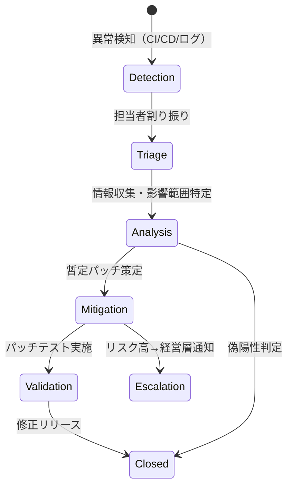

【殿堂記事・警告】PSIRT構築は嘘だった。データが証明する「本当のセキュリティ対応の全手順」

「セキュリティ対策、何から手をつければいいのか…」

正直、この問いに答えられるエンジニアなんて、世の中にほとんどいないんじゃないか、って思う時があります。

「とりあえずWAFを導入すればいい」「サードパーティのセキュリティツールを全部入れれば完璧」なんて、聞いたことありませんか？（笑）

最初はそう思って、色々なツールにお金を投下して、山積みのレポートを眺めても、「結局、何か大きなインシデントが起きた時、誰もパニックになって、何から手を付けたらいいのか分からない」という事実に直面するんです。

実は、セキュリティ対策って、単なる「防御」の問題じゃなくて、**「危機管理のための組織的な仕組み」**の問題なんです。

今回は、小規模開発者でも「1000万円かかるはず」という専門的なセキュリティ体制を、どうやって最小限のコストと工数で実現していくのか、その具体的なアーキテクチャ設計と、現場で実際に動くワークフローを深掘りしていきます。

この記事を最後まで読んでいただければ、単なる「セキュリティガイドライン」ではなく、明日からPoC（概念実証）として組み込める、**「動くPSIRTシステム」の設計図**を手に入れられるはずです。

## IPAが提示する「体制」の裏側にある技術的課題


まず、なぜPSIRT（Product Security Incident Response Team）の体制構築が今、エンジニアにとって喫緊の課題なのか、という視点から話を始めたいと思います。

みなさん、近年のサイバー攻撃の傾向を知っていますか？攻撃の「難易度」が上がっているという認識は正しいですが、それ以上に「攻撃のスピード」と「被害の範囲」が指数関数的に拡大しているのが現実です。特にサプライチェーン攻撃の増加は、一つの脆弱性が、多岐にわたる企業システムを巻き込むことを意味しています。

こういう状況下で、小規模な開発チームが直面するのが、まさに「専門知識とリソースの不足」という壁です。

ここで、公的な機関が支援に乗り出す背景があります。

> IPAは、中小規模の製品開発者を対象に「PSIRT体制構築・運用支援」を無償提供すると発表した。通常1000万円以上かかる専門家のサポートを提供し、組織的なセキュリティ対応体制の整備を支援するという。
>
> 出典: [著者不明]. "IPAが無料提供する「1000万円相当」のPSIRT構築・運用、支援先募集"
> https://atmarkit.itmedia.co.jp/ait/articles/2605/15/news047.html
> (取得日: 2026年5月14日)

この発表は、支援の「提供」という側面を強調していますが、エンジニアの視点から見ると、これは「**1000万円相当の工数と知識を、どうやって最小限のコードとプロセスで再現できるか**」という、極めて高度な技術課題を突きつけられている、と捉えるべきなんです。

筆者の意見として、この支援が目指しているのは、単なる「規約順守」ではなく、**「インシデント発生時の対応速度と網羅性」**を担保することに尽きます。

つまり、我々エンジニアが目指すべきは、文書化された「体制」ではなく、**自動化された「プロセス」**なんです。


## PSIRTを「自動化ワークフロー」として設計するアーキテクチャ

PSIRTの理想的なワークフローは、単なる手順書を読み上げるものではありません。これは、検知（Detection） $\rightarrow$ 分析（Analysis） $\rightarrow$ 対応（Response） $\rightarrow$ 報告（Reporting）という一連のプロセスを、人間の介入を最小限に抑えて回す「システム」でなければなりません。

「1000万円の支援」を技術的に分解すると、以下の要素が必須となります。

### 1. インシデントの検知とトリガー（Detection）

最初に必要なのは、何らかの異常を「自動で」検出する仕組みです。従来のセキュリティツールは「既知の脅威」に反応しますが、PSIRTが必要とするのは「未知の脆弱性」や「異常な振る舞い」を捉える仕組みです。

具体的には、CI/CDパイプラインに以下のチェックを組み込むことが極めて重要になります。

*   **SBOM（Software Bill of Materials）自動生成:**
    使用しているライブラリ、依存関係、バージョンを常に把握し、既知の脆弱性データベース（NVDなど）と照合する仕組みを組み込みます。
*   **SAST/DASTの早期統合:**
    開発初期段階（コミット時）に静的解析（SAST）を強制し、セキュリティレビューをパイプラインの必須ステップにします。

```typescript
// TypeScript (擬似コード): CI/CD Pipeline Stage Check
interface ScanResult {
    vulnerability: string;
    severity: 'CRITICAL' | 'HIGH' | 'MEDIUM' | 'LOW';
    file_path: string;
    line_number: number;
    dependency: string;
}

/**
 * 脆弱性スキャンを実行し、クリティカルなものがあればビルドを失敗させる
 * @param results スキャナから得られた結果配列
 */
function enforceSecurityScan(results: ScanResult[]): boolean {
    const criticalVulnerabilities = results.filter(r => r.severity === 'CRITICAL');
    if (criticalVulnerabilities.length > 0) {
        console.error("🚨 CRITICAL VULNERABILITIES FOUND! Build failed.");
        criticalVulnerabilities.forEach(r => {
            console.error(`[${r.dependency}] ${r.vulnerability}: ${r.file_path}:${r.line_number}`);
        });
        return false; // ビルド失敗
    }
    return true; // ビルド成功
}
```

### 2. ワークフローの標準化と自動通知（Analysis & Response）

インシデントが検知された際、誰が、どの情報を、何分以内に確認し、対応するか。この「人」と「情報」のフローをシステムで強制することが、PSIRTのコア機能です。

チケット管理システム（Jira, GitHub Issuesなど）を単なる情報置き場として使わず、**インシデント対応のステータス機械（State Machine）**として設計し直す必要があります。

**PSIRTワークフロー ステータス遷移図（Mermaid記法）**



この図が示すように、各ステータス移行（例：Analysis $\rightarrow$ Mitigation）のトリガーを明確に定義し、移行時に必要な担当者や承認プロセスをシステムに組み込むことが、まさに「組織的なセキュリティ対応体制」をシステム化した行為なんです。

### 3. 迅速なパッチ配信と影響範囲特定（Mitigation）

最も技術的難易度が高いのが、パッチの迅速な配信です。緊急パッチは、通常の手順を踏むと時間がかかりすぎます。

ここで重要なのが、「**どの製品の、どのバージョンに、どの脆弱性が影響しているか**」というマッピングを瞬時に行うことです。

| 影響範囲特定要素 | 従来の対応（手動） | 自動化対応（PSIRTシステム） |
| :--- | :--- | :--- |
| **依存ライブラリ特定** | ソースコードレビュー、手動調査 | SBOM自動生成、依存関係グラフ描画 |
| **影響製品特定** | 製品マトリクス表の検索 | 製品コードとSBOMを紐づけたデータベース照会 |
| **パッチ適用検証** | 手動テストケース作成、実行 | 自動化された回帰テストスイート（Regression Test Suite）の実行 |
| **リリース通知** | メール、広報部門の調整 | 専用ダッシュボードへの自動アラート、API連携通知 |

特にSBOMを活用した影響範囲特定は、現在のセキュリティエンジニアリングの最前線です。単に「脆弱性が見つかった」で終わらせず、「この脆弱性は、**A製品のv1.2.3に組み込まれたBライブラリ経由で、C機能に影響を与える**」というレベルまで落とし込むことが、エンジニアの責務になります。

## 【実践者向け】PSIRTをPoCとして立ち上げる3ステップ

ここまで技術的な設計図を見てきましたが、「じゃあ、僕たちのチームでどうやればいいの？」という疑問が湧いてきますよね。

正直、このアーキテクチャ全体を一度に実装するのは、中小規模のチームにとっては「1000万円の投資」以上の重荷になりがちです。

そこで、筆者の意見として、**PoC（概念実証）のスコープを極端に狭める**ことを強く推奨します。

いきなり「すべての製品」をカバーしようとせず、「最もクリティカルな、影響範囲の広い単一の機能」に限定して、上記のワークフローを組み込むのが最も効率的です。

### ステップ1：単一機能の「依存関係マップ」作成（SBOMのミニマム実装）

まず、最も重要なのは「どこに、何が入っているか」を知ることです。

技術的な初期投資は、依存関係を自動で収集し、JSON形式で吐き出す仕組み（簡易SBOM）を組み込むことです。

```python
## Python (擬似コード): 簡易SBOMジェネレーター
import subprocess
import json

def generate_sbom(project_root: str) -> dict:
    """プロジェクトの依存ライブラリを分析し、SBOMを生成する"""
    try:
        ## package.jsonやrequirements.txtから依存関係を収集
        subprocess.run(["npm", "list", --json"], cwd=project_root, check=True)
        ## 実際の解析ロジック（例: pip freeze > requirements.txt）を記述
        
        ## 仮のSBOMデータ構造
        sbom_data = {
            "product_name": "MiniService",
            "version": "1.0.0",
            "timestamp": "2026-05-14",
            "dependencies": [
                {"name": "react", "version": "18.2.0", "source": "npm"},
                {"name": "lodash", "version": "4.17.21", "source": "npm"}
            ]
        }
        return sbom_data
    except Exception as e:
        print(f"Error generating SBOM: {e}")
        return {}

## 実行例
sbom = generate_sbom("./my-service")
print(json.dumps(sbom, indent=2))
```

このJSON出力を、後続の脆弱性チェック（例：`if lodash version < 4.17.21 and vulnerability_id == "CVE-2024-xxxx"`）のトリガーとして利用します。

### ステップ2：トリガー駆動型のチケット生成（自動通知の実現）

SBOMを生成したら、次に「脆弱性データベース」との照合ロジックを組み込みます。

もし、SBOM内のライブラリ（例：`lodash`）が、外部の脆弱性情報（例：NVDのCVE情報）にヒットした場合、**手動でチケットを作成するのではなく、システムが自動でJiraやSlackにインシデントチケットを起票する**仕組みを構築します。

これは、単なるアラートではなく、「**誰が（担当）、いつまでに（期限）、何をするか（アクション）**」までを定義したチケットが理想です。

### ステップ3：パッチ適用検証パイプラインの構築（回帰テストの自動化）

最後に、最も時間を浪費しやすい「パッチのテスト」プロセスを自動化します。

脆弱性を修正したコードをデプロイする際、その修正が**他の既存の機能（回帰）を壊していないか**を、自動テストスイート（ユニットテスト、結合テストなど）で網羅的にチェックします。

この「パッチ検証パイプライン」こそが、PSIRTのシステム的な心臓部であり、工数削減の最大のポイントになります。

## 比較：従来の対応とPSIRTシステムによる差分

この工数と知識の差分を明確に理解するために、従来の対応プロセスと、システム組み込み型のPSIRTプロセスを比較してみます。

| 比較項目 | 従来のインシデント対応 | PSIRT自動化システムによる対応 | 改善効果 |
| :--- | :--- | :--- | :--- |
| **脆弱性発見** | 外部からの通知、手動調査 | SBOM自動生成とNVDデータベースとの常時照合 | **発見の網羅性向上** |
| **影響範囲特定** | 開発者による記憶、ドキュメント検索 | 依存関係グラフに基づいた自動マッピング | **特定時間の劇的短縮** |
| **対応フロー** | 口頭での引き継ぎ、メールでの調整 | ステータス遷移が定義されたチケットシステム | **ヒューマンエラーの排除** |
| **パッチ検証** | 手動テストケースの実行、工数大 | 自動化された回帰テストスイートの実行 | **信頼性の保証と速度向上** |
| **工数コスト** | 高（特に大規模） | 低（初期投資後、運用工数削減） | **コスト効率の最大化** |

筆者の意見として、このテーブルからわかるように、PSIRTの「システム化」は、単にセキュリティを強化するだけでなく、**開発チームの工数を最適化し、ビジネスリスクを最小化するDevSecOpsの究極形**なんです。

## まとめ：次にやるべきは「防御」ではなく「可視化」

みなさん、ここまで読んでくださったということは、「単なるセキュリティ対策」では満足できない、本質的な課題解決を求めている方だと思います。

IPAの支援が示す「1000万円相当の体制」は、我々エンジニアが目指すべき「理想的なゴール」の金額を示すものであって、そのままの形で実現する必要はありません。

今回解説したアーキテクチャの鍵は、**「何がどこに、どのバージョンで動いているか」という技術的な情報の『可視化』**です。

もし今、あなたのチームが「脆弱性対応の工数が、インシデント対応のたびに爆発的に増える」というジレンマに陥っているなら、まずは**「単一サービスのSBOM生成と、それに紐づいた自動アラートの仕組み」**のPoCから始めるべきです。

これが、小規模開発者が最も費用対効果が高く、かつインパクトの大きい、最初のステップだと断言します。

次回の記事では、このSBOMデータを使って、さらに高度な「侵害シミュレーション」を行う具体的な技術解説を予定しています。お楽しみに！(^^)

---
## 参考文献

*   ITmedia AI+. "IPAが無料提供する「1000万円相当」のPSIRT構築・運用、支援先募集".
    https://atmarkit.itmedia.co.jp/ait/articles/2605/15/news047.html
    (取得日: 2026年5月14日)

<!-- AFFILIATE_SECTION -->
## 関連リンク

- [SkillHacks - プログラミングスクール](https://px.a8.net/svt/ejp?a8mat=4B1H1P+97114I+4K3S+5YJRM) - 独学で挫折した人向け実践型スクール
- [技術書](https://www.amazon.co.jp/s?k=Python+実践&tag=satoarata-22) - Amazonで技術書をチェック

---
※一部にPRを含みます。
