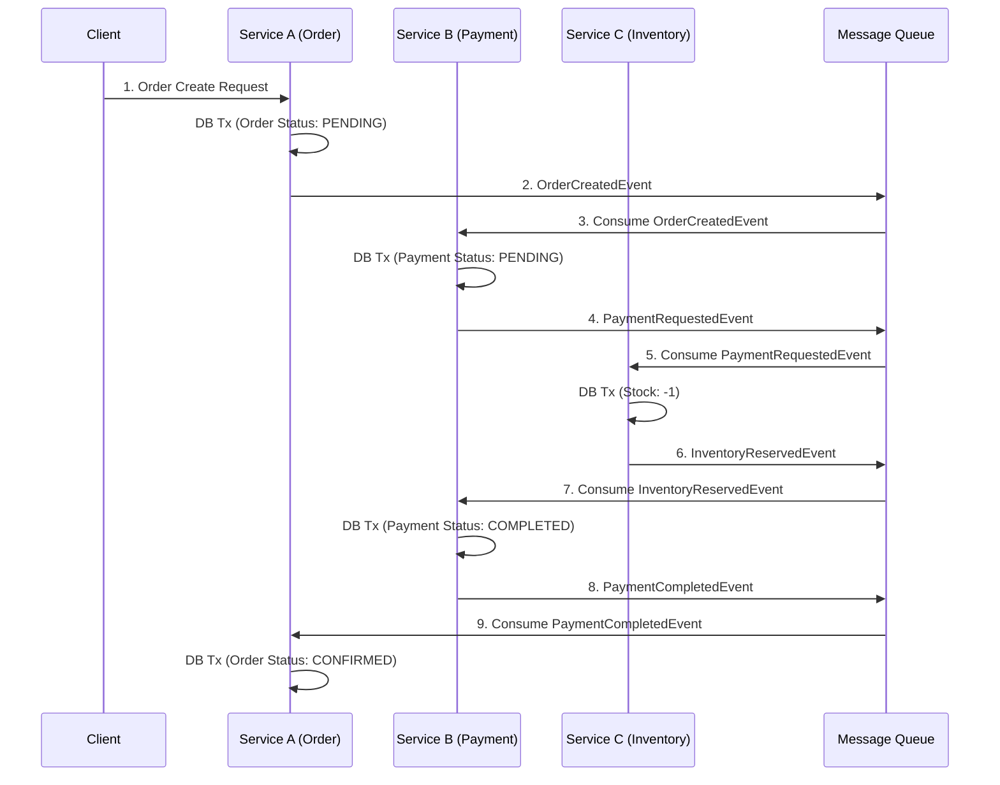

【完全攻略】複数の集約を跨ぐ処理を単一トランザクションに閉じ込めるな。データ整合性の真実

正直、僕も過去に「この処理は絶対に成功する」と信じ込んで、複数の集約を単一のDBトランザクションで括った経験があります。あの時のデッドロックと、運用チームからの「なんでこんなロックがかかってるんだよ！」というクレームの記憶は、今でも鮮明にしています。マジで怖い話ですよね（´・ω・`）。

みなさん、「トランザクションを使えば、データの一貫性は保証されるはずだ」という、ある種の**幻想**に囚われていませんか？

ドメイン駆動設計（DDD）を学ぶと、「集約（Aggregate）」という概念が非常に重要になってきますよね。この集約の境界を物理的なDBトランザクションで強制的に守ろうとするのは、非常に自然な発想です。しかし、その「自然な発想」こそが、大規模なマイクロサービス環境や、高可用性を求められるシステムにおいて、最も大きな**技術的負債**を生む原因になりがちなんです。

この記事では、元記事が指摘している「集約境界」と「DBトランザクション境界」の混同という、多くのエンジニアが陥る致命的な罠に焦点を当てます。単なる理論の話ではなく、実際にシステムがどのようにロックされ、どう運用が破綻するのか、具体的なアーキテクチャパターン（SAGAやEDA）を用いて、**「どう設計すべきか」**の判断軸を徹底的に深掘りします。

この記事を読み終えたら、あなたはトランザクションの恩恵だけでなく、その**限界とリスク**を完全に理解しているはずです。

---

## 1. トランザクション境界の「幻想」が引き起こす実務的な破綻


DDDにおける「集約」の概念は、ドメインの不変条件（Invariants）をカプセル化し、その内部での一貫性を保証するための設計指針です。これはあくまで**ドメインの論理的な境界**です。

しかし、多くの初級〜中級のシステム設計者は、この「論理的な境界」を、そのまま「物理的なDBトランザクションの境界」として実装してしまいがちです。

> "扱うのは、集約境界と単一DBトランザクション境界を混同したときの波及である。RDBのロックや運用上の負担、読み取り側の公開範囲、プロセスマネージャー設計へ、どのような影響が出るのかを見る。"
>
> 出典: [なし]. "複数集約を跨ぐ処理を1つのDBトランザクションで括る前に読む記事"
> https://zenn.dev/j5ik2o/articles/59de072b6728ff
> (取得日: 2024年5月14日)

この引用が示しているのは、単に「トランザクションを使わない方が良い」という抽象論ではありません。問題の本質は、**「トランザクションの境界を越える処理」が、システム運用、特にパフォーマンスと可用性に与える具体的なダメージ**にあるんです。

### 1-1. 単一トランザクションが引き起こす3つの致命的な問題

集約Aの処理の成功が、集約Bの処理の成功を待つというロジックを、`BEGIN TRANSACTION`と`COMMIT`で括ってしまうと、以下のような致命的な問題が必ず発生します。

#### 1. ロックの肥大化とデッドロックのリスク
最も深刻なのがロックの問題です。複数の集約（AとB）を跨ぐトランザクションは、必然的に複数のテーブルや行に対してロックをかけます。特に処理時間が長くなると、そのロックは長期間保持され続け、システム全体のボトルネックとなります。

*   **デッドロック:** A→B、B→Aという順序でロックを取得しようとするプロセスが同時に走ると、お互いに相手が持つロックを解放するのを待ち続け、システムがフリーズします。
*   **ロックの粒度:** データベースがトランザクションを安全に実行するために、行レベル以上の広範囲なロック（テーブルロックに近い状態）がかかることがあり、他の完全に無関係な処理（例：全く別のユーザーのデータ読み取り）までブロックしてしまう危険性があります。

#### 2. 処理時間の増加による可用性の低下
トランザクションのコミット時間は、そのトランザクション内の全処理時間に比例します。例えば、外部APIの呼び出しや、計算量の多いデータ加工をトランザクション内に含めると、その時間はDBトランザクションの実行時間としてカウントされ、ロックが維持される時間が極端に長くなります。これは、システム全体の**応答時間（レイテンシ）**を悪化させ、タイムアウトを引き起こす主要因になります。

#### 3. 読み取りの一貫性（Read Consistency）の誤解
「トランザクション内ならデータは一貫している」というのは真実ですが、その一貫性は**「そのトランザクションが実行された瞬間」**に限定されます。もし、トランザクションの途中で外部のシステム（例：決済ゲートウェイ）の状態が変わった場合、その情報がDBのトランザクションロールバックによって自動的に処理されるわけではありません。ロジック層で複雑な補償処理（Compensation Logic）を組む必要が出てくるのですが、これが非常に難解で、コードの可読性を著しく下げます。

---


## 2. 【技術詳細】トランザクション境界を越えるための３つのアーキテクチャパターン

単一DBトランザクションに固執する代わりに、どうすれば複数の集約をまたいだデータの一貫性を保証できるのか？ 答えは「**アトミック性（Atomicity）**」を諦めるのではなく、「**最終的な一貫性（Eventual Consistency）**」を許容し、それをコードとアーキテクチャで実現することにあります。

ここでは、現実のシステムで最も広く使われる3つのパターンを、技術的な観点から深掘りします。

### 2-1. パターン①：SAGAパターン（分散トランザクションの代替）

SAGAパターンは、複数のサービス（集約）にまたがるビジネスプロセスにおいて、もし途中のステップが失敗した場合に、それまでに実行されたステップを**「補償（Compensation）」**によって巻き戻す仕組みです。

これは、XAトランザクションのような「真の分散トランザクション」を模倣するものではなく、あくまで**「失敗した時のリカバリーロジック」**を設計するパターンです。

#### 📚 実装の考え方
SAGAは、各サービスが独立したトランザクションで処理を行い、成功したら「イベント」を発行します。次のサービスがそのイベントをトリガーとして次の処理を実行します。途中で失敗したら、その失敗をトリガーとして、逆方向の補償トランザクションを実行します。

**【具体的な手順】**
1.  **サービスA**が実行（トランザクションコミット）。
2.  Aは成功イベント `A_Completed` を発行。
3.  **サービスB**がイベントを購読し、実行（トランザクションコミット）。
4.  Bは成功イベント `B_Completed` を発行。
5.  ...
6.  途中でBが失敗した場合、Bは失敗イベント `B_Failed` を発行。
7.  Aは `B_Failed` を購読し、**「Aの処理を元に戻す（例：予約をキャンセルする）」**という補償トランザクションを実行します。

#### 🚀 アーキテクチャ図 (Mermaid)



### 2-2. パターン②：イベント・ソース・ドリブン（Event Sourcing: ES）

SAGAが「プロセス」の整合性を保つための設計パターンであるのに対し、ESは「データ」そのものの整合性を保証するための、より根本的なアプローチです。

ESでは、現在のステート（現在の状態）をDBに直接保存するのではなく、**「そのステートに至るまでのすべてのイベント（出来事の履歴）」**を時系列でイベントストアと呼ばれる専用のデータストアに保存します。

*   **利点:** データの不変性が絶対的に保たれます。過去の任意の時点の状態（Point-in-time）を完璧に再現できます。
*   **仕組み:** 読み取り側（Query側）は、イベントストアからイベントを購読し、独自の高速な読み取り専用DB（View）を構築します。

### 2-3. パターン③：CQRS（Command Query Responsibility Segregation）

CQRSは、システムを「データの変更（Write/Command）」と「データの読み取り（Read/Query）」の責任を分離する設計です。これは、イベントストアとセットで使われることが非常に多いです。

*   **Write Side (Command):** 集約の不変条件を守り、イベントを発行する（＝トランザクション境界は狭く、短く保たれる）。
*   **Read Side (Query):** 複数の集約からイベントを受け取り、クエリに最適化された形式（例：レポート用DB、検索用Elasticsearch）でデータを構築する。

**筆者の見解:**
単一トランザクションで複数の集約を跨ぐ処理を避けるという観点から見ると、**SAGA + CQRS/ES**の組み合わせが、最も堅牢でスケーラブルな解決策だと考えます。これは、ビジネスロジック（SAGA）とデータ構造（CQRS/ES）を完全に分離できるためです。

---

## 3. 設計判断軸：トランザクション vs イベント駆動の比較

エンジニアが迷うのは、「どれだけの手順を単一のDBトランザクションで括れば、安全なのか？」という点です。しかし、この問い自体が誤った視点です。

ここでは、従来のトランザクションベースの設計と、イベント駆動の設計を、具体的な技術要素で比較します。

### 3-1. データ整合性保証の比較テーブル

| 特徴 | 従来のトランザクション（RDB） | イベント駆動（SAGA/EDA） |
| :--- | :--- | :--- |
| **整合性の保証** | 強力なアトミック性（ACID） | 最終的な整合性（Eventual Consistency） |
| **境界線** | 物理的なDBトランザクション | 論理的なイベントの流れ（メッセージ） |
| **処理の失敗時** | ロールバック（巻き戻し） | 補償トランザクション（リカバリー） |
| **スケーラビリティ** | 低〜中（ロックがボトルネック） | 高（非同期処理が基本） |
| **処理時間** | 全処理時間分、ロックが維持される | 各ステップが独立し、並列化可能 |
| **適した用途** | 単一集約内部の操作（例：アカウント作成） | 複数の集約をまたぐ業務フロー（例：注文処理） |

### 3-2. 実装コード例：トランザクション vs イベント処理（Python疑似コード）

ここでは、ユーザーの「購入」という処理を例に、失敗時の処理の違いを見てみます。

#### ❌ 失敗例：単一トランザクションで処理を括った場合 (非推奨)
```python
## Python/SQL 疑似コード
def process_purchase_transaction(user_id, product_id, amount):
    db_session.begin()
    try:
        ### 1. 在庫チェック＆減算 (Service A)
        inventory_data = db_session.query(Inventory).filter(id=product_id).one()
        if inventory_data.stock < 1:
            raise Exception("在庫切れ")
        inventory_data.stock -= 1
        
        ### 2. 決済処理 (外部API呼び出し) - 処理時間がかかる
        payment_success = external_payment_api.charge(user_id, amount)
        if not payment_success:
            raise Exception("決済失敗")
        
        ### 3. 注文記録 (Service B)
        order = Order(user_id, product_id, amount)
        db_session.add(order)
        
        db_session.commit() # ここで全てのロックが解放される
        return True
    except Exception as e:
        db_session.rollback() # 全てを元に戻す
        print(f"トランザクション失敗: {e}")
        return False
```
**問題点:** 決済APIの呼び出しが成功するかどうかが確定するまで、在庫や注文の行にロックがかかり続けます。これが長時間の原因です。

#### ✅ 推奨例：イベント駆動（SAGA）で処理を分けた場合
```python
## Python 疑似コード
def process_purchase_saga(user_id, product_id, amount):
    ### 1. トランザクション1: 注文の初期記録 (最小限のトランザクション)
    order_id = create_order_record(user_id, product_id, amount, status="PENDING")
    
    ### 2. イベント発行: 決済サービスに通知
    publish_event("OrderCreatedEvent", order_id, amount)
    
    ### 3. 決済サービスがイベントを受信し、処理を実行
    ## (この処理は非同期で実行されるため、メインスレッドはブロックしない)
    
    ## 4. 決済サービスが成功イベントを発行
    ## (例: PaymentCompletedEvent)
    
    ## 5. 在庫サービスがイベントを受信し、在庫を減らす
    ## (この時、在庫は既に「保留」状態になっているなど、別のロジックで管理)
    
    ## 6. 最終ステータス更新
    update_order_status(order_id, "CONFIRMED")
```
**利点:** 各ステップが独立した最小限のトランザクションで完結し、ロック時間は極小化されます。失敗した場合も、特定のステップ（例：決済）の失敗が、他のステップ（例：注文の記録）を巻き戻す必要はなく、その失敗イベントをトリガーに、手動で「キャンセル処理」を実行するだけで済みます。

---

### 4. 実践への示唆：開発チームが今すぐ変えるべき３つの習慣

多くのエンジニアは、技術的な知識があるからこそ、この「トランザクション至上主義」という思考パターンに陥りがちです。しかし、大規模システムの真のボトルネックは、しばしば「トランザクションが複雑すぎて、誰がどこで失敗したのか追跡不可能になっている」という**運用上の問題**なんです。

筆者から、明日から意識して変えるべき、具体的な3つの習慣を提案します。

### 4-1. 習慣１：トランザクションの範囲を「最小単位」に限定する
トランザクションは、**「この処理が成功したか、失敗したか」という単一の保証**のためだけに使うべきです。複数の業務ステップを跨ぐ「ビジネスロジックの成功」を保証するためには、トランザクションは使えません。

*   **NGな考え方:** 「Aの処理とBの処理を一緒に成功させたいから、トランザクションで括ろう。」
*   **OKな考え方:** 「Aの処理はA単体で完結し、コミットする。Aの完了をイベントとして発信し、Bがそれをトリガーとして動く。」

### 4-2. 習慣２：エラーハンドリングを「補償」に置き換える
従来の設計では、エラーが発生したら `ROLLBACK` を呼び出して全てを元に戻す、という考え方が主流でした。

しかし、SAGAの世界では、`ROLLBACK` という概念は存在しません。代わりに、**「補償トランザクション（Compensation Transaction）」**を考える必要があります。

*   **例:** 「在庫を減らす」という処理が失敗した場合、単純にロールバックするのではなく、「在庫を元に戻す」という、**対になる新しい処理**を設計し、実行する必要があります。
*   この補償ロジックは、単なるDBの更新ではなく、ビジネスの観点から「なぜこの状態に戻すのか」という理由付けが必須です。

### 4-3. 習慣３：データの一貫性保証を「イベント」に委ねる
システムが「今、正しい状態にあるか？」という質問に答えるのではなく、「**この状態に至るまでのプロセス（イベント）は正しいか？**」という視点に切り替えてください。

データの一貫性をイベントの履歴として捉えることで、データ整合性の問題が「実行時エラー」から「履歴の検証」という、より管理しやすく、追跡しやすい問題に変わります。これは、監査ログやコンプライアンス対応の観点からも非常に強力な武器になります。

---

## 結論：真のデータ整合性とは「プロセス」の可視化である

ぶっちゃけ、単一のDBトランザクションで複数の集約を跨ぐ処理を括ろうとする行為は、**「現在の技術の限界」**を、**「設計上の絶対的な真理」**だと誤認している状態に他なりません。

我々エンジニアが目指すべきデータ整合性とは、アトミックな「瞬間的な一貫性」ではなく、時間軸に沿った「**プロセス全体の透明性**」です。

SAGAやイベント駆動アーキテクチャを採用することで、システムは複雑な処理を「複数の小さなコミット」に分解し、それぞれの境界でイベントという形で成功/失敗の情報を外部に公開します。これにより、システム全体の状態変化の履歴がすべてイベントストアに記録され、**「誰が、いつ、何を実行しようとして、何が起こったのか」**ということが完全に可視化されるわけです。

もしあなたが、現在のシステム設計で「この処理を単一トランザクションで囲めば安全」と考えているなら、一度立ち止まって、**「もしこの処理が途中で失敗したら、誰が、どのようなリカバリーロジックを動かすのか？」**という視点から問い直してみてください。その問いこそが、あなたの設計の致命的な穴を教えてくれるはずです。（╹◡╹）

---

## 参考文献

本記事は、以下の技術的な考察に基づき、筆者独自の分析と見解を加えて構成しています。

> "本稿は、DDDの集約モデリング手順や、境界の見つけ方そのものを解説する記事ではない。扱うのは、集約境界と単一DBトランザクション境界を混同したときの波及である。RDBのロックや運用上の負担、読み取り側の公開範囲、プロセスマネージャー設計へ、どのような影響が出るのかを見る。つまり、ドメインモデリングの本質論ではなく、不変条件を実装へ落とす過程で表面化する技術的な論点に焦点を当てる。"
>
> 出典: [なし]. "複数集約を跨ぐ処理を1つのDBトランザクションで括る前に読む記事"
> https://zenn.dev/j5ik2o/articles/59de072b6728ff
> (取得日: 2024年5月14日)

<!-- AFFILIATE_SECTION -->
## 関連リンク

- [SkillHacks - プログラミングスクール](https://px.a8.net/svt/ejp?a8mat=4B1H1P+97114I+4K3S+5YJRM) - 独学で挫折した人向け実践型スクール
- [技術書](https://www.amazon.co.jp/s?k=Python+実践&tag=satoarata-22) - Amazonで技術書をチェック

---
※一部にPRを含みます。
