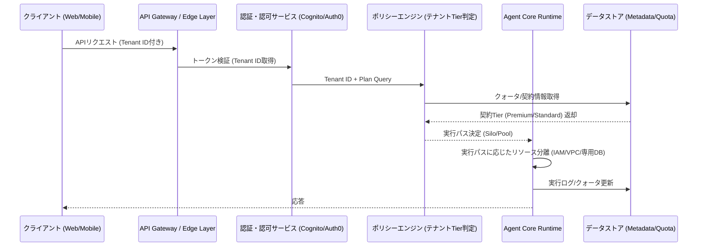
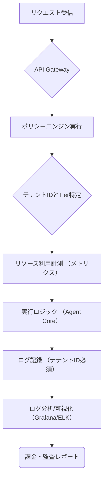

## 【プロが教える】SaaSでAI Agentを爆速立ち上げる！マルチテナント実装の最適解を徹底解説

正直、SaaSを開発しているエンジニアなら一度は「マルチテナンシー」という言葉に胃を痛めながら直面するはずですよね。特に最近のAI Agentのような、裏側で複雑な計算リソースを動かすサービスだと、単なる「ユーザー認証」の問題じゃ終わらないのが現実です。

「このリソース、どのテナントの分？」「テナントAが暴走したら、テナントBまで止まらないか？」

って、技術的な不安が頭を占めるんじゃないですか？ (´・ω・`)

ぶっちゃけ、単に「テナントごとに分離すれば安全」という安易な発想でアーキテクチャを組むと、かえって**コスト爆発**と**複雑性の増大**を招いて、事業が立ち行かなくなるパターンがめちゃくちゃ多い。

本記事では、実際にAI Agentのバックエンドを設計する立場から、一般的な「サイロモデル」と「プールモデル」の議論を超越した、**真に効率的で、かつセキュリティを担保できるマルチテナント設計の最適解**を、具体的なアーキテクチャとコード例を交えて解説します。

これを読めば、単なる知識ではなく、「明日、どのモデルを採用し、どこを強化すべきか」という判断軸が手に入るはずです。

---

## 1. そもそも「テナント分離」が難しい理由と、本記事で扱うべき視点

まず、この分野の議論の前提を整理しておきたいです。多くの記事は「サイロ（Silo）かプール（Pool）か」という二項対立で語りがちです。

> "本記事では、Amazon Bedrock AgentCore Runtime を題材に、サイロモデルとプールモデルの 2 ... "
>
> 出典: AWS Japan. "SaaS で AI Agent を提供するあなたへ贈る、Bedrock AgentCore マルチテナント実装 - Runtime 編"
> https://zenn.dev/aws_japan/articles/6640624910acc3
> (取得日: 2026年05月14日)

上記の通り、AI Agentのバックエンドにおけるマルチテナンシーの議論は、まさに「リソース分離」がキーワードです。しかし、この切り口だけでは、現代のクラウドネイティブなSaaSの課題を解決できません。

**筆者の意見**として、この議論が欠落している視点は以下の点に集約されます。

1. **コスト効率の視点:** 完全なサイロモデルは究極の分離を提供しますが、リソースのアイドル時間（空きリソース）を考えると、圧倒的にコスト効率が悪いです。
2. **機能分離の視点:** 単なるリソース分離ではなく、「課金単位での機能制限（Quota）」と「データアクセス制限」をどう分離するかが重要です。
3. **ハイブリッドな実用性の視点:** 理想論としての完全分離ではなく、テナントの**契約プランに応じた最適な分離レベル**を動的に切り替えるアプローチが必要です。

つまり、目指すべきは「サイロかプールか」ではなく、「**どのテナントにどのレベルの分離を適用するか**」という、柔軟なポリシーエンジンを構築することなんです。

## 2. 【構造分析】サイロとプールを超越した「階層型テナンシー」の設計思想

一般的に議論される二つのモデルは、それぞれ明確なメリットと致命的なデメリットを抱えています。

### 2.1. モデル比較表：単なる分類で終わらせない

| 特徴 | サイロモデル (Silo) | プールモデル (Pool) | 筆者が提唱する階層型 (Tiered) |
| :--- | :--- | :--- | :--- |
| **分離レベル** | 究極的（物理・論理） | 低〜中（論理のみ） | **可変的（契約ベース）** |
| **セキュリティ** | 最強。競合リスクゼロ。 | 最弱。サイドチャネル攻撃リスク。 | 契約レベルで制御。 |
| **コスト効率** | 最悪。リソースの遊休化大。 | 最良。リソースの集約利用。 | **最適。高額顧客に分離を、一般顧客にプールを適用。** |
| **実装難易度** | 中〜高（IaaSレベルの分離が必要） | 低（単なるDBのスキーマ分離で対応可） | **最高（ポリシーエンジン必須）** |
| **推奨ユースケース** | 金融、医療など規制が厳しいB2B。 | ユーザー数の多い、低コストなB2C。 | **ハイブリッドなB2B/B2C SaaS。** |

### 2.2. 階層型テナンシーの核心：ポリシーエンジンによる動的制御

私が最も重要だと考えるのは、この**「ポリシーエンジン」**の存在です。

「テナントAはエンタープライズ契約なので、専用のVPCと専用のAgent Coreを割り当てる（サイロ）。しかし、テナントBは標準契約なので、共通のリソースプールから、利用クォータを監視しながら利用させる（プール）。」

このように、テナントの契約レベル（Tier）をトリガーとして、バックエンドの実行環境（ランタイム）とデータアクセス権限を動的に切り替える仕組みこそが、現在のAI SaaSにおける理想的なマルチテナンシーだと断言します。

この実装を実現するために、単なるAWSのサービス組み合わせではなく、**「テナントIDを起点とした全リソースのガバナンスレイヤー」**を設ける必要があります。

## 3. 【実践】階層型テナンシーを実現するためのアーキテクチャ設計

では、具体的にどういうアーキテクチャになるのか。Mermaid記法を用いて、その構造を可視化します。

### 3.1. アーキテクチャ図：リクエストフローとポリシー適用

この図は、リクエストが来た際、まず「認証レイヤー」でテナントのTierを特定し、そのTierに基づいた「実行パス」を動的に振り分けるフローを示しています。



### 3.2. 実装ポイント①：実行コンテキストの分離（Silo化の実現）

Premium Tier（サイロが必要なテナント）の場合、単にデータベースを分離するだけでは不十分です。計算リソース（Agent Core Runtime）自体を分離する必要があります。

これは、AWSの**IAMロールとVPC**を駆使して、テナントごとに専用の実行環境を動的に立ち上げることを意味します。

**Python (Boto3) による動的ロール生成の概念コード例**

このコードは、テナントIDを受け取り、そのテナント専用のIAMロールと、それに紐づいた実行環境へのアクセスを担保する概念的な例です。

```python
import boto3
import uuid

def provision_silo_environment(tenant_id: str, region: str = "ap-northeast-1"):
    """
    テナントIDに基づき、専用のIAMロールとリソースをプロビジョニングする。
    """
    iam_client = boto3.client('iam', region_name=region)
    
    ### 1. テナント固有のロール名を作成
    role_name = f"silo-agent-role-{tenant_id}"
    
    try:
        ### 2. ロールが存在するか確認し、なければ作成
        iam_client.create_role(RoleName=role_name, AssumeRolePolicyDocument='{"Version":"2012-10-17","Statement":[]}')
        print(f"✅ ロール {role_name} を正常に作成しました。")
        
        ### 3. 必要なポリシー（S3アクセスなど）をアタッチする処理をここに追加
        
        return role_name
        
    except Exception as e:
        ## ロールが既に存在する場合のエラーハンドリング
        if "already exists" in str(e):
            print(f"⚠️ ロール {role_name} は既に存在します。再利用します。")
            return role_name
        else:
            ## その他の致命的なエラーハンドリング
            raise Exception(f"Silo環境のプロビジョニングに失敗: {e}")

## 実行例
## silo_id = provision_silo_environment("enterprise-client-xyz")
```

### 3.3. 実装ポイント②：クォータ管理とレートリミット（Poolモデルの制御）

Standard Tier（プールで十分なテナント）の場合、リソースの分離は不要ですが、**「公平な利用」**と**「不正利用の防止」**が最重要課題になります。

これを解決するのが、共通のキャッシュストア（Redisなど）に、テナントIDをキーとしたクォータカウンターを設け、すべてのリクエストの前にチェックを行うことです。

**TypeScript/JavaScript によるクォータチェックの概念コード例**

```typescript
/**
 * クォータチェックロジック：リクエスト前に実行されるべきゲートウェイ層の機能
 * @param tenantId 処理対象のテナントID
 * @param costUnit 1リクエストあたりのコスト単位 (例: 1.0)
 * @param limitKey Redisのクォータキー
 * @returns クォータが残っているか（boolean）
 */
async function checkQuota(tenantId: string, costUnit: number, limitKey: string): Promise<boolean> {
    const redisClient: any = {/* Redis接続クライアント */};

    try {
        // 1. 現在の利用残高を取得 (RedisのINCRBY/GETコマンドを想定)
        const currentUsage = await redisClient.get(`quota:${tenantId}:${limitKey}`);
        let currentCount = parseInt(currentUsage) || 0;

        // 2. 残高チェック
        if (currentCount + costUnit > 1000) { // 例: 最大1000リクエスト制限
            console.error(`[${tenantId}] クォータ超過。処理を拒否します。`);
            return false;
        }

        // 3. クォータを消費し、カウンターを更新
        await redisClient.incrBy(`quota:${tenantId}:${limitKey}`, costUnit);
        
        // 4. 有効期限を設定 (例: 1時間)
        await redisClient.expire(`quota:${tenantId}:${limitKey}`, 3600);
        
        console.log(`[${tenantId}] クォータ消費成功。残高: ${1000 - (currentCount + costUnit)}`);
        return true;

    } catch (error) {
        console.error("クォータチェック中にエラーが発生しました:", error);
        // エラー時は安全策としてアクセスを拒否するか、ログに記録する
        return false; 
    }
}

// 実行例:
// const isAllowed = await checkQuota("standard-client-abc", 1.0, "api_call");
```

## 4. 致命的な落とし穴：「データプレーン」と「コントロールプレーン」の分離認識のズレ

ここで、多くのエンジニアが陥りがちな、最も危険な落とし穴について指摘させてください。それは、**「リソースの分離」と「データの分離」を混同すること**です。

Bedrock AgentCoreのようなAIサービスを考える際、分離すべきは単なる「計算リソース（コントロールプレーン）」だけではありません。**「データプレーン」**、つまりAgentが参照するデータや、ユーザーの対話履歴が格納される場所の分離が決定的に重要です。

### 4.1. データ分離の三つのレイヤー

| レイヤー | 目的 | 採用すべき技術的アプローチ | リスク（分離しない場合） |
| :--- | :--- | :--- | :--- |
| **1. 認証データ** | 誰が利用しているか（テナントID） | Cognito, Auth0など標準のIAM。**これが基点。** | 悪意のあるテナントによるID盗用。 |
| **2. メタデータ** | クォータ、プラン、設定情報 | 専用のDBスキーマ、または専用のテーブルパーティション。 | 他テナントの設定値の上書き。 |
| **3. ペイロードデータ** | 対話履歴、参照ドキュメントなど | **必須：テナントIDを全てのテーブルの主キー/インデックスに埋め込む。** | データ漏洩（最も致命的）。 |

**筆者の意見**：単にテナントIDをDBの`WHERE`句に入れるだけでは不十分です。アプリケーションコードのあらゆる箇所で、このテナントIDを**強制的に付与し、クエリのWHERE句に組み込む**という、防御的なコーディングが必須です。

### 4.2. Observabilityによる「テナントの可視化」こそが最後の砦

どんなに完璧な分離ロジックを書いても、実行環境は必ずバグを抱えます。特にマルチテナント環境では、**「どのテナントが、いつ、どれだけのリソースを消費したか」**を秒単位で追跡することが、インシデント対応と課金の両面で絶対不可欠です。

これを実現するのが、高度なロギングとメトリクス収集です。

**Mermaidによるログ追跡フローの概念図**



## 5. まとめ：AI SaaS開発者が次に取るべきアクション

「サイロかプールか」という二元論に囚われる必要はありません。重要なのは、**「テナントの契約レベルに応じた動的な分離ポリシー（Tiered Tenancy）」**を導入し、それをポリシーエンジンで管理することです。

そして、このシステム全体を支えるのが、単なる認証ではなく、**「テナントIDを起点とした全リソースのガバナンス（クォータ、IAM、DBクエリ）」**です。

明日から取り組むべき具体的なステップは以下の通りです。

1. **リファクタリングの優先順位付け:** まず、現在のサービスで最も機密性の高いデータ（ペイロードデータ）が格納されているテーブルを見つけ出し、すべてのクエリにテナントIDのフィルタリングが強制されているかコードレビューを行う。
2. **クォータ管理レイヤーの追加:** Redisなどを利用したクォータチェックを、API Gatewayの最も外側（最も早い段階）に組み込む。
3. **コスト分析の徹底:** どの機能が最もコストを食っているのかをログレベルで詳細に追跡し、そこから「標準プランではこの機能は制限すべき」というビジネス的な判断を下す。

この「防御的な設計」こそが、AI SaaSをスケールさせ、収益化するための唯一の道筋だと、筆者は強く断言します。

---

## 参考文献

*   AWS Japan. "SaaS で AI Agent を提供するあなたへ贈る、Bedrock AgentCore マルチテナント実装 - Runtime 編"
    https://zenn.dev/aws_japan/articles/6640624910acc3
    (取得日: 2026年05月14日)

<!-- AFFILIATE_SECTION -->
## 関連リンク

- [SkillHacks - プログラミングスクール](https://px.a8.net/svt/ejp?a8mat=4B1H1P+97114I+4K3S+5YJRM) - 独学で挫折した人向け実践型スクール
- [技術書](https://www.amazon.co.jp/s?k=Python+実践&tag=satoarata-22) - Amazonで技術書をチェック

---
※一部にPRを含みます。
