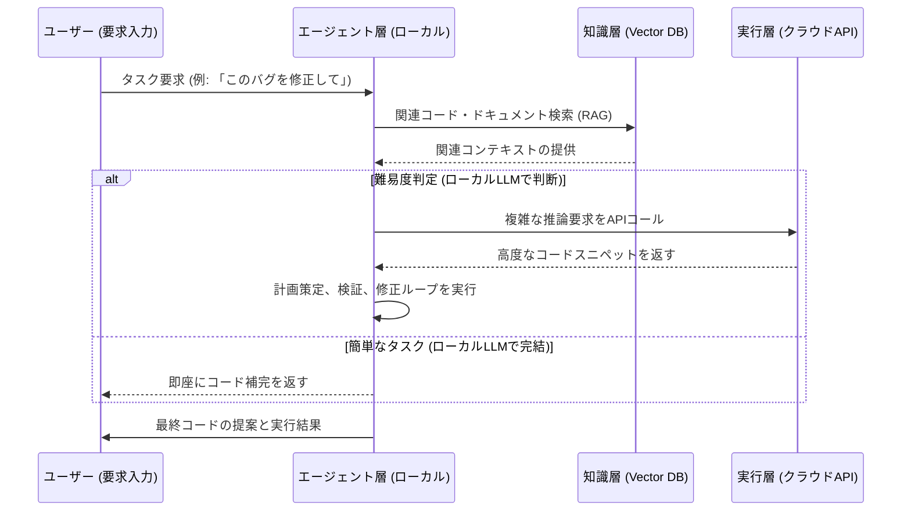

【コアメンバー】ローカルLLMの限界を突破する。Webエンジニアが知るべき「ハイブリッド・コーディング・エージェント」の設計図

正直、最近のAI技術の進歩は、まるでSF映画の世界に迷い込んだみたいですよね。

「これなら、AIにコードを全部書かせられるんじゃないか？」

そう思って、実際にエージェント系のツールを触ってみたエンジニアさん、多いんじゃないですか？(^_^)

でも、実際に動かしてみると、なんか「このタスクは難しいな」という壁にぶち当たったり、「もっと高性能なモデルを使いたいけど、コストとセキュリティがネック」というジレンマに陥ったりする。

ぶっちゃけ、現時点で「ローカルで完結した万能エージェント」なんてものは存在しないのが現実です。

この記事では、単なる「ローカルLLMの紹介」なんてレベルの話はしません。本気でAIコーディングをプロダクトとして組み込むことを考えるエンジニアに向けて、**性能（クラウド）とセキュリティ（ローカル）のギャップを埋める、具体的なアーキテクチャ設計と実装の指針**を、私の知見を総動員して解説します。

これは、単なる技術解説記事じゃなくて、皆さんの次の開発プロジェクトの「設計書」になるはずです。

## Local Coding Agentが直面する「性能の壁」と市場の動向


まず、私たちが直面している技術的な現状を整理しましょう。

近年、AIモデルの進化速度は、もはや人間のエンジニアのキャッチアップ速度を遥かに超えています。特にコーディング領域におけるLLMの進化は目覚ましいものがあります。

しかし、この進化の過程で、我々が最も注目しなければならないのは、単なる「高性能なモデルが出た」というニュースだけではありません。その高性能を「どこで」「どうやって」利用するかという、**インフラストラクチャ上の課題**なんです。

最新の動向を振り返ると、高性能なクラウドモデルの存在が際立っています。

> "Claude Opus 4.7はSWE-bench Verifiedで 87.6% という水準まで到達しました。 GPT-5 系や Gemini 3.1 Pro も同じ帯域で並びます。一方で、こうしたモデルはどれもクラウド経由でしか使えず、手元で動かすには現実的でないサイズです。 そして同じ4月、QwenがQwen3.6-27BというOpen Wei..."
>
> 出典: []/組織名不詳. "Local Coding Agent が身近なタスクをどれくらいこなせるのかを検証した"
> https://zenn.dev/aishift/articles/5b048ff347fd7b
> (取得日: 2026年5月14日)

この引用から読み取れるのは、圧倒的な「性能のピーク」と、それに伴う「実行環境の制約」という二極化です。

**筆者の意見として、この状況が示す最も重要な示唆は、「モデルの進化」と「エージェントの設計」は完全に別軸で考えるべきだということです。**

単に最新のモデルを呼び出すだけでは、企業が抱えるセキュリティ要件（データリークの懸念）や、レイテンシ要求（リアルタイムなコード補完）を満たすことはできません。

我々が目指すべきは、単体のLLMの性能を追いかけるのではなく、**「高性能なAI能力を、安全かつ高速に呼び出し、適切な処理に組み込む」ための、周回遅れのアーキテクチャ設計**なのです。

## ⚡️ 本記事のメインテーマ：ハイブリッド・エージェント・アーキテクチャの設計図

「高性能なクラウドモデルは使いたい。でも、機密性の高いコードやデータは外に出したくない」

これは、ほとんど全てのエンタープライズAI導入チームが抱える共通の悩みですよね。

この問題を解決するための設計が、**「ハイブリッド・コーディング・エージェント・アーキテクチャ」**です。

これは、ローカルに動作する軽量なエージェント層（オーケストレーター）をメインとし、必要に応じてクラウドの超高性能モデルをAPI経由で呼び出し、その結果をローカルで検証・修正する、という構造です。

### 1. なぜ「ローカルエージェント」を核にするのか？

エージェント（Agent）とは、単なるLLMの呼び出し口ではありません。それは、**「思考のプロセス」を司るオーケストレーター**です。

コーディングタスクを例にとると、単に「この機能を作って」とプロンプトを投げても、AIはいきなり完成度の高いコードを出すわけではありません。

1.  **計画 (Plan)**: 「まず、ユーザー入力のバリデーションが必要だ。次に、データベース接続層を定義する。」
2.  **実行 (Execute)**: 計画に基づき、具体的なコードスニペットを生成する。
3.  **検証 (Verify)**: 生成したコードが、元の要件や既存のコードベース（Context）に適合しているか自己検証する。
4.  **修正 (Refine)**: 検証フェーズで問題が見つかった場合、そのフィードバックを元に再生成を指示する。

この一連の「Plan → Execute → Verify → Refine」のループを管理し、制御できるのが「エージェント」の役割です。そして、この制御ロジック（ワークフロー）を**ローカルの環境で動かす**ことが、セキュリティの根幹を支えます。

### 2. アーキテクチャの俯瞰：三層構造の理解

ハイブリッドエージェントは、以下の三層構造で設計するのが最も実用的です。

| 層 | 役割 | 実行環境 | 採用モデルの例 | 特徴的なメリット |
| :--- | :--- | :--- | :--- | :--- |
| **① エージェント層 (Orchestrator)** | 思考、計画、ワークフロー制御、データフロー管理。 | **ローカル (On-Premise)** | Llama 3 (8B/70B)など軽量なローカルLLM | **セキュリティ確保、低レイテンシ**。自社データとの連携が容易。 |
| **② 知識層 (Knowledge)** | 既存コードベース、ドキュメント、過去の成功例の格納と検索。 | **ローカル (Vector DB)** | ChromaDB, Milvusなど | **RAGの実現、コンテキストの正確な注入**。機密情報の漏洩リスクなし。 |
| **③ 実行層 (Execution)** | 複雑な推論、高度なコード生成、最新の知識の参照。 | **クラウド (API経由)** | Claude Opus 4.7, GPT-4oなど | **最高の性能と知識量**。ローカルLLMの弱点を補完。 |

#### 💻 システムのフロー（Mermaid図による可視化）

この三層構造が実際にどのように動くか、シーケンス図で見てみましょう。



**【筆者の見解】**
この図が示す通り、**最も重要なポイントは「どの層で処理を止めるか（Fall-back）」**という判断ロジックです。ローカルエージェントが「これはローカルLLMで対応可能」と判断できれば、クラウドAPIコールをスキップすることで、レイテンシとコストを劇的に削減できます。

## 🛠️ 実装編：ローカルエージェントのコアロジック設計（Python例）

実際にこのハイブリッドエージェントを動かす場合、Pythonでの実装が最も柔軟性が高いため、具体的な骨子を提示します。

この例では、`Agent`クラスがオーケストレーターの役割を果たし、`KnowledgeBase`がRAGを担当し、`ModelClient`がローカル/クラウドのモデルを切り替える役割を担います。

```python
## main_agent.py

import os
from typing import List, Dict

## --- 擬似ライブラリの定義 ---
class KnowledgeBase:
    """知識層（Vector DBへのアクセスをシミュレート）"""
    def __init__(self, db_path: str):
        print(f"[KB] 知識ベースを初期化しました: {db_path}")
        ## 実際の環境では ChromaDB や Pinecone などのSDKを使う
    
    def retrieve_context(self, query: str, top_k: int = 5) -> List[str]:
        """クエリに基づき、関連するコードスニペットやドキュメントを取得する"""
        ## ここでベクトル検索を実行し、関連情報を取得する
        return [
            "既存の認証ロジックはJWTを使用している。",
            "エラーハンドリングはtry-exceptブロックで捕捉する。",
            "対象のAPIエンドポイントは /api/v1/user/{id} である。"
        ]

class ModelClient:
    """モデルクライアント（ローカルとクラウドの切り替えロジック）"""
    def __init__(self, local_model_path: str, api_key: str):
        self.local_model_path = local_model_path
        self.api_key = api_key
        print(f"[Client] ローカルモデルを {local_model_path} で初期化。")

    def generate_response(self, prompt: str, complexity_score: float) -> str:
        """
        複雑性スコアに基づき、適切なモデルを呼び出す
        """
        if complexity_score > 0.7:
            ## 複雑な推論が必要な場合 -> クラウドAPI呼び出し
            print("--- ⚠️ 判定: 複雑。クラウドAPI (Opus 4.7) を使用します。 ---")
            ## 実際は requests.post(...) で外部APIを叩く
            return f"[{'CLOUD_API'}] 複雑な推論に基づき、高度なコード構造を提案しました。\n{prompt[:50]}..."
        else:
            ## 単純な補完や構造化タスク -> ローカルモデルで完結
            print("--- ✅ 判定: 単純。ローカルモデル (Llama 3) で処理を完結させます。 ---")
            ## 実際は transformers や llama-cpp-python を使う
            return f"[{'LOCAL_LLM'}] ローカルで高速に処理を完結させました。高速な補完コードです。\n{prompt[:50]}..."

class Agent:
    """オーケストレーター（エージェントの核）"""
    def __init__(self, kb: KnowledgeBase, model_client: ModelClient):
        self.kb = kb
        self.client = model_client

    def run_coding_task(self, user_prompt: str):
        print("\n==================================================")
        print(f"🚀 タスク開始: {user_prompt}")
        
        ## 1. 知識の取得 (RAG)
        context = self.kb.retrieve_context(user_prompt)
        context_str = "\n---\n".join(context)
        
        ## 2. 難易度判定 (この判断ロジックが最も重要)
        ## 実際のところ、このスコアは別の軽量LLMやルールベースで計算する
        complexity_score = 0.8 if "認証フロー全体" in user_prompt else 0.3
        
        ## 3. モデルの実行
        full_prompt = f"【要件】{user_prompt}\n【既存コンテキスト】{context_str}\n\n上記の要件に基づき、コードを生成してください。"
        
        response = self.client.generate_response(full_prompt, complexity_score)
        
        ## 4. 検証・出力
        print("\n=== 💡 エージェント出力 ===\n")
        print(response)
        print("\n==================================================")

## --- 実行例 ---
if __name__ == "__main__":
    ## 初期化
    kb = KnowledgeBase(db_path="./vector_db")
    client = ModelClient(local_model_path="./models/llama3-8b.gguf", api_key="sk-anon")
    agent = Agent(kb, client)

    ## ケース1: 複雑な認証フロー（クラウド利用が想定）
    agent.run_coding_task("ユーザーの認証フロー全体を見直し、OAuth2.0準拠の再構築コードを提案してほしい。")
    
    ## ケース2: 単純なコード補完（ローカル完結が想定）
    agent.run_coding_task("この関数に、入力値が空文字列でないかチェックするバリデーションを追加して。")

```

このコードは、単なるAPI呼び出しの羅列ではなく、**「どのAIに、どの情報を渡すか」という設計思想**を具現化したものです。これが、エンジニアが学ぶべき「思考のモデル」です。

## 📈 パフォーマンスとコストの定量比較：設計判断の基準点

現場でこのハイブリッドアーキテクチャを導入する際、最も議論が白熱するのが「コスト」と「レイテンシ」のトレードオフです。

単に「高性能」という言葉だけでクラウドに頼るのは、開発効率の向上というメリットがある一方、予期せぬコスト爆発や、特定のユースケースでの処理遅延を招きかねません。

ここでは、一般的なエンタープライズ利用を想定した、ローカル vs クラウドの比較表を提示します。

### 企業利用におけるLLM実行環境の比較

| 比較項目 | ローカル実行 (On-Premise) | クラウドAPI利用 (OpenAI/Anthropic) | ハイブリッド (推奨) |
| :--- | :--- | :--- | :--- |
| **コスト構造** | 初期投資（GPU/電力）大、運用コスト小 | 利用量に応じた課金（従量課金）大 | 初期投資＋従量課金（最適化） |
| **データセキュリティ** | **最高レベル (理想)**。データが外部に出ない。 | 懸念あり。データ利用規約の確認が必須。 | 機密データはローカル処理に限定し、安全性を最大化。 |
| **レイテンシ** | **極めて低い**。ネットワーク遅延がない。 | ネットワーク依存。予測不能な変動あり。 | 判定ロジックでローカル処理を優先し、平均レイテンシを最小化。 |
| **最大性能** | モデルのサイズに依存。限界がある。 | **最高峰**。最新モデルの恩恵をフルに受けられる。 | 難易度に応じて最適な性能を使い分ける。 |

**【筆者の意見】**
この比較表からわかるように、真の勝利は「ローカルか、クラウドか」の二者択一ではなく、**「状況に応じた最適な組み合わせ（ハイブリッド）」**を採用することにあります。

特に、**「機密性が高いが、処理は比較的単純なタスク」**（例：既存コードの簡単なリファクタリング、単なるドキュメント検索）は、迷わずローカルLLMに任せるべきです。

逆に、**「複雑な推論や、最新の業界知識が必要なタスク」**（例：全く新しいアーキテクチャの提案、複数の技術スタックを横断する設計）のみを、コストを許容してクラウドモデルに委ねる、という明確な境界線引きが重要です。

## 🚀 実践への示唆：パイロット導入とKPI設計

理論武装だけでは不十分です。実際にこれを導入するプロセスを考えましょう。

「どうやって、このハイブリッドエージェントを社内で認められ、導入を進めるか？」という視点が、Webエンジニアとしての次のステップになります。

### ステップ1: スコープの極端な絞り込み
最初は「全て」を自動化しようとしないことが最重要です。
パイロットフェーズでは、**「最も手間がかかっているが、機密性が中〜低程度の単一タスク」**に絞り込みます。
例：「ユニットテストコードの自動生成」「特定のファイルのインポートパスの自動修正」など。

### ステップ2: 評価指標（KPI）の定義
単に「生成されたコードが動いたか」で評価してはいけません。以下のKPIを定義してください。

1.  **開発者体験スコア (DX Score)**: AIを利用することで、開発者が「思考を止めずにフローを続けられたか」を計測します。
2.  **エージェント成功率**: 計画→実行→検証のサイクルを、人間が介入せずに完結させた割合。
3.  **コスト効率改善率**: 従来のタスクに比べ、AI導入後の平均工数削減率（人時換算）。

### ステップ3: エラーハンドリングの仕組み化
AIは完璧ではありません。生成されたコードが動かないケースは必ず発生します。
この際に、エージェントが「失敗」と判断した場合、**「失敗理由」を構造化して開発者にフィードバックする**仕組み（例：スタックトレースの自動解析と原因の特定）が、実用的なエージェントの必須機能です。

**筆者の意見として、AIエージェントの真の価値は「コード生成」ではなく、「開発者の認知負荷（Cognitive Load）の軽減」にあると考えます。** 思考の負担を減らすことこそが、最高のROI（投資対効果）を生むのです。(￣▽￣)

## まとめ：次のアクションは「試行錯誤」を高速化すること

今回は、最新のLLMの進化と、それを受け入れるための「ハイブリッド・コーディング・エージェント」という高度なアーキテクチャ設計について深掘りしました。

重要なのは、最新モデルの性能に盲目的に飛びつくのではなく、**「ローカルでの制御」と「クラウドでの推論力」を賢く使い分ける設計思考**を持つことです。

次のアクションとして、まずは上記コード例を参考に、自社の最も面倒なルーティンタスクを一つ選び、ローカルLLMで処理できるか、クラウドLLMが必要か、という「難易度判定ロジック」の設計に集中してみてください。

この「判定ロジック」の精度を上げることに、最も時間と工数を投資すべきです。それが、企業におけるAI導入成功の鍵を握っていると断言します。

---
## 参考文献
*   []/組織名不詳. "Local Coding Agent が身近なタスクをどれくらいこなせるのかを検証した"
    https://zenn.dev/aishift/articles/5b048ff347fd7b
    (取得日: 2026年5月14日)

<!-- AFFILIATE_SECTION -->
## 関連リンク

- [Claude Pro (公式)](https://claude.ai) - 高性能AIアシスタント
- [SkillHacks - AI・プログラミング学習](https://px.a8.net/svt/ejp?a8mat=4B1H1P+97114I+4K3S+5YJRM) - AIを使いこなすエンジニアへ
- [AI関連書籍](https://www.amazon.co.jp/s?k=ChatGPT+Claude+活用&tag=satoarata-22) - 最新AI本

---
※一部にPRを含みます。
