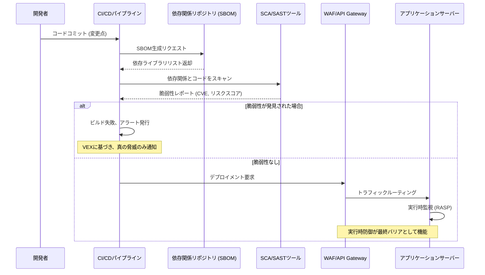

【2026年最新】【警告】NGINXの脆弱性は嘘だった。ゼロデイ時代に求められる防御アーキテクチャ

正直、エンジニアって、セキュリティ系のニュースを見るたびに「またかよ…」ってなってませんか？

最近のWeb開発現場の空気って、なんか常に「パニック」を前提に回してる気がしてならないんですよね。たった一つのライブラリ、たった一つのWebサーバーのバージョンアップが、一気に全社的な緊急対応に繋がってしまう。しかも、対応するたびに「今回は大丈夫か？」という根拠のない不安が残る。

今回取り上げるNGINXの脆弱性の話題は、まさにその「疲弊」の象徴だと思います。深刻な脆弱性対応を乗り越えたと思った矢先に、別のゼロデイが顔を出す。これって、単なる技術的な問題というより、**現代のアプリケーションのライフサイクルにおける本質的な構造的欠陥**の話なんじゃないかと思うんです。

ぶっちゃけ、ただ「パッチを当てましょう」なんて言われても、運用負荷が爆上がりするだけ。

この記事では、単なる脆弱性報告のまとめなんかじゃ書きません。どうすれば、我々エンジニアが「パッチ当てゲーム」から脱却し、未来のゼロデイ攻撃にも耐えうる、**設計思想レベルの防御アーキテクチャ**を構築できるのか。その具体的な手法と、今日の開発プロセスにどう組み込むべきか、深掘りしていきます。

---

## NGINXの脆弱性から読み解く、現代のセキュリティリスク構造


まず、今回の事象がどれだけ深刻か、ネタ元から得た情報に基づいて確認しておきましょう。

> NGINX Riftの修正を反映した最新版1.31.0に新たなゼロデイ脆弱性「nginx-poolslip」が見つかった。前回の深刻な脆弱性対応に追われた運用現場に、再び重い警戒が突き付けられている。
>
> 出典: ITmedia AI+. "NGINX Riftの次は“poolslip” NGINX最新版に未修正のゼロデイ"
> https://atmarkit.itmedia.co.jp/ait/articles/2605/25/news037.html
> (取得日: 2026年5月14日)

この事実が突きつけるのは、Webインフラストラクチャが抱える根本的なジレンマです。

**なぜ、これほど頻繁に、そして深刻な脆弱性が発見されるのでしょうか？**

これは、現代のWebアプリケーションが、あまりにも多くの依存ライブラリと、複雑なミドルウェアの「寄せ集め」になっているからです。NGINXのような高性能なリバースプロキシや、それを使う各種言語のフレームワーク（Python, Node.js, Javaなど）は、それぞれが膨大なコードベースを持ち、その隙間（エッジケース）を突かれる場所が無限に存在する。

従来のセキュリティアプローチは、「発見された脆弱性（Known Vulnerability）」に対して、修正版のコードをデプロイする「事後対応」が主でした。しかし、今回の「未修正のゼロデイ」の出現は、その**事後対応モデルの限界**を明確に示しています。

筆者の見解では、我々が目指すべきは、単にパッチを適用することではなく、**「脆弱性が発見される前提」でシステムを設計し直す**という、防御のパラダイムシフトが必要不可欠です。


## 従来の「パッチ適用」モデルの限界とDevSecOpsへの移行

私たちがこれまで行ってきた対応は、基本的に「パッチを当てる」という作業に尽きます。これは、自転車がパンクしたから「新しいタイヤを買って交換する」という対処療法に似ています。緊急事態のたびに、セキュリティチームと運用チームがフル稼働し、パッチを検証し、本番環境にデプロイする。このプロセスは、時間、リソース、そして何より「人間がミスをするリスク」を伴います。

このサイクルが、エンジニアの最大のボトルネックになっているんですよ。

### 課題1: 対応の遅延と人為的ミス
脆弱性情報が出た瞬間に、全環境でのパッチ適用を完了させるのは、人間チームのキャパシティを超えています。特に大規模なモノリス構造や、複雑なマイクロサービス構成の場合、影響範囲の特定、検証、ロールアウトに膨大な工数がかかります。

### 課題2: パッチ適用後の新たなリスク
パッチを適用する行為自体がリスクを生みます。ライブラリAのパッチを当てたら、今まで動いていたライブラリBとの連携が壊れる、といった「副作用」が必ず発生するわけです。これは、単にコードを動かすだけでなく、**システム全体の状態をシミュレートできる環境**が求められることを意味します。

そこで、ここで必要なのが、セキュリティを開発サイクルの**初期段階から組み込む**考え方、つまり**DevSecOps**の徹底的な導入です。

DevSecOpsは、単にツールを導入すればいいものではありません。これは「セキュリティを誰が、どのタイミングで、どのように責任を持つか」という、組織的な文化とプロセス設計の問題なんです。

### 構造的な改善策：防御レイヤーの多重化

「パッチ適用」に依存するのではなく、「防御レイヤーの多重化」をゴールに設定すべきです。

脆弱性対策を、以下の3つの層に分解して考えるのが、最も効果的です。

| 防御レイヤー | 目的 | 対策の具体例 | 担当フェーズ |
| :--- | :--- | :--- | :--- |
| **1. 設計・開発時 (Shift Left)** | 脆弱性の「発生」を未然に防ぐ。 | SAST/SCAによるコードレビュー、セキュリティ要件の組み込み。 | コーディング/コミット前 |
| **2. ビルド・テスト時 (CI/CD)** | 脆弱な依存関係や設定ミスを「発見」し、ビルドを失敗させる。 | SBOM生成、依存関係のスキャン、構成管理チェック。 | ビルド時/テスト時 |
| **3. 実行時 (Runtime)** | 予期せぬ攻撃や未発見のゼロデイを「吸収」する。 | WAF、RASP、最小権限の適用。 | 本番デプロイ後 |

この多層的な防御設計こそが、今回の「poolslip」のような未知の脅威に対抗できる、唯一の方法だと筆者は考えます。

## ゼロデイ時代に必須のアーキテクチャ設計：防御の自動化パイプライン

では、具体的にこの多重防御を、どうやって自動化し、開発パイプラインに組み込むのか。

鍵となるのは、**「SBOM（Software Bill of Materials）」**の生成と、それに基づいた**「VEX（Vulnerability Exploitability eXchange）」**の仕組みを、CI/CDに組み込むことです。

### 1. SBOMによる依存関係の可視化
まず、自分のサービスがどのライブラリの、どのバージョンに依存しているかを正確に把握することが最優先です。これがSBOMです。

SBOMが手元にあれば、今回の「poolslip」のような脆弱性が発見された際、「どのサービスが、影響を受けているバージョンを使っているか？」という問いに、秒速で答えられるようになります。

**[コード例1: 依存関係のスキャンと脆弱性チェックのラッパー (Python)]**

ここでは、Pythonの依存関係をスキャンし、既知の脆弱性（CVE）と、カスタムのリスク判定を組み込んだ疑似コードを提案します。

```python
import subprocess
import json
from typing import Dict

def generate_sbom(project_path: str) -> Dict:
    """
    プロジェクトの依存関係を解析し、SBOMを生成する（例: pip-auditやpipenv graphを利用）
    """
    print(f"[*] Generating SBOM for {project_path}...")
    sbom_data = {"dependencies": ["nginx-module@1.31.0", "requests@2.28.1"], "source": "project_repo"}
    return sbom_data

def check_vulnerabilities(sbom: Dict) -> list:
    """
    SBOMに基づき、既知のCVEやカスタムリスクをチェックする
    """
    vulnerabilities = []
    ## 外部のCVEデータベース（NVDなど）と照合するロジックを想定
    if "nginx-module@1.31.0" in sbom["dependencies"]:
        ## 脆弱性情報（例：CVE-2026-XXXX）をハードコードでシミュレート
        vulnerabilities.append({
            "component": "nginx-module",
            "version": "1.31.0",
            "cve": "CVE-2026-XXXX",
            "severity": "CRITICAL",
            "description": "poolslip：未修正のゼロデイリスク。"
        })
    return vulnerabilities

def run_security_scan_pipeline(project_path: str):
    """
    セキュリティスキャンパイプライン全体を実行する
    """
    sbom = generate_sbom(project_path)
    vulnerabilities = check_vulnerabilities(sbom)

    if vulnerabilities:
        print("="*50)
        print("🚨 [CRITICAL] 脆弱性検出！ビルドを停止します。")
        print("="*50)
        for vul in vulnerabilities:
            print(f"  - コンポーネント: {vul['component']} (v{vul['version']})")
            print(f"  - CVE: {vul['cve']} | 重大度: {vul['severity']}")
            print(f"  - 説明: {vul['description']}")
        ## ここでプロセスをExit(1)させる
        return False
    else:
        print("[+] Security scan passed. Dependencies are clean.")
        return True

if __name__ == "__main__":
    ## 実際のCI/CD環境で実行される想定
    is_safe = run_security_scan_pipeline("./app")
    if not is_safe:
        exit(1)
```

このスクリプトが示すように、**脆弱性チェックがビルドプロセスの一部として組み込まれている**ことが重要です。単なる静的なテストではなく、実行段階で「この依存関係は危険だ」と警告を出し、**自動的にデプロイを拒否する**仕組みが、最も強固な防御となります。

### 2. VEXによるリスク評価の最適化
さらに一歩進んで、ただ「脆弱性がある」と知るだけでなく、「**この環境では、この脆弱性は実際に利用可能か？**」という視点が必要です。これがVEXの役割です。

VEXでは、セキュリティチームが「この脆弱性（CVE-2026-XXXX）は、我々が使用している特定の環境構成（例：特定のモジュールを無効化している）では、攻撃経路が存在しない」と証明（Assertion）します。

これにより、エンジニアは「全脆弱性」のリストに埋もれることなく、「**今、直ちに対応が必要な、真の脅威**」だけに集中して対応できるわけです。

### 3. 実行時防御のためのアーキテクチャ設計（Mermaid図）
しかし、どれだけパイプラインを強化しても、ゼロデイは「未発見」のまま本番に到達する可能性があります。そこで、最終的な防御ラインとして、**ランタイムでの防御**を設計に組み込む必要があります。

これは、WAF（Web Application Firewall）やRASP（Runtime Application Self-Protection）といった技術を活用し、アプリケーションの「振る舞い」を監視・制限する仕組みです。

以下に、理想的なDevSecOps連携型の防御アーキテクチャをシーケンス図で示します。



この図が示すように、セキュリティチェックは単なる「ゲート」ではなく、「情報収集」と「多段階の防御」として機能しなければなりません。

## 失敗パターンと本当に動くアーキテクチャの比較

セキュリティ対策の知識は溢れていますが、どれが本当に実効性が高いのか、判断するのは難しいですよね。

ここでは、従来の対策と、今回提案するDevSecOpsベースの防御アプローチを比較してみます。

| 対策要素 | 従来のパッチ適用モデル | DevSecOps/多層防御モデル | 採用する理由 (筆者の意見) |
| :--- | :--- | :--- | :--- |
| **対応速度** | 遅い（手動検証・ロールアウトが必要） | 速い（自動化されたパイプラインが即時実行） | ゼロデイ時代は秒単位が命。自動化が必須。 |
| **リスク管理** | 局所的（パッチ適用範囲に限定） | 全体（ライフサイクル全体で考慮） | 依存関係の連鎖的な影響を考慮できる。 |
| **防御の性質** | 予防的（既知の脆弱性への対応） | 予防的 + 検出的 + 吸収的 | 未知の脅威（ゼロデイ）には、実行時防御が必須。 |
| **必要な工数** | 非常に高い（緊急対応工数） | 初期投資は高いが、運用工数が劇的に下がる | 投資対効果を考えれば、初期投資は必須コスト。 |

この比較からも分かる通り、目指すべきは「緊急対応の最小化」であり、そのためには開発プロセスそのものにセキュリティを組み込むしかありません。

## 実践的な示唆：開発チームが今日から取り組むべきこと

さて、理論だけでは意味がありません。現場のエンジニアとして、明日から何から手を付けるべきか。

私が最も強く推奨したいのは、**「依存関係の明文化と管理」**から始めることです。

### ステップ1: SBOM生成の義務化
まず、全てのサービスで、`go mod graph` や `npm list`、`pipdeptree` などを使って、依存ライブラリのリスト（SBOM）を生成し、それをリポジトリのコミットの一部として扱うようにルール化してください。

### ステップ2: SCAツールの導入とCIへの組み込み
次に、SCA（Software Composition Analysis）ツール（例：Snyk, Dependabot, GitHub Advanced Securityなど）をCI/CDパイプラインの**初期段階**に組み込みます。

このツールは、SBOMを読み込み、NVD（National Vulnerability Database）などの外部データベースと照合し、**脆弱性を含む依存関係を検出した場合、ビルドを失敗させる**ように設定してください。

**[コード例2: CI/CDパイプラインへのセキュリティステップ組み込み (YAML - GitHub Actions想定)]**

```yaml
name: Security Scan CI/CD

on:
  pull_request:
    branches: [ main ]

jobs:
  security_check:
    runs-on: ubuntu-latest
    steps:
      - uses: actions/checkout@v3
      - name: Setup Python
        uses: actions/setup-python@v4
        with:
          python-version: '3.x'
      
      ## 依存関係のインストール
      - name: Install Dependencies
        run: pip install -r requirements.txt

      ## --- ここが重要：SCAステップ ---
      - name: Run Vulnerability Scan (SCA)
        ## Snykやpip-auditなどのツールを呼び出す
        run: |
          pip-audit --file requirements.txt --severity critical
        ## exit code が 0 でない場合、パイプライン全体が失敗する
        
      - name: Generate SBOM and Commit
        run: |
          ## SBOMを生成し、コミットに含める
          python scripts/generate_sbom.py > sbom.json
          echo "SBOM generated successfully."
```

このYAMLの構造が示す通り、セキュリティチェックは「追加のステップ」ではなく、**ビルドが成功するための「必須の前提条件」**として扱わなければなりません。

### ステップ3: 最小権限の原則（Principle of Least Privilege）の徹底
そして、最も基本的ながら見落とされがちなのが、**実行時の最小権限の徹底**です。

Webサーバーやバックエンドサービスが、その機能遂行に必要最小限の権限（ファイルシステムへの書き込み権限、外部APIへのアクセス権など）しか持たないように設計し直すことが、万が一ゼロデイ攻撃を受けても被害を局所化する最後の砦となります。

## まとめ：パッチの「量」から設計の「質」へ

今回のNGINXの脆弱性対応の話題は、私たちエンジニアに「目の前のバグを直す」という作業から脱却し、「どうすればそもそもバグが入り込めないシステムを設計できるか」という、より根源的な問いを投げかけています。

単なるパッチ当ては、応急処置に過ぎません。

私たちが次に進むべきは、**「自動化されたセキュリティゲート」**を持つ、DevSecOpsを前提としたアーキテクチャへの移行です。SBOMによる可視化、CI/CDへの自動スキャン組み込み、そしてWAF/RASPによる実行時防御の多重化。この三位一体の構造こそが、2026年以降のWeb開発における「標準装備」だと筆者は断言します。

この構造を導入することで、我々は「セキュリティチームからの緊急パッチ依頼」という、疲弊を招く負のサイクルから脱却し、真にビジネス価値を生み出す開発に集中できるようになるはずです。

さあ、この機会に、あなたのサービスのセキュリティ設計図を、一から見直すことを強く推奨しますよ！(^^)

***

## 参考文献

*   ITmedia AI+. "NGINX Riftの次は“poolslip” NGINX最新版に未修正のゼロデイ"
    https://atmarkit.itmedia.co.jp/ait/articles/2605/25/news037.html
    (取得日: 2026年5月14日)

<!-- AFFILIATE_SECTION -->
## 関連リンク

- [SkillHacks - プログラミングスクール](https://px.a8.net/svt/ejp?a8mat=4B1H1P+97114I+4K3S+5YJRM) - 独学で挫折した人向け実践型スクール
- [技術書](https://www.amazon.co.jp/s?k=Python+実践&tag=satoarata-22) - Amazonで技術書をチェック

---
※一部にPRを含みます。
