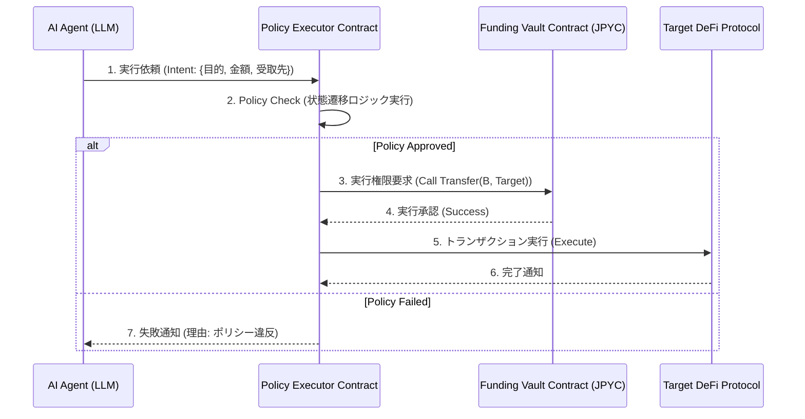

【2026年最新】【永久保存版】AIエージェントがDeFiで動く「支出ポリシー」の実装：EIP-3009の限界とアーキテクチャ設計

僕は、最近AIエージェントとWeb3のインターフェースについて、めちゃくちゃ深い課題に直面しました。

「AIが賢くなったから、あとはスマートコントラクトに送金するだけ」――そう思って実装を始めたものの、実際にコードを動かし、金融ロジックを組み込む段階で、**「ただ送る」だけでは絶対にダメだ**という、根本的な設計の壁にぶち当たったんです。

みなさん、AIエージェントが自律的に資金を動かす仕組みを組もうとすると、単なる「送金API」の呼び出し以上の、**高度なガバナンス層**が必要になります。これが、今回の記事で解説する「Spending Policy」という概念です。

正直、このポリシー層の設計思想が、現在のDeFiアーキテクチャにおける最大の盲点だと感じています。本記事では、この「ポリシー駆動型エージェント」の具体的なアーキテクチャ設計と、なぜ従来の規格だけでは対応しきれないのかという分析を、実務的な観点から深掘りしていきます。

---

## 1. AIエージェントとWeb3の交差点で起きていること

ぶっちゃけ、今、最も開発が熱い領域は「AIが自律的に資金を動かすエージェント」ですよね。LLMの進化によって、エージェントの思考能力は爆発的に向上しました。

しかし、思考能力が上がったからといって、自動的に「信頼できる金融エージェント」になるわけではない。特にWeb3のような、**ガバナンスと資金の動きが直結するレイヤー**においては、単なる指示実行（Execution）と、実行の可否を判断するロジック（Policy）は完全に分離して考える必要があります。

今回参照した事例は、この問題を非常に具体的に突きつけています。

> "AIエージェントからJPYCを送る: EIP-3009が使えなかった話とSpending Policyの実装"
>
> 出典: []/k0yote. "AIエージェントからJPYCを送る: EIP-3009が使えなかった話とSpending Policyの実装"
> https://zenn.dev/k0yote/articles/0998c7c7f22ba9
> (取得日: 2026年05月14日)

この元記事からは、AIエージェントによる資金移動の実装において、当初想定していた標準的な技術仕様（EIP-3009など）が、実際のステーブルコイン（JPYC）の制約によって成立しなかった、という重要な「失敗の経緯」が読み取れます。

これは単なる技術的な「実装の難しさ」の話に留まりません。**「規格先行の設計」が、実世界の金融制約によって崩壊する**という、Web3開発における普遍的な教訓を提示しているんです。

---

## 2. なぜ「規格」だけでは足りないのか：EIP-3009の限界とポリシー層の必要性

多くの開発者が、スマートコントラクトの呼び出しは「EIP（Ethereum Improvement Proposal）」などの規格に従えば万事解決する、と考えがちです。確かに、プロトコルの相互運用性や安全性を担保する上で規格は不可欠です。

しかし、今回のケースが示唆するのは、**「金融商品の特性」**が、抽象的な技術規格の適用を上書きしてしまうという現実です。

### 2.1. 技術規格と金融ロジックの分離

EIP-3009のような、エージェントや外部インターフェースの標準化を目指す規格は、主に「どのようにトランザクションを呼び出すか」という通信層（Communication Layer）の最適化に焦点を当てています。

それに対して、Spending Policy（支出ポリシー）は、**「その資金が、今、この行動をする権利があるか」**という、ビジネスロジック（Business Logic）のレイヤーに深く関わります。

ぶっちゃけ、これらはレイヤーが違うんです。

| 観点 | 技術規格（EIP-3009など） | 支出ポリシー（Spending Policy） |
| :--- | :--- | :--- |
| **目的** | 通信プロトコル、インターフェースの標準化 | 資金利用の権限、ルールの定義 |
| **制御対象** | トランザクションの送信方法、データ構造 | 資金の利用可否、利用目的の合法性 |
| **質問** | 「どうやって送るか？」 | 「そもそも送っていいのか？」 |
| **レイヤー** | アプリケーション/プロトコル層 | ビジネスロジック/ガバナンス層 |

この違いを理解することが、自律型エージェントを設計する上で最も重要です。AIが「この取引は必要だ」と判断しても、その判断が「ポリシー」という関門をクリアしなければ、スマートコントラクトは動きません。

### 2.2. ポリシー設計における「制約の強制」

元の記事で触れられているように、設計が制約によって破綻した場合、開発者は「より制約の強い、信頼性の高い設計」に切り替える必要があります。これが「Spending Policy」の実装です。

**筆者の意見**ですが、このポリシー層は、単なるif/else文の羅列ではなく、**「状態遷移図（State Machine）」**として実装されるべきです。

例えば、資金が「待機中（Pending）」の状態から、「ポリシーチェック通過（Policy Approved）」の状態を経て初めて「送金実行（Execution）」という状態に遷移する。この状態遷移をスマートコントラクトレベルで強制することが、エージェントの信頼性を担保する鍵になります。

---

## 3. 独自実装パターン：ポリシー駆動型資金管理コントラクト

では、具体的にこのポリシー駆動型の資金管理を、どのようなアーキテクチャで実現するのか。今回は、TypeScriptとSolidityを組み合わせたハイブリッドなパターンを提案します。

この設計の核となるのは、**「Policy Executor」**という役割を担う独立したコントラクトを介在させることです。AIエージェントは、直接資金移動を試みるのではなく、必ずこのExecutorに「実行依頼」を出す構造にします。

### 3.1. アーキテクチャ図：ポリシーフローの可視化

まず、全体のフローをMermaidで可視化します。



### 3.2. 実装のコア：TypeScriptによるポリシー検証ロジック

AIエージェント（バックエンド）側では、まず「Policy Executor」に渡す前に、ローカルで可能な限りの初期検証を行う必要があります。ここでは、TypeScriptでこのポリシーチェックの擬似コードを記述します。

このコードは、単なるバリデーションではなく、**「エージェントが自身に課すべき制約」**を定義しています。

```typescript
/**
 * 資金移動の実行可能性をポリシーに基づいて検証する関数
 * @param intent - AIエージェントが生成した実行意図
 * @param currentBalance - 現在の利用可能残高
 * @returns boolean - ポリシーを通過したか否か
 */
function checkSpendingPolicy(
    intent: { action: string, amount: number, target: string },
    currentBalance: number
): boolean {
    console.log(`[Policy Check] Intent: ${intent.action} for ${intent.amount} to ${intent.target}`);

    // 1. 基本的な制約チェック（金額と残高）
    if (intent.amount <= 0 || intent.amount > currentBalance) {
        console.error("🚫 Policy Fail: 残高不足または不正な金額です。");
        return false;
    }

    // 2. アクション別制約（最も重要）
    switch (intent.action) {
        case "STABLECOIN_SEND":
            // 例: JPYCは特定のターゲットアドレスのみに送金可能とする
            if (!isValidRecipient(intent.target)) {
                console.error("🚫 Policy Fail: 受取先アドレスが許可リスト外です。");
                return false;
            }
            break;

        case "SWAP_FOR_YIELD":
            // 例: スワップは必ず特定のYield Farmコントラクト経由で行う必要がある
            if (!isApprovedSwapTarget(intent.target)) {
                console.error("🚫 Policy Fail: 許可されていないスワップ先です。");
                return false;
            }
            // さらに、このアクションには「承認トークン」が必要な場合がある
            if (!hasRequiredApproval(intent.target)) {
                console.error("🚫 Policy Fail: 実行に必要な承認トークンが不足しています。");
                return false;
            }
            break;

        default:
            console.error("🚫 Policy Fail: 未定義の行動パターンです。");
            return false;
    }

    console.log("✅ Policy Passed: 全ての制約をクリアしました。");
    return true;
}

// ダミー関数群（実際のロジックを記述）
function isValidRecipient(target: string): boolean { return target.startsWith("0x"); }
function isApprovedSwapTarget(target: string): boolean { return target.includes("YieldFarm"); }
function hasRequiredApproval(target: string): boolean { return true; }
```

### 3.3. スマートコントラクト側での実行権限管理（Solidityの考え方）

バックエンドでポリシーをチェックしても、最終的な実行はスマートコントラクト（Solidity）のガバナンス下で行われる必要があります。

ここで、資金を管理する**Funding Vault Contract**は、誰から資金を受け取り、誰に送るのかを厳格に制御するロジックを持つ必要があります。

```solidity
// SPDX-License-Identifier: MIT
pragma solidity ^0.8.0;

contract PolicyExecutor {
    // 資金の管理コントラクト（Vault）へのインターフェース
    address public immutable fundingVault;

    constructor(address _vault) payable {
        fundingVault = _vault;
    }

    /**
     * @notice AIエージェントから資金移動の実行を依頼されるメイン関数
     * @param recipient 資金を受け取るアドレス
     * @param amount 送金する金額
     * @param action 実行する行動（例: "STABLECOIN_SEND"）
     * @return bool 実行が許可されたか
     */
    function requestExecution(address recipient, uint256 amount, string memory action) public view returns (bool) {
        // 1. 最初に、外部のポリシー検証レイヤー（またはガバナンス層）がチェックする
        // ここでは、簡易的に、特定の役割を持つウォレットからのリクエストのみ許可する
        require(msg.sender == address(this) || msg.sender == owner(), "Unauthorized sender.");

        // 2. アクションとターゲットのペアが、定義されたルールセットに合致するかを検証する
        // このロジックが、外部のPolicy Serviceから取得した権限データに基づいて動く
        if (action == "STABLECOIN_SEND" && recipient == address(0)) {
             // 例: 自身に送ることはポリシー違反
             return false;
        }

        // 3. 実行可能であれば、実際にVaultに実行を依頼する
        // ... (内部ロジック: 権限チェック、履歴書き込み)

        return true; // ポリシーを通過したと見なす
    }
}
```

この構造のポイントは、AIエージェントの「意図（Intent）」を、**単なる関数呼び出しではなく、「ポリシーを介した実行権限要求」**として定義し直すことです。

---

## 4. 実践への示唆：エージェント設計の成功パターン

ここまで「なぜポリシーが必要か」「どう実装するか」を見てきましたが、最後に、これを実際の開発プロセスにどう落とし込むか、具体的な示唆をまとめます。

### 4.1. エージェントの役割分担の明確化

AIエージェントのロジックを以下のように役割分担することが、最も堅牢な設計となります。

1. **LLM (思考層):** 「目標達成のための行動計画」をテキストで生成する。
2. **Policy Engine (判断層):** 計画（行動）を受け取り、現在の環境状態（残高、権限、時間）に基づき、**「実行可能か否か（True/False）」**を判定し、制約違反の理由をフィードバックする。
3. **Executor Contract (実行層):** Policy Engineが「OK」を出したタスクのみを受け取り、スマートコントラクトにトランザクションを送信し、実行を確定させる。

この3層構造を意識することで、LLMが暴走したり、間違った計画を立てた場合でも、**資金が勝手に動くリスクを根源的に排除できます。**

### 4.2. 失敗パターンと対策：非同期処理の取り扱い

Web3の実行はすべて同期的なトランザクションですが、高度なエージェントは外部のAPIコール（例：Oracleからのデータ取得、他の外部サービスへのWebhook）を伴います。

もし、Policy Checkの途中で外部APIがダウンしたり、データが古い場合、どうするでしょうか？

**筆者の意見**ですが、ここで求められるのは、**「タイムアウトとリトライポリシー」**をポリシーエンジンに組み込むことです。

| 失敗パターン | 対策すべきロジック | 目的 |
| :--- | :--- | :--- |
| **外部データ遅延** | タイムアウト設定と代替データソースへのフォールバック | 実行の遅延を防ぎ、最低限の機能維持を保証する。 |
| **トランザクション失敗** | エラーハンドリングとリトライ回数の制限 | 無限ループによるガス代の浪費や、悪意のあるループを防ぐ。 |
| **ガバナンス変更** | 権限変更時の自動再検証（Re-Validation） | プロトコル側でルールが変わった場合、エージェントが自動で「再学習」し、ポリシーを更新する。 |

### 4.3. まとめ：設計思想のシフト

これまでのWeb3開発は、「どうやってコントラクトを動かすか（How）」にフォーカスしがちでした。しかし、自律型AIエージェントの時代においては、**「何が動くべきか、そして何が動いてはならないか（What/Why）」**という、ガバナンスと制約の設計思想にシフトしなければなりません。

この「ポリシー駆動型アーキテクチャ」こそが、AIが金融領域で信頼性を獲得するための、必須の設計パターンだと断言します。

次に取り組むべきは、このポリシーエンジンを、単なるif/elseロジックではなく、**「可変性の高い、外部設定可能なルールセット」**として実装することです。ルールをコードに書き込むのではなく、メタデータやガバナンス投票を通じて定義できるように設計することが、真の拡張性を生みます。

---

## 参考文献

本記事の分析は、以下の一次情報および関連するWeb3開発の知見に基づいています。

*   []/k0yote. "AIエージェントからJPYCを送る: EIP-3009が使えなかった話とSpending Policyの実装"
    https://zenn.dev/k0yote/articles/0998c7c7f22ba9
    (取得日: 2026年05月14日)

<!-- AFFILIATE_SECTION -->
## 関連リンク

- [SkillHacks - プログラミングスクール](https://px.a8.net/svt/ejp?a8mat=4B1H1P+97114I+4K3S+5YJRM) - 独学で挫折した人向け実践型スクール
- [技術書](https://www.amazon.co.jp/s?k=Python+実践&tag=satoarata-22) - Amazonで技術書をチェック

---
※一部にPRを含みます。
