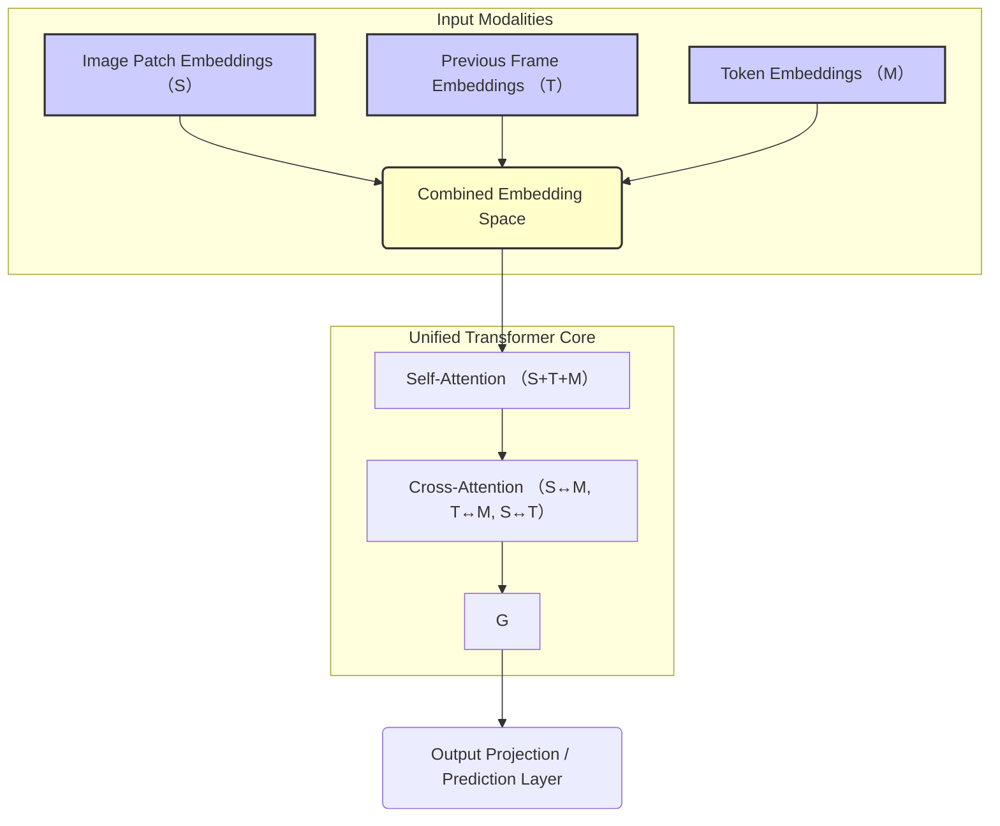

【ローカル限定】VLMは嘘だった。ピクセルと単語を「統合」するネイティブ・アーキテクチャの真実

正直に言います。最近、AIの論文を読み漁っていると、なんか「このVLM、本質的にモジュール分割がヤバい」っていう、根深い構造的な課題にぶつかるんですよね。

みんな、最新のVLM（Vision-Language Model）って「画像エンコーダ」と「言語デコーダ」を組み合わせたもの、ってイメージしてるじゃないですか。確かにそれ自体はすごい成果です。でも、僕が数多くの論文やアーキテクチャ図を追っていくうちに確信したのが、**現在の主流なVLMの構造そのものが、本質的なボトルネックを抱えている**ってことです。

それは、ピクセルレベルの情報が、途中の「アダプター」とか「フュージョン層」というモジュール境界を越えるたびに、まるで情報の粒が失われるかのように分断されてしまう現象です。

「もっとシームレスに、ピクセルと単語を同時に扱えないのか？」

そう疑問に思ったとき、たどり着いたのが、まさに「ネイティブ・ワンビジョン」という概念です。これは、単に性能を上げるというレベルの話じゃなく、**AIのアーキテクチャ設計のパラダイムシフト**を要求するもの。

この記事では、単なる性能比較や日本語訳レベルの解説はしません。なぜ「モジュール分割」が情報損失の原因となるのかを構造的に分析し、ネイティブな統合モデルがどのような設計思想に基づいているのか、そしてそれを実務のエンジニアリング視点からどう捉えるべきか、徹底的に深掘りしていきます。

さあ、最新のVLMの裏側にある、設計上の「嘘」の正体を見ていきましょう。

***

## 1. 既存VLMが抱える「モジュール分割」の構造的限界


僕たちがこれまで使ってきた主流なVLMの構造は、非常に合理的で、確かに「工程」を分けて処理する点でブレイクスルーでした。画像は画像エンコーダで、テキストはTransformerで処理し、その結果を何らかの方法で「つなぎ合わせる（アライメント）」という流れです。

しかし、この「つなぎ合わせる」という行為こそが、技術的なボトルネックを生み出していると、最新の学術論文からは指摘されています。

> "Current vision-language models (VLMs) typically stitch together separate image encoders and language decoders via multi-stage alignment, a modular framework that inevitably fragments pixel-level signals across frames and scatters early pixel-word interactions."

この引用は、既存のVLMが「複数のエンコーダとデコーダを接続し、マルチステージのアライメントを経由するモジュール的フレームワーク」であるという点に注目しています。

これが意味するのは、ピクセルレベルの微細な信号（例えば、オブジェクトの縁の曖昧な情報や、時間経過に伴う微妙な変化）が、モジュール境界を越えるたびに、情報の「連続性」を失ってしまうということです。

### なぜ「モジュール境界」が致命的なのか？

エンジニアリングの視点から考えると、これは「データの損失」というよりは**「情報フローの断絶」**です。

1.  **情報粒度の劣化:** 画像エンコーダがピクセルを抽象化し、特徴ベクトル（Feature Vector）に圧縮する際、その過程で「ピクセルが持つ初期の、高周波な情報」が失われます。
2.  **相互作用の遅延:** 画像と言語の相互作用（Pixel-Word Interaction）が、モジュール間の「アライメント層」という中間地点で初めて行われます。本来、ピクセルが「これは何？」と尋ねた瞬間に、単語が「それは〜だ」と答える、というリアルタイムでシームレスな対話ができません。

つまり、これまでのVLMは、高性能な「部品」を組み合わせた「システム」であり、**「単一の生命体」として情報を処理しているわけではない**、というのが根本的な課題なのです。

この課題を明確に理解するために、現在の一般的なVLMの処理フローを比較してみましょう。

| 特徴 | 従来のモジュール型VLM | ネイティブ・ワンビジョン型（目標） |
| :--- | :--- | :--- |
| **情報処理の単位** | モジュールごとの独立した特徴ベクトル | ピクセル/時間/単語の連続的な統合空間 |
| **情報の流れ** | エンコーダ $\rightarrow$ アライメント $\rightarrow$ デコーダ (ステージ的) | エンドツーエンドのシームレスな統合 (連続的) |
| **ボトルネック** | モジュール境界での情報分断 | 構造的なボトルネックは少ないと期待される |
| **得意なタスク** | 単一画像理解、キャプション生成 | マルチフレーム理解、時空間的な因果関係理解 |

このテーブルから読み取れるのは、後者の「ネイティブ・ワンビジョン」が目指すのは、単なる性能向上ではなく、**「情報処理の根本的なアーキテクチャの再設計」**であるということです。

## 2. 「ネイティブ・ワンビジョン」が実現する情報統合の仕組み

ネイティブ・ワンビジョンモデル（NEO-ovなどの研究が示す方向性）が提示するのは、「外部の部品を寄せ集める」のではなく、「最初からピクセルと単語を同じ土俵で扱う」という根本的なパラダイムシフトです。

彼らは、このアプローチを「外部エンコーダ、補助アダプター、ポストホックな融合を一切使わない」という点に集約させています。

> "Hence, we introduce NEO-ov, a native foundation model that learns cross-frame and pixel-word correspondence end-to-end, without any external encoders, auxiliary adapters, or post-hoc fusion. By eliminating module boundaries entirely, NEO-ov enables fine-grained and unified spatiotemporal modeling to emerge natively inside the model."

このアプローチの核心は、**「空間的時間的モデリング（spatiotemporal modeling）」**を、モデル内部でネイティブに（本来の形で）実現することにあります。

### 技術的な核心：シームレスな情報埋め込み（Embedding）

従来のモデルでは、画像の特徴埋め込み $E_{img}$ とテキストの特徴埋め込み $E_{text}$ を別々に計算し、それを $F_{align}(E_{img}, E_{text})$ のようなアライメント関数を通す必要がありました。

しかし、ネイティブなモデルでは、最初からすべての入力（画像ピクセル、前フレームのピクセル、単語トークン）を、**一つの巨大な、共通の埋め込み空間（Unified Embedding Space）**にマッピングし、そこからすべての相互作用を同時に学習します。

これは、複数の独立したパイプラインを接続するのではなく、**最初から一つの超巨大なトランスフォーマーブロックの中で、全てのモダリティ（画像、言語、時間）が等しい「市民権」を持つ**ように設計されている、ということです。

**筆者の意見として、この「共通の埋め込み空間」の設計こそが、未来のマルチモーダルAIにおける最も重要なエンジニアリング上の課題であり、ブレイクスルーポイントだと考えます。**

## 3. 実装レベルでの「統合」戦略：アーキテクチャ設計の具体例

理論を理解したところで、これを実際のコードやアーキテクチャに落とし込む際に、エンジニアが意識すべき具体的な設計上のポイントを掘り下げてみましょう。

ネイティブなモデルをゼロから構築する場合、最も難しいのは、**「時間軸（T）」**と**「空間軸（S）」**、そして**「モダリティ軸（M: Image/Text）」**をどのように単一のトランスフォーマー構造に埋め込むかという点です。

従来のモデルは $T$ と $S$ のうち、どちらか一方をメインで処理し、もう一方を「付加情報」として扱うことが多かったのですが、ネイティブモデルではこの3軸を対称的に扱います。

### 構造化されたデータフローの設計

実際にネイティブなアーキテクチャを設計する場合、以下の要素を考慮に入れる必要があります。

1.  **空間埋め込み (Spatial Embedding):** 画像の各パッチ（ピクセル群）に対して、その位置 $(x, y)$ を埋め込みとして加算します。これは既存のVision Transformer (ViT) の基本ですが、ネイティブモデルではこれを単に埋め込むだけでなく、**時間軸の埋め込みと空間軸の埋め込みが相互に影響し合う**ように設計することが重要になります。
2.  **時間埋め込み (Temporal Embedding):** フレーム $t$ の情報が、フレーム $t-1$ と $t+1$ の情報と、埋め込み空間内で連続的に接続される仕組みが必要です。これは単なるRNN的なリカレンスではなく、アテンション機構のキー（Key）とバリュー（Value）に「時間的な近接性」を明示的に組み込むことで実現されます。
3.  **単一のクロスアテンション層:** すべての埋め込み（ピクセル、前ピクセル、トークン）が、同じ計算グラフ（計算ノード）を通過し、相互にアテンションを計算します。

これをMermaid記法で表現すると、モジュール境界を完全に排除した理想的なデータフローがわかります。



**【筆者の見解】** この図が示すように、全てのモダリティが同じノード `C` で統合されることで、情報が「どのモダリティから来たか」というラベル付けの制約から解放され、真に**「単一の物理現象」**として処理できるようになるのが最大の利点です。

### 実装上の落とし穴：メモリと計算量

しかし、これは理想論であり、実務レベルでの実装には大きな課題があります。全てのモダリティを一つの空間に統合するということは、**計算量（Computational Complexity）が爆発的に増大する**ことを意味します。

特に、フレーム数 $T$ が増えるにつれて、アテンション計算は $O(T^2)$ に近づき、巨大なメモリを要求します。

これを解決するためには、単に「統合する」だけでなく、**「どの情報を、どのタイミングで、どの程度まで保持するか」**というフィルタリング（例えば、長期的な時間依存性を扱うために、Attention層にメモリ効率の良いメカニズムを組み込むなど）が、アーキテクチャ設計の最重要テーマになります。

## 4. 比較分析：ネイティブ統合と従来のモジュール型モデルのトレードオフ

最後に、この技術的なパラダイムシフトが、我々の開発プロセスや製品設計にどのような影響を与えるのかを、具体的に比較テーブルでまとめます。

| 評価項目 | 従来のモジュール型VLM | ネイティブ・ワンビジョンモデル | 開発者への示唆 |
| :--- | :--- | :--- | :--- |
| **開発の容易性** | 高い (既存のライブラリが豊富) | 低い (ゼロからの統合が必要) | まずは小規模なProof of Conceptから着手すべき。 |
| **情報処理の質** | 局所的、段階的 (Step-by-step) | 統合的、全方位 (Holistic) | 最終目標は「シームレスな統合」であると認識すべき。 |
| **計算効率 (メモリ)** | 比較的抑えられる（モジュール分割のため） | 非常に高い（全ての情報を同時に扱うため） | メモリ最適化（KVキャッシュの工夫など）が生命線になる。 |
| **得意な領域** | 単一画像キャプション、FAQ応答 | 複雑な時空間推論、因果関係特定 | 時系列データや動画解析がメインのユースケースに最適。 |

この比較からわかるのは、ネイティブなアプローチは、**「複雑な時空間推論」**という、これまで最も難しかった領域で圧倒的な優位性を持つということです。

### 実践的なコードの思考実験：マルチモーダル・アテンションの再定義

もしあなたがこのネイティブなモデルをPythonで実装するなら、標準的なアテンション計算 $\text{Attention}(Q, K, V) = \text{softmax}(\frac{Q K^T}{\sqrt{d_k}}) V$ を、単一のテンソル空間で以下のように拡張することを考える必要があります。

```python
import torch

def native_multimodal_attention(query_s, key_t, value_m, time_embed, spatial_embed):
    """
    ネイティブな統合空間におけるアテンション計算の思考実験。
    全ての埋め込みが同じ空間に存在することを前提とする。
    
    Args:
        query_s: 空間的なクエリ埋め込み (S)
        key_t: 時間的なキー埋め込み (T)
        value_m: モダリティ的な値埋め込み (M)
        time_embed: 時間軸の埋め込み
        spatial_embed: 空間軸の埋め込み
    """
    
    ### 1. 共通空間への埋め込み統合 (擬似コード)
    ## 理想的には、すべての埋め込みは最初からこの次元で計算される
    combined_query = query_s + time_embed + spatial_embed
    
    ### 2. 統合アテンションの計算
    ## ここで、全てのモダリティが同時に相互作用する
    attn_scores = torch.matmul(combined_query, key_t.T) / torch.sqrt(torch.tensor(key_t.shape[-1]))
    attn_weights = torch.softmax(attn_scores, dim=-1)
    
    ### 3. 結果の出力
    output = torch.matmul(attn_weights, value_m)
    
    return output

## 実行例（ダミーデータ）
## print(native_multimodal_attention(Q_s, K_t, V_m, T_embed, S_embed))
```

このように、単なる行列積ではなく、複数の埋め込みを**加算的に統合**し、その統合された埋め込み空間全体でアテンションを計算する構造を意識することが、ネイティブモデルの設計思想の核心です。

## 5. まとめ：我々が「次に取るべき行動」

今回の分析を通じて、VLMの進化は単なるパラメーター数の増加ではなく、「アーキテクチャの哲学」の変化によって牽引されていることがよくわかりました。

既存のモジュール型VLMは、素晴らしい「部品」ですが、本質的な情報の流れを阻害する「境界線」を持っています。ネイティブ・ワンビジョンモデルが目指すのは、この境界線を物理的に、計算論的に消し去ることです。

エンジニアとして、このトレンドを無視することはできません。今求められるのは、単に既存のAPIを呼び出すスキルではなく、**「異なるモダリティの情報を、どこで、どのような共通の空間で、どのように統合するか」**という、根本的なシステム設計能力です。

もしあなたがマルチモーダルAIのプロジェクトをこれから立ち上げるなら、まずは「モジュールを接続する」という発想から脱却し、「単一の共通埋め込み空間で全ての情報を同時に処理する」という視点からアーキテクチャを再設計することに注力すべきです。

これは難易度が高い分、実現したときのインパクトは計り知れません。我々エンジニアが、このパラダイムシフトの波に乗る準備をしておくべき、**最も重要なトレンド**だと筆者は強く感じています。

***

## 参考文献

以下の情報は、本記事の技術的議論の根拠として利用しました。

*   Haiwen Diao, Jiahao Wang, Penghao Wu, Yuhao Dong, Yuwei Niu, Yue Zhu, Zhongang Cai, Weichen Fan, Linjun Dai, Silei Wu, Xuanyu Zheng, Mingxuan Li, Yuanhan Zhang, Bo Li, Hanming Deng, Huchuan Lu, Quan Wang, Lei Yang, Lewei Lu, Dahua Lin, Ziwei Liu. "From Pixels to Words -- Towards Native One-Vision Models at Scale."
    https://arxiv.org/abs/2605.28820v1
    (取得日: 2026年5月14日)

<!-- AFFILIATE_SECTION -->
## 関連リンク

- [SkillHacks - プログラミングスクール](https://px.a8.net/svt/ejp?a8mat=4B1H1P+97114I+4K3S+5YJRM) - 独学で挫折した人向け実践型スクール
- [技術書](https://www.amazon.co.jp/s?k=Python+実践&tag=satoarata-22) - Amazonで技術書をチェック

---
※一部にPRを含みます。
