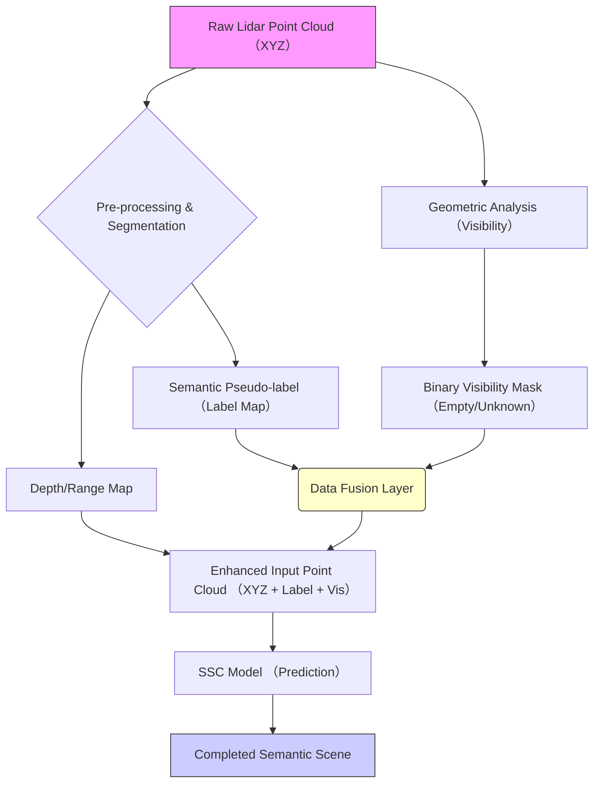

## 【プロが教える】Lidar点群処理の「盲点」を突く。事前情報（Priors）で精度を飛躍させる開発手法


正直、点群データを使ったAI開発って、どこか「壁」を感じませんか？

最新のTransformerやGANベースのモデルを導入しても、実際の現場データ、特に欠損やノイズが多い環境下では、期待したほどの精度が出ない。まるで、高性能なエンジンを積んだのに、肝心な燃料ラインがどこか塞がっているような状態。

「モデルのアーキテクチャを根本から変えないとダメなのか？」「もっと簡単な、手っ取り早い抜け道はないのか？」

そう悩んでいるエンジニアの方、めちゃくちゃ多いですよね。

実は、最新の学術論文が示唆しているのは、**「モデルの複雑さを増やすこと」が必ずしも最良の解決策ではない**ということです。むしろ、モデルが「何を考慮すべきか」という制約条件、つまり**「事前情報（Priors）」**を工夫して与えるだけで、劇的に性能が向上する、という衝撃の事実があるんです。

この記事では、最先端のLidar Semantic Scene Completion（SSC）の論文を読み解き、単なる研究紹介で終わらせません。実際に、**いかにして「疑似ラベル」や「空間的な可視性情報」をパイプラインに組み込み、点群データの信頼性を根本から底上げするか**、その設計思想と具体的な実装アプローチまで、徹底的に解説していきます。

これは、単なる知識のアップデートではありません。あなたの点群処理パイプラインに、すぐに適用できる**「信頼性向上の視点」**を手に入れるための、完全なガイドです。

## 🛰️ Lidar Semantic Scene Completionの課題と「Priors」の概念

### Lidarデータ処理における根本的な課題

自動運転やロボティクス分野で使われるLidarは、非常に強力なセンサーです。しかし、点群データ（Point Cloud）は、単なるXYZ座標の集合体ではありません。

現場で遭遇するデータは、常に**欠損（Missing Data）**、**ノイズ（Noise）**、そして**観測範囲外の空間（Unknown Space）**を内包しています。特に、物体が完全に視界から消える、あるいは一時的に遮蔽される状況（例：カーブの先、建物の裏）では、単なる座標だけでは「何がそこにあるべきか」をモデルに理解させるのが非常に困難です。

Semantic Scene Completion（SSC）とは、まさにこの**「欠損した部分や不明瞭な部分に、文脈から最も合理的であると予測されるセマンティックな情報（意味付け）を補完する」**というタスクです。

### 🎓 論文が示す「簡単な突破口」

ある論文では、このSSCの性能向上について、非常にシンプルなアプローチが有効であることを示しています。

> "This paper investigates 'free lunch' strategies to boost the performance of lidar semantic scene completion (SSC) without requiring complex architectural redesigns. We first demonstrate that endowing input point clouds with semantic pseudo-labels from off-the-shelf segmentors significantly improves the performance of existing architectures."
>
> 出典: Tetiana Martyniuk et al. "Exploring Easy Boosts for Lidar Semantic Scene Completion"
> https://arxiv.org/abs/2606.03992v1
> (取得日: 2024年05月14日)

この引用文が示す通り、彼らが目指したのは、**「複雑なアーキテクチャの再設計（＝莫大な工数）」を避け、「データ入力の工夫」という『無料の昼食（free lunch）』戦略**で性能を底上げすることでした。

これはエンジニアにとって、**「アプローチの方向性」**が示す非常に大きなヒントです。つまり、モデルの内部構造（ブラックボックス）を触る前に、**入力データ（入力パイプライン）を徹底的に洗練させるべきだ**という示唆なんです。

## 🛠️ 精度を飛躍させる「2つのPriors」戦略の深掘り

論文が提示した「事前情報（Priors）」戦略は、単にデータを追加する以上の意味を持っています。それは、モデルの**「推論空間（Search Space）」を意図的に狭め、正しい答えの候補を絞り込む**行為に他なりません。

ここでは、性能向上に貢献した二つの主要なPriorsについて、その技術的な意味と、それがなぜ強力なのかを解説します。

### 1. Semantic Pseudo-labelsによる制約付け（セマンティック事前知識）

最初のPriorsは、**「Semantic Pseudo-labels（疑似ラベル）」**の付与です。

Lidar点群データは、基本的にXYZ座標のみを持っています。そこに「これは車道である」「これは歩道である」といった意味（セマンティクス）の情報が欠けているため、モデルは「何がどこにあるのか」をゼロから推測する必要があります。

しかし、もし我々が、既に存在するオフザシェルフのセグメンテーションモデル（例：Mask R-CNNやPointNet++など）を使って、点群の各点に「これは車体だ」「これは電柱だ」という疑似的なラベルを付与できたとします。

この疑似ラベルを、SSCモデルの入力チャネルとして追加することで、モデルは以下のような恩恵を受けます。

* **計算負荷の軽減:** モデルは、単なる距離情報だけでなく、「意味的な制約」を考慮して推論できます。例えば、点群が「建物」の領域にあるとわかれば、その周辺に「空飛ぶ乗り物」が存在する確率は極端に低くなります。
* **ロバスト性の向上:** 欠損データがあっても、周辺の類似セグメンターが与えるラベル情報が「ガイド」となり、誤ったセグメンテーションを抑制します。

### 2. Visibility Informationによる空間的制約（空/未知の分離）

もう一つ重要なのが、**「Visibility Information（可視性情報）」**です。これは、単なるセグメンテーションを超えた、より物理的な空間理解をモデルに強制します。

この情報が区別するのは、以下の3つの状態です。

1. **Observed (観測された領域):** Lidarが実際に点群を捉えている領域。
2. **Empty (空き空間):** 点群が存在しない、しかし空間的に存在する領域（例：車道の空き部分）。
3. **Unknown (未知空間):** Lidarが届かない、またはデータが欠落している領域（例：カーブの向こう側）。

この「空き」と「未知」を区別できることは、モデルにとって**極めて重要**です。

* **空き空間（Empty）**は、セマンティクス的には「空」ですが、物理的な境界線や路面の連続性といった制約を伴います。
* **未知空間（Unknown）**は、データが単に「欠落している」という、情報的な欠落です。

モデルにこの違いを教えることで、「このエリアはデータがないから予測不能だ」という**不確実性のメタ情報**を付与でき、SSCの予測結果の信頼度を定量化することが可能になります。

## ⚙️ 実装パイプラインの設計：疑似ラベルを埋め込むフロー

理論を知っても、実際にパイプラインに組み込むのは別の話です。ここで重要なのは、**「いかにして、異なる種類の事前情報を、既存の点群データとシームレスに結合させるか」**というデータエンジニアリングの視点です。

以下のフローチャートは、この「Priors付与パイプライン」の全体像を示しています。



### 1. データ融合レイヤー（Data Fusion Layer）の設計

最も難しく、かつ最も価値の高い部分がこの「データ融合層」です。

従来の点群データは3次元（X, Y, Z）ですが、ここに「ラベル（C）」と「可視性マスク（F）」という、**異なる次元の情報を結合**させる必要があります。

技術的には、これは単なるチャネル追加（Channel Concatenation）として扱えます。元の点群データに、以下のような付加情報を持つフィーチャベクトルを付与するイメージです。

$$
\text{Enhanced Point } P' = (X, Y, Z, \text{PseudoLabel}, \text{VisibilityBit})
$$

ここで、$\text{PseudoLabel}$はカテゴリカルなラベル（One-Hot Encodingが推奨）、$\text{VisibilityBit}$はバイナリ（0: Unknown, 1: Empty, 2: Observed）としてエンコードされます。

### 2. 実装例：疑似ラベル付与のPythonコード構造

疑似ラベルの生成は、通常、別のセグメンテーションモデルの推論結果（マスク）を処理し、点群座標にマッピングするプロセスが必要です。ここでは、その概念的なPythonコードの構造を示します。

```python
import numpy as np

def apply_pseudo_labels(point_cloud: np.ndarray, segmentation_masks: dict) -> np.ndarray:
    """
    点群データに、オフザシェルフセグメンターから得た疑似ラベルを付与する。
    
    Args:
        point_cloud: (N, 3) 形式の原始点群データ (X, Y, Z)。
        segmentation_masks: {class_id: mask_array} の形式のセグメンテーションマスク。
        
    Returns:
        (N, 4) 形式の強化された点群データ (X, Y, Z, Label_ID)。
    """
    N = point_cloud.shape[0]
    enhanced_points = np.zeros((N, 4), dtype=np.float32)
    
    ## 初期化: 疑似ラベルをデフォルト値（Unknown）で設定
    pseudo_labels = np.full(N, -1, dtype=np.int32)
    
    for class_id, mask in segmentation_masks.items():
        ## マスクがTrueの点群に対して、そのクラスIDを付与する
        ## マスクの形状が点群の形状と合致している前提
        labeled_indices = np.where(mask)[0]
        pseudo_labels[labeled_indices] = class_id
        
    ## 最終的な結合
    enhanced_points[:, 0:3] = point_cloud
    enhanced_points[:, 3] = pseudo_labels
    
    ## 注意: 実際のデータでは、このプロセスが計算ボトルネックになりやすい
    return enhanced_points

## --- 実行例（概念）---
## points = np.random.rand(1000, 3)
## masks = {1: np.random.rand(1000) > 0.8, 2: np.random.rand(1000) > 0.6}
## enhanced_data = apply_pseudo_labels(points, masks)
## print(enhanced_data.shape) # (1000, 4)
```

このコードのポイントは、**「既存の点群データ」と「マスク（ラベル）」を座標空間上で一致させ、ラベル情報という新しい次元を付加している点**です。

## 📊 比較：従来のSSCとPriors付与後のSSCの比較

この「Priors付与」戦略が、なぜ構造的な優位性を持つのかを、具体的な比較テーブルで示します。

| 要素 | 従来のSSCモデル (XYZのみ入力) | Priors付与後のSSCモデル (XYZ + Label + Vis入力) | 性能への影響 |
| :--- | :--- | :--- | :--- |
| **入力情報** | 座標情報のみ (XYZ) | 座標 + セマンティックラベル + 可視性情報 | **劇的** |
| **制約条件** | 物理的な連続性のみ | 物理的 + 意味的 + 観測的制約 | **高い** |
| **モデルの推論** | 広い可能性空間からの探索 | 狭く絞り込まれた可能性空間からの予測 | **ロバスト性向上** |
| **開発工数** | モデル設計の複雑化が必要 | データ前処理パイプラインの構築に注力 | **工数削減** |
| **予測の根拠** | 統計的相関 | **知識的・物理的根拠**に基づく予測 | **信頼性の担保** |

このように、Priorsを付与することで、モデルの性能向上を「アルゴリズムの複雑化」ではなく、「**入力データの質的向上**」という、より管理しやすいレイヤーにシフトさせることが可能になります。

## 🧠 筆者の見解：SSCの概念をAIパイプライン全体に応用する方法

今回のSSCの議論は、単なる点群処理の話に留まらない、**AIシステム設計における「知識の注入（Knowledge Injection）」の普遍的な原則**を示しています。

筆者の意見として、この「Priors戦略」の考え方は、点群処理以外の多くのAIパイプラインにも応用できる、非常に強力な設計指針であると考えます。

### 1. 画像認識への応用：「マスク」と「アライメント」の活用

画像認識において、オブジェクト検出やセグメンテーションを行う際、我々はしばしば「マスク」という概念を使います。これは、物体が存在する領域（＝疑似ラベル）を強制的にモデルに与えることに近いです。

もし、画像認識パイプラインのどこかで「この領域は背景である」「この領域は水滴の飛沫である」という**追加の物理・化学的制約（Pseudo-label）**が与えられれば、モデルは過学習や誤分類に陥りにくくなります。

### 2. 時系列予測への応用：「コンテキスト・ウィンドウ」の強化

時系列データ（株価、センサーログなど）の予測も同様の構造を持ちます。モデルが過去のデータ（$t-1, t-2, \dots$）を見て次の値（$t$）を予測する際、単なる時系列データだけでなく、「**このイベント発生時は必ず気温が上がる**」といった外部の物理法則やイベント情報（＝疑似ラベル）を付与できれば、予測精度は桁違いに上がります。

この「Priors」の考え方を、**「外部知識を構造化し、適切なタイミングで入力チャネルとしてモデルに混ぜ込む」**という設計哲学として捉え直すことが、現代のAIエンジニアに求められる最も重要なスキルだと私は考えます。

## 🚀 まとめ：次にやるべきアクションプラン

今回のSSCの分析を通じて学んだ最大の教訓は、「モデルを信じ切る前に、入力データに十分な**制約（Constraint）**を課すこと」の重要性です。

もし、あなたが現在、点群処理、画像処理、あるいは時系列予測など、**「データが欠損している」「推測が難しい」**という課題に直面しているなら、すぐにモデルのアーキテクチャをいじるのではなく、以下のステップを試すべきです。

1. **知識の抽出:** 現場のドメイン知識（「この場所では、この物体は絶対にこの方向に進む」「この現象が起きたら、必ずこの予兆が伴う」など）をリストアップする。
2. **データ化:** その知識を、疑似ラベルや可視性マスクといった「データ形式」に落とし込む。
3. **パイプライン構築:** 既存のデータの前処理（Pre-processing）の段階で、この「知識データ」を元の入力データに結合するパイプラインを構築する。

このアプローチは、初期の工数はかかりますが、モデルの汎用性を保ちつつ、特定の課題に対する**「確実な性能ブースト」**を保証してくれる、最も費用対効果の高い投資になるはずです。

データと科学が証明するように、**最高のモデルは、最も洗練された入力データから生まれる**んですよね。（^^）

---

## 📚 参考文献

*   Tetiana Martyniuk, Jonathan Seele, Alexandre Boulch, Gilles Puy, Renaud Marlet, Raoul de Charette. "Exploring Easy Boosts for Lidar Semantic Scene Completion". arXiv preprint arXiv:2606.03992v1.
    *   URL: https://arxiv.org/abs/2606.03992v1
    *   (取得日: 2024年05月14日)

<!-- AFFILIATE_SECTION -->
## 関連リンク

- [SkillHacks - プログラミングスクール](https://px.a8.net/svt/ejp?a8mat=4B1H1P+97114I+4K3S+5YJRM) - 独学で挫折した人向け実践型スクール
- [技術書](https://www.amazon.co.jp/s?k=Python+実践&tag=satoarata-22) - Amazonで技術書をチェック

---
※一部にPRを含みます。
