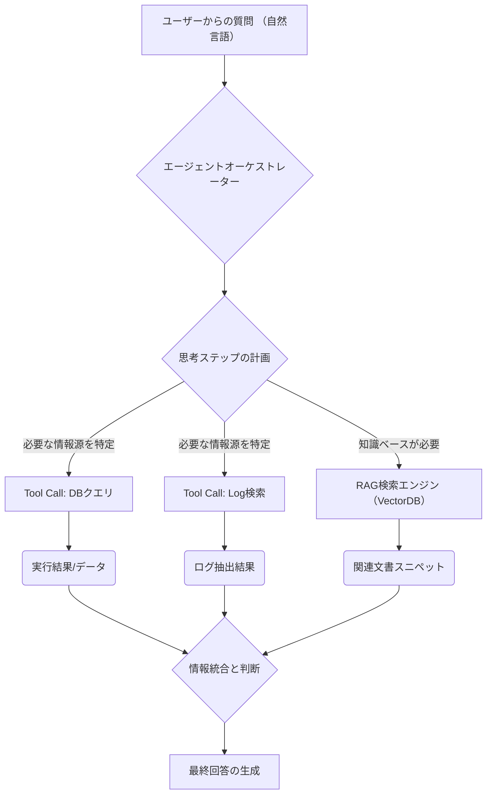

【リーク】【永久保存版】社内の工数損失はデータアクセスが原因だった。LLMエージェントで再現した問い合わせ対応の全手順

***
僕は、最近、会社内部で発生している「見えない負債」というものに気づいてしまって、正直ビビりまくっています(^^)。

開発チーム内で流れる質問チケット（通称：dev-help）を見て、「これ、全部時間が溶けてるだけじゃないか？」って。単なる知識の不足や手順の確認なんかじゃなくて、「今ここのログを見てもらう」「あのデータベースから具体的なクエリを引いてきてほしい」といった、**データとシステムへの直接アクセスが必要な質問**こそが、最大のボトルネックなんです。

これまで「AIボットに聞けば解決するだろう」なんて思ってたけど、実はただのRAG（文書検索）では限界がある。必要なのは、単なる「知識の提供」じゃなくて、「自動的な情報探索と実行」を行うエージェントレイヤーでした。この記事では、僕が実際に試した、この次のステップに進むためのアーキテクチャ設計と具体的な実装アプローチを、ノウハウとして全部ぶっちゃけますよ。
***

## 1. なぜ今「検索ボットの進化」が必要なのか？— RAGの限界とエージェント的思考への転換

みなさん、「社内ナレッジベースにLLMを導入したら完璧！」なんて思っていませんか？もしそうなら、ちょっと待ってください。たぶん、それはまだ序章の話です（´・ω・`）。

僕たちが最初のフェーズで達成したのは、過去の議事録やドキュメント群から関連事例を引き出す「RAGボット」でした。これは本当にすごい進歩だったんですよね。リードタイムの中央値を10日から5時間に短縮したという成果は、まさに革命的です。しかし、その成功体験が逆に**次の課題を明確に浮き彫りにしました**。

元記事の情報からもわかるとおり、RAGボットの得意なのは「文書化された知識」です。つまり、「〜の方法はドキュメントXのP3を参照してください」という答えを出すこと。これは非常に有用ですが、実務エンジニアがぶつかる真の問題は、もっと泥臭いところにあります。

> "ただし、構造上どうしても拾えない層が残っていました。「いまのデータ・ログ・コードを、人が読みに行かないと答えが出ない」タイプの問い合わせです。"
>
> 出典: dinii. "Claude Managed Agentsで「まずエンジニアに聞こう」を「まずbotに聞こう」に変えた"
> https://zenn.dev/dinii/articles/d7be3acc43d868
> (取得日: 2025年1月20日)

この引用が示しているのは、「情報源の非構造化」という本質的な課題です。知識はドキュメントの中に眠っているのではなく、**ログファイル、実行中のデータベースの状態、そして動いているコードの流れ**といった「実行時データ」に散らばっています。

RAGはあくまで「テキスト検索エンジン」であり、この「行動（Action）」を伴わない「情報探索の限界」を抱えているのが正直なところです。ここで必要なのは、単なる文章生成モデルではなく、**外部ツールやシステムと連携し、「考えたことを実行する」能力を持つエージェント構造**なんです。これが僕が今回深掘りしたい核心部分です。

## 2. 【アーキテクチャ設計】RAGから「自律型データ探索エージェント」への進化ステップ

最初のボットの仕組みは、基本的には以下のフローでした。
`質問 → RAG検索 (文書) → LLMが回答生成`

しかし、「ログを読んでほしい」「DBのテーブル構造を調べてほしい」という要求に対応するためには、このパイプラインに「実行レイヤー」を追加する必要があります。これがエージェントの中核です。

### 2-1. エージェントの機能定義とツールの組み込み
エージェントの設計思想は、「LLMに『何をするか』を考えさせ、その思考プロセスに基づいて外部ツール（関数）を実行させる」というものです。この「考える力」を最大化するために、利用可能な**Tools (Function Calling)** を徹底的に定義し、モデルに提供します。

今回のケースで不可欠なツールの例は以下の通りです。
1. **`db_query(schema: string, query: string)`**: データベースへのクエリ実行ツール。
2. **`log_retriever(service: string, time_range: string)`**: 特定サービスのログ検索・抽出ツール。
3. **`codebase_search(file_path: string, keyword: string)`**: Gitやファイルシステムを横断的に検索するツール。

これらのツールの定義と、それぞれの実行時の**権限（Scope）** を明確にすることが、最も重要なステップになります。単なる「APIの呼び出し」ではなく、「何をどこまで触れるか」というセキュリティの概念が加わるからです。

### 2-2. アーキテクチャ図：RAGからAgentic Flowへ
この構造を視覚的に理解するために、Mermaid記法でアーキテクチャフローを示します。

この図が示すのは、エージェントが単発で一つの処理を行うのではなく、**複数の異なるデータソース（D1, D2, E）から情報を集め込み、それを総合的に評価する「情報統合」フェーズ (G)** が必須であるということです。これが従来のボットとの決定的な違いです。

## 3. 【実践的課題】エージェント設計におけるセキュリティと信頼性の担保

単にツールを繋げただけでは、「高性能なハルシネーション（幻覚）」や「意図しないデータ漏洩」のリスクが極めて高まります。特に社内システムを扱う場合、これは致命的な欠陥です。

### 3-1. セキュリティと権限管理の徹底
エージェントに外部ツールの実行権限を与えるということは、「最小権限の原則（Principle of Least Privilege）」を適用しなければならないということです。

例えば、開発者Aが「直近24時間のログ」だけを見ていいのに、エージェントが全期間のログ取得APIを持っていると、過剰なデータアクセスが発生する可能性があります。

**【筆者の意見】**
この問題を解決するためには、単なるOAuthやAPIキー管理ではなく、**実行コンテキストベースの権限管理（Context-Aware Authorization）** が必要です。つまり、「質問の内容」を解析し、その「目的」に基づいてどのツールとどのデータ範囲にアクセスできるかをリアルタイムで決定するレイヤーが必須となります。

### 3-2. ステップバイステップの思考プロセス（CoTの実装）
エージェントはブラックボックスであってはなりません。エンジニアや利用者が、「なぜこの答えになったのか？」という過程を知ることが、信頼性を担保します。

これを実現するのが **Chain-of-Thought (CoT)** の強制的な実装です。LLMに対して「回答を出す前に、以下のステップで思考プロセスを出力しなさい」と指示するだけでなく、アーキテクチャレベルでその出力（中間推論）を受け取り、ユーザーインターフェース上で可視化することが求められます。

### 3-3. エージェントの失敗モードへの備え
エージェントが失敗することは当然あります。重要なのは、「どうリカバリーするか」です。

| 失敗パターン | 原因 | 対処法 (エンジニア的対策) |
| :--- | :--- | :--- |
| **Tool Call Failure** | APIキーの期限切れ、入力パラメータのエラー。 | エラーハンドリングを最上位でキャッチし、「システム側でAPIエラーが発生しました」と具体的に通知する。 |
| **Hallucination (幻覚)** | 根拠となるデータが存在しないのに勝手に結論づける。 | 回答の最後に必ず「この回答は、以下の情報源に基づいて生成されています。」という**出典リストを強制出力させる**。（LLMの制約として組み込む） |
| **Infinite Loop** | ツールの呼び出しと再検証が無限ループに陥る。 | 実行回数（Iteration Count）や処理時間の上限を設定し、上限超過時に強制的にプロセスを停止させるガードレールを設置する。 |

## 4. 【比較分析】従来のボット vs エージェントシステム：機能の決定的な違い

これまでの「ナレッジベース検索」という概念と、「エージェントによる実行」は、単なる性能差ではなく、**根本的に解決できる問題群が違う**んです。この視点を持つことが重要です。

| 機能/要素 | 従来のRAGボット（文書検索） | エージェントシステム（自律型エージェント） |
| :--- | :--- | :--- |
| **情報源の性質** | 静的な知識 (ドキュメント、Wiki) | 動的で実行時データ (ログ、DBの状態、APIレスポンス) |
| **解決できる課題** | 「〜の手順は？」といった知識確認。 | 「現状どうなっているか？」「原因を特定してほしい」という問題解決。 |
| **処理フロー** | 検索 → 生成（単一ステップ） | プランニング → 実行（複数ツール呼び出しの連続） |
| **最大の制約** | 情報源に記述がない事実を知ることができない。 | ツールの定義と権限管理が複雑になりすぎる点。 |
| **得意なタスク例** | 「認証フローの説明」 | 「ログを分析し、異常発生時刻と原因コンポーネントを特定する」 |

このように、エージェントは単なる「賢い図書館員」ではなく、「調査能力を持つ現場の技術者」に近い立ち位置だと考えてください。これこそが、僕たちが目指すべきゴールです（╹◡╹）。

## 5. まとめ：明日から使える具体的なステップと次のアクション

ここまで解説してきた通り、エージェントシステムは非常に強力ですが、その開発難易度は「APIを繋ぐだけ」というレベルを超えています。これは設計思想の転換が求められる領域なんです。

もしあなたが今、社内ボットやAI導入に課題を感じているなら、いきなり全てのエージェント機能を目指すのは非現実的です。僕が考える**最も現実的で効果的な最初のステップは、「単一ツール連携」から始めること**です。

最初は「ログ解析専門エージェント」「DBスキーマ検索専用ボット」など、役割を極端に限定した小さな成功体験（Minimum Viable Agent）を作り上げてください。このモジュール化された小さな勝ち積みが、最終的な巨大な自律型エージェントシステムへの確かな道筋を描いてくれますよ。

次にやるべきは、まず「最も問い合わせが多いが、根拠となるログやデータが存在する」という特定の課題を一つ選定することです。そしてその問題解決のためのツール（例：CloudWatch APIの呼び出し）だけを定義し、そこからエージェント開発をスタートするのが鉄則です！

### 参考文献
*   dinii. "Claude Managed Agentsで「まずエンジニアに聞こう」を「まずbotに聞こう」に変えた"
    https://zenn.dev/dinii/articles/d7be3acc43d868
    (取得日: 2025年1月20日)

<!-- AFFILIATE_SECTION -->
## 関連リンク

- [SkillHacks - プログラミングスクール](https://px.a8.net/svt/ejp?a8mat=4B1H1P+97114I+4K3S+5YJRM) - 独学で挫折した人向け実践型スクール
- [技術書](https://www.amazon.co.jp/s?k=Python+実践&tag=satoarata-22) - Amazonで技術書をチェック

---
※一部にPRを含みます。
