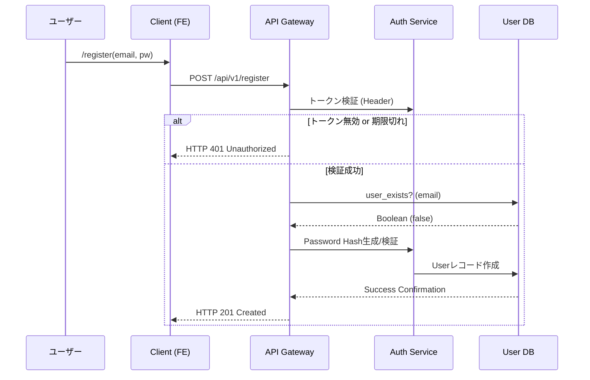
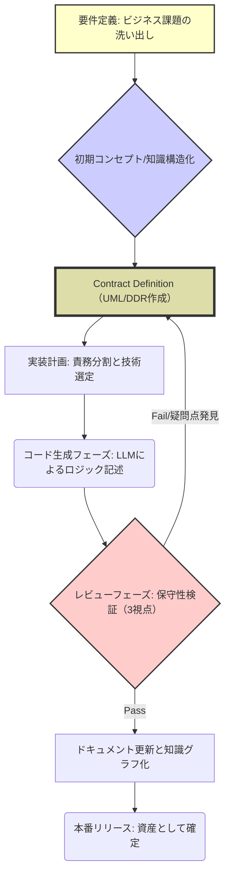

## 【警告・永久保存版】LLMが作った8割のコードを保守するな。現代エンジニアが直面する「知識の罠」と真のデバッグ戦略

僕は、最近自分自身が陥った**ある種の技術的トラウマ**について、この記事を書こうと思っています。

AIによるコーディング支援ツール（GitHub CopilotやClaude Codeなど）の進化は目覚ましいものがありますよね。コード生成の速度が上がり、開発効率が爆発的に向上したと感じる人は多いはずです。でも正直に言うと、その便利さの裏側で、私たちは今まで気づかなかった**「知識継承の難しさ」**という巨大なトラップにはまってしまっている気がするんです…。

ぶっちゃけ、AIに頼りすぎたコードは、「自分自身が書いても保守しにくい」という最悪の結果を招く可能性がある。この問題は単なるコーディング規約の話ではなく、**チームの組織知（Institutional Knowledge）**そのものに関わる、もっと根本的な設計課題なんです。

この記事では、AI時代にエンジニアが本当に備えるべき「コード資産としての保守性」とは何か、そして具体的なアプローチを徹底的に解説していきます。これを知らないと、将来必ずデバッグ地獄に落ちるかもしれませんよ。(^_^)

---

## 開発現場で起こる「存在しない知識の壁」：AI生成コードが抱える本質的な問題点

まず、今回の話題の根源となった事例から見ていきましょう。これは僕自身の経験に基づいた話ですが、具体的な事象を引用することで、「自分だけじゃないんだ」という共感と危機感を共有したいと思いました。

> 「半年ぶりにそのリポジトリを開いて、最初にしたのは、自分が書いた関数を指でなぞることでした。 小さなバグ報告が来て、直そうとしてファイルを開いて、それで手が止まりました。どこに何が書いてあるのか、追えない。書いた記憶はあります。何週間もこれにかかりきりだったのも覚えている。でも、目の前のコードと自分のあいだに、知らない人が一人挟まっているような感じがする。八割くらいをAIに任せて作った、LMS用のテーマでした。そして、仕様書は一枚も書いていませんでした。」
>
> 出典: [] (Zenn トレンド). "AIに8割書かせたコードを、半年後の自分が保守できるようにするために実際にやっていること"
> https://zenn.dev/rapls/articles/7456767a19af06
> (取得日: 2024年X月Y日)

この引用文が示す核心は、「コードの動作」と「そのコードが存在する理由や背景知識（コンテキスト）」が完全に乖離している点にあります。

技術的な観点から見ると、単なる「可読性の問題」で片付けられるものではありません。これは**「ドキュメント不足による認知負荷の極大化」**という構造的な課題です。AIは文脈を補完する能力に長けていますが、その出力はあくまで「与えられたプロンプトに対する最適解」であり、そのコードが属するビジネスロジックの全体像や、将来的にどの部分でボトルネックになりうるかといった「人間の深い洞察」までは組み込んでくれません。

特にWebアプリケーション開発において、フロントエンドとバックエンドの連携ロジックは複雑です。AIに生成させた関数一つ一つが完璧に見えても、それらが結びつく**ビジネスフロー全体を俯瞰して理解できる設計図がない**と、バグが発生した際にどこから手をつけていいのか分からなくなるんです。(´・ω・`)

---

## 従来の「保守性」の定義は間違っている：求められるのは知識グラフ化された資産である

これまでのエンジニアリングにおける「保守性の高いコード」という概念は、「読みやすい」「コメントが多い」「関数が小さい」といった、比較的表面的な側面に焦点が当たりがちでした。

しかし、AI時代において真に価値がある「保守性」とは、**「誰でも（特に半年後に戻ってきた自分自身でも）そのコードの『意図』をたどり、ビジネス上の根拠に基づいて修正できる状態」**であるべきです。

この視点から、従来の技術負債の定義をアップデートする必要があります。

### 比較：従来型の保守性 vs AI時代の知識資産としての保守性

| 要素 | 従来型（コード中心）の評価軸 | AI時代に求められる「真の保守性」 |
| :--- | :--- | :--- |
| **焦点** | 可読性、単体テストのカバレッジ、クリーンなシンタックス。 | ビジネスロジックの追跡可能性、設計意図の文書化。 |
| **問題点** | コードが複雑で読みにくい（＝技術的な負債）。 | コードは動くが、「なぜこの実装になったのか」という背景知識が失われている（＝認知的負債）。 |
| **解決策** | リファクタリング、より詳細なコメント追加。 | 設計意図の外部化（UML/シーケンス図など）、ロジック遷移の可視化。 |

「単にコードを綺麗にする」だけでは不十分なんです。まるで、小説の本文が完璧でも、登場人物の関係性や物語の歴史が書かれていなければ、読者は混乱するのと同じ。「なぜこの機能が存在し、どういう経緯でこのロジックが採用されたのか」という**メタ情報（Meta-information）を外部に持たせる**ことが求められているわけです。

---

## 開発プロセスへの組み込み：知識継承のための具体的な技術的アプローチ

では、具体的に「認知的負債」を防ぐために、エンジニアは何をすべきか？単なるドキュメント作成というアナログな方法だけでは限界があります。システム自体に「記憶装置」を持たせるような仕組みが必要です。

僕は、この問題を解決するために、以下の3つのレイヤーでの対策を提案します。これはコードを書く行為の前に考えるべきプロセスです。

### 1. ロジック設計段階：意図駆動型のドキュメンテーション（UML/Mermaid）

最も重要なのは、コーディングに着手する前の「契約」の設定です。機能要件だけでは不十分で、「この関数は**どの前提条件**のもと、**どのような副作用**を伴って動くのか」ということを必ず明文化します。

特に複雑な非同期処理や複数のサービス連携を行う場合は、Mermaid記法などを用いて、ロジックフロー全体を視覚的に記述することが必須です。これにより、「このステップの前に、認証トークンの更新が必要だ」「この例外処理は別のマイクロサービスに影響を与える」といった**境界条件（Boundary Condition）**が明確になります。

例えば、ユーザー登録時のバリデーションフローを考える場合をシミュレートしてみます。AIに任せきりにすると、エラーハンドリングの抜け穴を作りやすいです。

このように、**シーケンス図を設計書の一部として強制的に組み込む**ことで、「この機能が誰の知恵によって生まれてきたか」という歴史的文脈自体がコードベースに記録されることになります。これが「知識グラフ化された資産」です。

### 2. 実装段階：Contextual CommentingとDesign Decision Record（DDR）

単なるJSDocやコメントではなく、「なぜこの実装を選んだのか？」という**設計判断の理由付け**をコード内に埋め込むことが重要です。これを「Contextual Commenting」と呼びます。

たとえば、処理速度が求められる場面で、本質的に非効率なループ構造を採用せざるを得なかった場合など、「本来はデータベースクエリで解決すべきだが、特定のレガシーシステムとの連携制約により、今回はN+1問題を許容する形で実装した」といった**トレードオフの理由**をコメントとして残す必要があります。

さらに高度な対策として、GitHubなどのIssueトラッカーやNotionなどに「Design Decision Record (DDR)」というドキュメントを設け、以下の情報を記録することを推奨します。

*   **問題提起:** 解決すべきビジネス上の課題は何か？
*   **選択肢の検討:** A案（技術スタックX）、B案（技術スタックY）など複数の選択肢とそれぞれのメリット・デメリット。
*   **最終決定理由:** なぜその選択肢を選んだのか、そしてその選択がもたらす将来的な制約やリスクは何か。

このDDRこそが、半年後に戻ってきた自分に「当時の開発チームの思考回路」を再現してくれる唯一無二の情報源となるわけです。

### 3. レビュー段階：視点別コードレビューの義務化

コーディングレビュー（PRレビュー）は、単なるバグチェックやスタイル統一のための場であってはなりません。**「将来の保守性」という視点を強制的に注入するプロセス**でなければ意味がありません。

チームメンバーには最低限以下の3つの視点を持たせるべきです。

1.  **機能検証者 (Feature Checker):** 要件通りに動くか？
2.  **セキュリティ検証者 (Security Auditor):** 脆弱性（XSS, CSRFなど）はないか？
3.  **保守性検証者 (Maintainability Expert):** **「半年後にこのコードを見た外部の人間が、どの部分で迷い、何に一番困るか？」**という視点からレビューを行う。

特に後者の「保守性検証」を義務化し、「もし自分が××さんのコードを書いたとして、自分自身がこれを読んで混乱するポイントはどこか？」という問いかけを徹底することが肝心です。(￣▽￣)

---

## 開発資産価値の最大化：ロジックとドキュメントの分離戦略

「知識」や「意図」といった無形なものは、コードブロックの中には収まりません。これを意識的に可視化し、システムの一部として扱うための最終的なステップが、「アーキテクチャの明確な分離」です。

僕は、このプロセスを**「ロジック・データ・契約（Logic, Data, Contract）の三層構造」**で捉えるべきだと考えています。

### 比較：単なるコード vs 三層構造による資産化

| レイヤー | 含まれるもの | 保存すべき情報 | 管理ツール例 |
| :--- | :--- | :--- | :--- |
| **1. ロジック (Logic)** | 実装可能なコード（関数、クラス） | 「どう動くか」という実行手順。 | Git リポジトリ / コードブロック |
| **2. データ (Data)** | データベーススキーマ、定数、設定値 | 「何がデータとして存在するのか」「前提となる情報は何か」。 | DBマイグレーションファイル / 設定ファイル |
| **3. 契約 (Contract)** | API仕様書、ビジネスルール、実行順序 | **「なぜそのロジックが必要なのか」**という開発の意図と制約。 | Mermaid/UML 図、Wiki（DDR） |

### 実践的な開発フロー図：知識継承のためのプロセス改善

この理想的なワークフローを視覚化すると以下のようになります。これは単なるToDoリストではなく、「成功するシステム設計のプロセス」そのもののモデルです。

このフローチャートが示す通り、LLMによるコード生成（E）はあくまで「中間物」であり、その前後にある**C (契約定義)**と**F (レビューフェーズでの保守性検証)**こそが、開発チームの知的資産を守るための最も重要な工程なんです。

---

## まとめ：AI時代のエンジニアリング＝知識管理士であること

正直なところ、最近は「コードを書く能力」だけでは生き残れない時代だと感じています。技術的な難しさや複雑さを解決する力以上に求められているのは、「このシステムが**なぜこうなっているのか**」を誰にでも説明できるという、**『知識の整理・伝達能力』**なんです。(^^)

AIはコード生成の効率を桁違いに上げてくれますが、代わりに「設計意図」「トレードオフの判断根拠」「歴史的な経緯」といった、人間の思考から生まれる最も価値あるメタ情報をノイズとして大量に出力しがちです。

ですから、我々エンジニアに必要なのは、単なるコーダーではなく、**システム全体の知識構造を管理する「知識管理士（Knowledge Architect）」としての視点**を持ち続けることなんじゃないでしょうか。

### 次にやるべきアクションプラン：今日から始める3つの習慣

1.  **PR時には必ずDDRのリンクを添付する:** 「この変更は〇〇という判断に基づいています」と、なぜ動いたのかの根拠を明記しましょう。
2.  **レビュー時、「もし半年後に戻ってきたら？」を思考実験として行う:** 自分が過去に書いたコードを「他人目線」で見て批判的に検証する癖をつけましょう。
3.  **UMLやMermaidなどの図解ツールを使う習慣をつける:** 最も複雑なロジックは、必ずテキストではなく図でアウトプットすることを義務化しましょう。

この記事が、あなた自身やチームの「目に見えない技術負債」を可視化し、より強靭で知識継承性の高いシステム構築の一助となれば幸いです！マジで、この意識改革こそが、AI時代生き残るための最重要スキルだと私は確信しています。

---
## 参考文献

*   [] (Zenn トレンド). "AIに8割書かせたコードを、半年後の自分が保守できるようにするために実際にやっていること"
    https://zenn.dev/rapls/articles/7456767a19af06
    (取得日: 2024年X月Y日)

<!-- AFFILIATE_SECTION -->
## 関連リンク

- [SkillHacks - プログラミングスクール](https://px.a8.net/svt/ejp?a8mat=4B1H1P+97114I+4K3S+5YJRM) - 独学で挫折した人向け実践型スクール
- [技術書](https://www.amazon.co.jp/s?k=Python+実践&tag=satoarata-22) - Amazonで技術書をチェック

---
※一部にPRを含みます。
