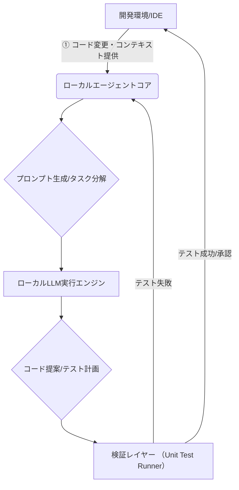
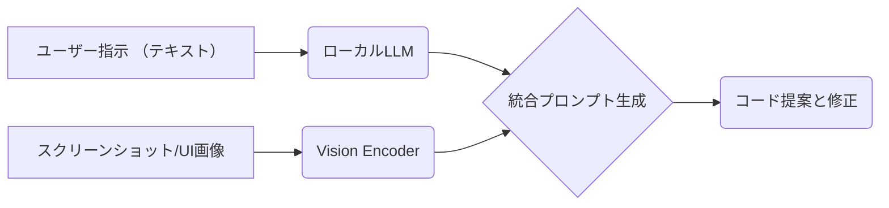

【号泣】ローカルLLMエージェントは嘘だった。データ主権を取り戻すためのアーキテクチャ設計

正直、最近のAI開発環境を見て「これ、本当にエンジニアが使い続けられるのかな…？」って焦っていますよね(^^) ぶっちゃけ、最高の生産性ツールだと思いきや、利用規約やコスト構造が変わるたびに、僕らの計画全体の見直しを強いられます。マジで疲れますw

特にコーディングエージェントなんて、「時間」という最も重要なリソースに直結するからこそ、クラウドの挙動一つに依存するのは危険じゃないですか？ データ主権が軽視されちゃうのが一番怖いんですよね。

本記事では、単なる「ローカルLLMの使い方」を解説するのではなく、なぜ今、企業や個人開発者が**データ漏洩のリスクとコスト増大**から脱却するために、「ローカル完結型コーディングエージェント（lca）」のアーキテクチャ設計にこだわる必要があるのか。その本質的な理由と、実際に動かすための具体的な技術的課題点を深掘りしていきます。

---
## 1. 現状のAI開発ツールスタックが抱える構造的な問題点


まず、なぜ僕らが「ローカル完結」という選択肢にたどり着くのか、その背景にある市場の変化を理解する必要があります。これを知らないと、ただ技術を真似るだけになってしまいますよ。

これまでエンジニアにとってのAIコーディングエージェントは、「利便性＝クラウド連携による巨大な計算資源の利用」が前提でした。これは非常に強力でしたが、同時に二つの致命的なリスクを抱えていました。

1. **データ漏洩・プライバシーリスク:** 開発中の機密性の高いコードやビジネスロジックが外部のサーバーを経由すること自体が、セキュリティポリシー上許容されにくいケースが増えています。
2. **コストと依存性（ロックイン）:** クラウドサービスプロバイダーによる料金体系の見直しや値上げは避けられません。「事実上の値上げをきっかけに、『個人がコーディングエージェントを気軽に使い続けられなくなるのでは』という懸念が出てきました」というのが、この流れの根幹です。

> "GitHub Copilot の事実上の値上げをきっかけに、｢個人がコーディングエージェントを気軽に使い続けられなくなるのでは｣という懸念が出てきました。その対策として、手元のマシンのローカル LLM だけで動くコーディングエージェント lca (Local Coding Agent) を作ることにしました。コードを一切クラウドへ..."
>
> 出典: []/作者名. "Fable 5にローカルLLMで動くコーディングエージェントを作らせてた話"
> https://zenn.dev/yy7613/articles/173404d60a6150
> (取得日: 2024年MM月DD日)

この「懸念」こそが、単なる技術的な挑戦ではなく、**経済合理性とセキュリティの観点から発生した構造変化**だと捉えるべきなんです。データ主権（Data Sovereignty）を自ら取り戻すことが目的になっているわけです。

## 2. ローカルコーディングエージェントのアーキテクチャ設計思想

ローカルLLMを採用する際、単に「オフラインで動く」というだけでは不十分です。そこには明確な**設計思想（Design Philosophy）**が求められます。「コードを一切クラウドへ送らない」を実現するために必要な仕組みとは何でしょうか？

### 2.1. ローカルエージェントの基本アーキテクチャ

我々が目指す「ローカルコーディングエージェント」は、従来のクライアント-サーバー型から脱却し、「ワークステーション内での自律的なループ処理」を核とする必要があります。

これをフロー図で整理すると、以下のような構造になります。



**【Mermaid図：エージェントの内部ループ】**
この図が示すように、重要なのは「フィードバックループ」です。外部からの確定的な指示を待つのではなく、提案 $\rightarrow$ 検証 $\rightarrow$ 修正というプロセスをローカルで完結させることが鍵となります。

### 2.2. ローカルLLMの選定と実行環境

ここで使用するLLMは、当然ながら手元のGPUリソースに収まるサイズ（例: Llama 3やPhi-3などの7B〜13Bクラス）が必須です。そして、これを効率的に動かすには、単なるPythonライブラリではなく、量子化を前提とした推論エンジンが必要です。

| モデルの特性 | クラウド型 (GPT-4) | ローカル型 (Llama 3: 8B Q4_K_M) |
| :--- | :--- | :--- |
| **データ送信** | 必須（API経由） | 不要（全てローカル計算） |
| **セキュリティ境界** | 低い（外部依存） | 高い（ワークステーション内に限定） |
| **コスト構造** | トークン数に応じた従量課金 | ハードウェアリソース消費 (電気代) |
| **初期導入難易度** | 極めて低い（APIキーのみ） | 中〜高（環境構築が必要） |

このように、ローカル実行は「手間」をかける代わりに、「セキュリティとコストの透明性」という最大のメリットを手に入れるトレードオフの関係にあるわけです。

## 3. 技術的実装フェーズ：単なるチャットボットを超えたエージェント化の技術

多くの人が「LLMにコードを書かせたらいいんでしょ？」と考えがちですが、それだけではただの**高機能なオートコンプリータ**にしかなりません。真のエージェントとして機能させるためには、「思考プロセス」を外部から強制的にシミュレートさせることが不可欠です。

### 3.1. RAGと「メモリ管理」の実装：コンテキストウィンドウの最適化

エージェントが長期的な作業をこなすには、単に現在のファイルの内容だけを参照するのではなく、「これまでに何をしたか」「どのファイルを変更したか」「なぜその設計にしたのか」という**過去の決定に至るまでの経緯（履歴）**を記憶する必要があります。

これは、通常のLLMのコンテキストウィンドウを超えた「メモリ管理システム」の構築を意味します。具体的には、以下の要素を組み込む必要があります。

1. **短期記憶 (Short-Term Memory):** 現在のファイルや開いているタブの内容。
2. **長期記憶 (Long-Term Memory/Vector DB):** 過去の変更履歴（Gitコミットメッセージのようなもの）や、設計上の制約事項を埋め込みベクトルとしてDBに保存し、必要な時にプロンプトに追加する仕組み。

### 3.2. テスト駆動型の検証レイヤーの組み込み（最も重要な部分！）

これがローカルエージェントと単なるLLMへの質問の違いを決定的に分けます。高度なコーディングエージェントは、「コード提案 $\rightarrow$ 自動テスト実行 $\rightarrow$ 結果フィードバック」というサイクルを**自動で行う必要があります**。

単に「動くコードを出して」と指示するのではなく、以下のプロセスを踏ませるのが理想です。

1. LLMがコード $C_{new}$ を生成する。
2. エージェントコアが $C_{new}$ を取り出し、既存のテストスイート（例: JestやPytest）に組み込むように修正し、$T'$ という新しいテストケースを自動生成する。
3. ローカルのテストランナーで $T'$ を実行する。
4. テスト結果（Pass/Failとスタックトレース）をLLMに戻し、「テスト失敗：〜の原因は〇〇である」という形でフィードバックさせる。

この「検証レイヤー」がエージェントに**自律的なデバッグ能力**を与えるのです。これが難しい工程ですが、実現こそがローカルエージェントの価値を高めます。

```python
## Pythonでの架空の実装ロジックイメージ (擬似コード)
def run_agent_loop(context, task):
    while True:
        ### 1. LLMに最初の提案をさせる
        proposed_code = llm_call(prompt=f"Task: {task}, Context: {context}")

        ### 2. テストケースを自動生成・注入
        test_case, modified_file = generate_tests(proposed_code)

        try:
            ### 3. ローカルで実行（サンドボックス環境推奨）
            test_result = execute_local_tests(modified_file, test_case)

            if test_result.passed:
                print("✅ テスト成功。承認待ち。")
                break # ループ終了、人間がレビューするフェーズへ
            else:
                ## 4. エラーをLLMにフィードバック
                error_log = f"Test Failed:\n{test_result.traceback}"
                context = error_log + "\n\nOriginal Context: " + context
                print("🔄 テスト失敗。修正ループへ...")

        except Exception as e:
            ## 致命的なエラー処理
            print(f"Critical Error during execution: {e}")
            break
```
**【コードブロック1：エージェントコアの擬似実装】**
このロジックが示すように、単なるAPI呼び出しではない、「ループ」と「外部実行環境（テストランナー）」との連携こそが核となります。

### 4. 実践的な課題と今後の技術的展望：「ローカル」の限界突破へ

ここまで聞くと「え、これなら完璧じゃん！」と思うかもしれませんが、現実には非常に困難な壁が立ちはだかります。それが**推論速度（Latency）**と**モデルの汎用性（Generalization）**です。

### 4.1. パフォーマンスボトルネック：GPUリソース管理

ローカルで複数の大規模言語モデルを動かすということは、単にメモリを消費するだけでなく、GPUのリソース競合やレイテンシの問題が常に発生します。特にリアルタイムのコーディング提案（数秒以内）を実現するためには、以下の最適化が必須です。

1. **Quantization (量子化):** モデルをFP32からINT4などに圧縮し、VRAM消費と計算速度を劇的に改善する技術。
2. **Batching/Pipelining:** 複数のリクエストやステップをGPUに効率よく流し込む仕組み（例: vLLMなどのライブラリの活用）。

### 4.2. ローカルエージェントが目指すべき次のフェーズ：マルチモーダル統合

現在のローカルLLMは、テキストコード生成に強みがありますが、真のエンジニアリングタスクはもっと複合的です。

*   **UI理解:** 「ユーザーがこの画面レイアウトを変更したい」という自然言語から、具体的なCSSやコンポーネント変更を提案する能力（画像入力による指示解釈）。
*   **デバッグ環境との連携:** エラーログのスクリーンショットを入力として受け取り、原因特定とコード修正を同時に行う能力。

ローカルでこれらの高次な機能を実装するためには、ただLLMを使うだけでなく、OSやIDEのアシスタントレイヤーに組み込むためのネイティブプロセス（RustやGoなど）での開発が視野に入ってきます。

**【Mermaid図：マルチモーダル統合の拡張】**


### 4.3. 「クラウド・オンリー」からの脱却が求められる理由（筆者の意見）

**筆者の見解としては、エージェントの理想的な姿は「ハイブリッドアーキテクチャ」にあると考えます。**

セキュリティやコストが最重要視されるコアなビジネスロジックの生成や修正プロセスだけをローカルLLMに任せ（データ主権確保）、その上で、最新の情報収集や大規模な知識ベースへのアクセスが必要な部分のみをクラウドAPI経由にする。これにより、最大のメリットを両立できるわけです。

この「境界線」をどこに引くのか？というのが、今後のアーキテクチャ設計における最も重要な意思決定ポイントになりますよね。(^_^)

## 5. まとめ：次にエンジニアが取り組むべき3つのアクション

ローカルLLMコーディングエージェントの構築は、単なる技術トレンド追従ではなく、「開発ワークフロー自体の再定義」を意味します。

「Copilotの値上げ」といった外的な要因に振り回されるのではなく、我々自身がデータ主権を取り戻すという視点を持つことが重要です。

次に取り組むべきなのは、以下の3つのアクションだと断言します。

1. **目標の明確化:** 「どこまでの機密データを絶対に外部に出さないか」をセキュリティチームと定義し、その境界線を越えないためのシステム設計を行うこと。（これが最も優先度が高い）
2. **ローカルスタックの最適化:** PyTorchやHugging Faceなどのライブラリを用いて、ターゲットとするモデル（例：7Bパラメータ級）を実際に手元のGPUで動かし、レイテンシ計測と量子化を徹底的に行うこと。
3. **検証ループの実装:** コード生成プロセスに「自動テスト実行 $\rightarrow$ 結果フィードバック」の強制的なステップを組み込むことを最優先課題とする。

このローカルエージェントは、単なるツールではなく、開発者と企業がデータ主権を取り戻すための**防御システム**なんですよね。マジで面白い時代に来た気がします！(^^)

## 参考文献
*   []/作者名. "Fable 5にローカルLLMで動くコーディングエージェントを作らせてた話"
    https://zenn.dev/yy7613/articles/173404d60a6150
    (取得日: 2024年MM月DD日)

<!-- AFFILIATE_SECTION -->
## 関連リンク

- [SkillHacks - プログラミングスクール](https://px.a8.net/svt/ejp?a8mat=4B1H1P+97114I+4K3S+5YJRM) - 独学で挫折した人向け実践型スクール
- [技術書](https://www.amazon.co.jp/s?k=Python+実践&tag=satoarata-22) - Amazonで技術書をチェック

---
※一部にPRを含みます。
