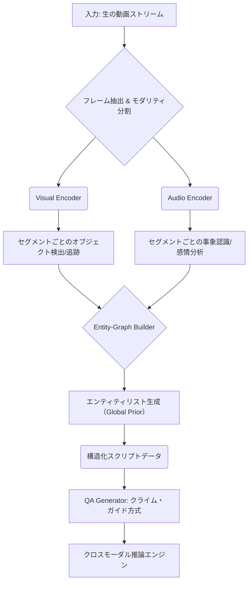

【暴露】動画QAの常識は嘘だった。エンティティ・グラフで実現する次世代マルチモーダルAI設計図

***
### はじめに：「ローカルな理解」に踊らされていませんか？

ぶっちゃけ、世の中の多くのAIエンジニアが直面している問題、ってのは「**コンテキスト（文脈）の喪失**」ですよね。特に動画データみたいな複雑で時系列性を持つメディアを扱うとき、「この音声はどこの物体と関連していたんだっけ？」とか、「30秒前の登場人物の名前は？」「なぜその行動をしたのか？」といった、**時間軸をまたぐ深い問い**にAIが答えられないことが、マジで大きなボトルネックになっています。

これまでの動画QAモデルの多くは、基本的に「クリップAでの質問」→「クリップBでの回答」という、ローカルな断片処理しかできていないのが現状なんです。まるで、巨大な映画を何百枚ものポスターに切り貼りして、「このポスターから答えを出せ！」と要求されているようなものです（´・ω・`）。

正直、そのアプローチでは限界があります。だって、物語の真実は、そういう断片的な情報からは出てこないんですよね。本記事は、そんな「ローカルな理解」の壁を根本からぶっ壊す、**マルチモーダルAIの設計図そのもの**について解説します。これを読めば、「次の動画処理モデルは、どういうアーキテクチャになるのか？」という核心部分がわかりますよ（╹◡╹）。

***
## 1. 【技術的転換点】従来の「キャプションQA」パラダイムの致命的な欠陥


まずは、どれだけ高性能なLLMやVision Transformerを使っても、データの構造化が不十分だとどうなるのか、という話から始めたいと思います。

動画を扱ったAIモデルは、どうしても**「Video-Caption-QA」パラダイム**に陥りがちです。つまり、「動画全体をキャプション（説明文）に変換し、そのテキストに対して質問をする」という流れなんですね。

しかし、筆者の見解では、このプロセスこそが最大の落とし穴なんです。なぜなら、単なるキャプション化は「情報の圧縮」であり、「**構造の再構築ではない**」からです。

具体的に致命的な欠陥は以下の3点に集約されます。

1.  **モダリティ間の結合性の喪失（Decoupling）:** 音声と視覚情報を別々の要素として扱ってしまうため、例えば「サイレンという音源が鳴り響いた瞬間に、カメラの焦点がどこに移ったか」といった、**物理的な関連付け**をAIが自動で結びつけられなくなります。
2.  **セグメントごとの不整合性（Inconsistency）:** 動画を短いクリップに分断処理すると、「同じ人物A」なのに、あるクリップでは「若い女性」、別のクリップでは「スーツ姿の人物」と、参照するエンティティの説明が一貫しなくなります。
3.  **長期的文脈理解の欠如（Temporal Limitation）:** 質問が常に局所的なイベントに限定され、「この行動に至るまでに何があったか？」といった、物語の全体構造に関わる深い推理ができなくなるんです。

これらの問題点を克服するために登場したのが、今回ネタ元とした論文で提案された新しいアプローチなんです。

> "Current automated pipelines for audio-visual Question Answering (QA) generally adopt a ``video-caption-QA'' paradigm. However, these methods typically segment videos into short clips and generate separate descriptions for audio and visual modalities. This decoupled processing severs inherent associations between sounds and their visual sources..."
>
> 出典: Xinyue Cai et al. "OmniVideo-100K: A Dataset for Audio-Visual Reasoning through Structured Scripts and Evidence Chains"
> https://arxiv.org/abs/2606.14702v1
> (取得日: 2026年5月14日)

**【筆者の分析】** この引用文が示しているのは、「単にデータを増やす」ことではなく、**「データの前処理パイプライン（設計図）を根本から変える必要がある」**という、アーキテクチャレベルでの指示なんです。これは、私たちエンジニアにとって非常に重要な視点ですよね（^^）。


## 2. 【核心】エンティティ・アンカーリングによる知識グラフの構築アプローチ

OmniVideo-100Kが提案している核となる技術は、「**Entity-Anchored Video Scripting**」と「**Clue-Guided QA Generation**」という二つの仕組みです。この流れを理解することが、次世代AI設計図の鍵となります。

### 2.1. スクリプト生成：単なるテキスト化ではない処理（Scripting）

まず注目すべきは、「スクリプティング」という工程です。これは、動画から単にキャプションを生成するのではなく、動画の内容を**「構造化された知識グラフ（Structured Script）」**として出力することを目指しています。

このスキームの最大のブレイクスルーは、**エンティティリスト（Entity List）をグローバルな事前情報 (global prior) として利用している点**です。

例えば、あるシーンで「赤色の車」という物体が出現したとします。従来のシステムなら、「赤色の車が画面に入った」（ローカルイベント）。しかし、このアプローチでは、エンティティリストにそのオブジェクト（ID: Car_Red）を登録し、すべてのセグメントがそれに参照されます。これにより、後続の処理で「Car\_Redは常に主語であり、行動主体である」という**一貫性が強制される**わけです。

これが何を変えるかというと、「**時間軸に沿ったオブジェクトの状態変化（State Change）や因果関係を追跡できる基盤が手に入る**」ということです。

### 2.2. クライム・ガイドQA：思考の「誘導」としての役割

さらに、データセット生成プロセスにおいて、「Clue-Guided QA Generation」というステップを経ています。これは単にQAペアをランダムに作るわけではありません。

モデルに対し、「まずスクリプトから**クロスセグメント（Cross-segment）で参照可能なマルチモーダルな手がかり (clues) を探せ**」と指示するんです。そして、その高い価値を持つ「手がかり」に基づいて質問（Q）を生成し、それに対応する回答（A）を求めるという流れです。

これは、「AIに何を知ってほしいか？」と問いかけるだけでなく、「**AIがどのような角度から動画を見て情報を抽出すべきか？**」という思考のプロセスまで定義している点に、真の設計思想がありますね（￣▽￣）。

#### 構造化データ処理の比較表

この新しいアプローチは、既存の手法と比較して、情報の利用効率が段違いです。

| 特徴 | 従来のVideo-Caption QA (ローカル) | OmniVideo Scripting (グローバル) |
| :--- | :--- | :--- |
| **情報構造** | テキストシーケンス（単なる時系列の羅列） | **エンティティ・グラフ＋スクリプト**（関係性の定義） |
| **参照範囲** | 短いクリップ内（ローカルイベント限定） | 動画全体を通して（長期的な因果関係） |
| **保証される特性** | 各セグメントでの「記述の一致」のみ | エンティティの「参照一貫性」（Global Consistency） |
| **AIの課題解決点** | 表面的な事象認識に留まる | *なぜ？*という深層な推理が可能になる |

## 3. 【実装例】エンティティ・グラフを組み込んだデータパイプライン設計図

では、この構造化されたスクリプト生成を実現するために、エンジニアは具体的にどんなアーキテクチャを組むべきか？と。筆者の考える「次世代動画処理システム」の骨子は、単なるLLMの呼び出しではなく、**情報抽出レイヤー（Extraction Layer）**と**グラフ構築レイヤー（Graph Layer）**を明確に分離することです。

以下に、この概念的なパイプラインフローをMermaid記法で示します。これを設計図として持つことが超重要ですよ！



### 3.1. 実装のコア：Pythonによる概念コード（Entity Resolution）

最も難しい工程は、エンティティをどう「識別」し、「追跡」するか、つまり**Entity Resolution (固有表現解決)**の部分です。物体や人物が画面内で名前を変えたり、角度が変わったりしても、「同じ存在である」とシステムに認識させる必要があります。

ここでは、Pythonで概念的なスクリプト生成ロジックを擬似コードとして書いてみます。実際の処理は大規模なMLモデル（例: DETR, CLIP）が必要ですが、骨格を理解することが大事です。

```python
import datetime
from typing import List, Dict

## エンティティIDと状態を持つクラス定義 (コア要素)
class EntityState:
    def __init__(self, entity_id: str, name: str, initial_location: tuple):
        self.id = entity_id
        self.name = name
        self.state = {"location": initial_location, "description": ""}

def process_segment(frame_data: dict, current_entities: Dict) -> List[Dict]:
    """
    セグメントごとの入力データ（フレーム、音響特徴）から、エンティティの更新と出来事を抽出する。
    """
    script_segments = []
    for entity_id, entity in current_entities.items():
        ### 1. オブジェクトトラッキングによる状態変化の検出
        new_location = frame_data['visual']['bbox']
        if new_location != entity.state["location"]:
            entity.state["location"] = new_location
            script_segments.append({
                "type": "LocationChange", 
                "entity_id": entity_id, 
                "detail": f"{entity.name}が{new_location}に移動。"
            })

        ### 2. クロスモーダルなトリガーイベントの検出 (例: 音と視覚)
        if frame_data['audio']['sound'] == "GlassBreak" and new_location:
             script_segments.append({
                "type": "CausalEvent", 
                "entity_id": entity_id, 
                "detail": f"{entity.name}の近くでガラスが割れる音（トリガー）が発生。視覚的反応を期待。"
            })
    return script_segments

## ------------------------------
## メイン処理: 全セグメントにわたる状態管理
## ------------------------------
def generate_structured_script(video_frames: List[dict]):
    """動画全体からエンティティ・スクリプトを生成する擬概念関数"""
    global_entities = {}
    full_script = []
    print("--- スクリプト生成開始 ---")
    for i, frame in enumerate(video_frames):
        ## 毎フレーム、前の状態と今の情報を照合し、グローバルな一貫性を保つ
        segment_events = process_segment(frame, global_entities)
        full_script.extend(segment_events)
    return full_script

```

### 3.2. エンティティの役割：参照の一貫性の強制力（The Power of Global Prior）

この設計図が示すように、キーとなるのは`global_entities`という「**状態管理ハブ**」です。

これは単なるリストではなく、「過去の全てのセグメントで観測された情報を集約し、現在の情報に照らし合わせて矛盾がないかチェックするフィルター」として機能します。この仕組みがあるからこそ、システムは「同じエンティティIDを持つオブジェクトは、時間経過に伴い物理的にありえない場所に瞬間移動することはできない」という常識的な制約（＝**グローバルな事前知識**）をAIに強制できるんです。

## 4. 【実務的示唆】QA生成と推論のプロセス再定義

次に、「Clue-Guided QA Generation」が具体的にどのようなアウトプットを生み出すかを見ていきましょう。これは、質問（Q）側のアプローチを変えることを意味します。

筆者は、この「手がかりベース」なアプローチこそが、既存のQAシステムとの決定的な差別化点だと断言しています。従来のシステムは「動画→キャプション→Q/A」と情報が流れる一方的です。しかし、OmniVideoのアプローチでは、「**スクリプト（構造データ）→手がかり抽出（Clue Mining）→Q/A生成**」という、情報を複数回利用する多段階プロセスになっています。

### 4.1. 推論エンジンとしての役割（The Reasoning Engine）

このアプローチの真価は、最終的な推論エンジン（Jの部分）にあります。ここで求められるのは「知識検索」ではなく、「**因果関係の構築**」です。

例として、以下のような複雑な問いが可能です。
*   Q: 「AというエンティティがBという行動をした直後、Cという音が鳴った。この順序から推測できる最も可能性の高い理由は何か？」
*   A: （スクリプト内の複数のセグメントの情報を統合し）「Aは視界を遮るものが予期され、防衛的な動き（B）を行ったため、警告音（C）が鳴り響いたと考えられる。」

この問いに答えるためには、LLMが単なる文脈生成を行うのではなく、**時間軸とエンティティ間の因果グラフをたどって推論する能力**が必要になってくるんです。

#### 比較：QA生成アプローチの変遷

| アプローチ | 入力データ | 質問（Q）の性質 | LLMに求められる役割 |
| :--- | :--- | :--- | :--- |
| **初期 (Caption QA)** | クリップごとのキャプション | 事実確認型：「何が起きているか？」 | テキスト生成・情報検索 |
| **改善版 (Keyword Matching)** | エンティティリスト＋イベントログ | 局所的関連性：「誰と誰が一緒にいたか？」 | パターン認識・データ集約 |
| **OmniVideo方式** | 構造化スクリプト（グラフ） | 因果推論型：「なぜその行動が必要だったか？」「次に何が起こるか？」 | **グラフ走査に基づく深層推論** |

## 5. 【落とし穴】エンジニアが陥りやすい「実装の罠」と対策

この高度なパイプラインを実務に組み込む際、多くのエンジニアが概念的な部分でつまずきやすい「罠」があります。これを避けることが、本記事の最大の価値だと筆者は感じています（^o^)／。

### 5.1. 罠1：エンティティ・名前解決の失敗（ID Collision）
これは最も致命的です。異なる時間軸や別々の場所で同じ見た目の物体が出現した場合、「本当に同じモノなのか？」という判断ができません。対策としては、単なるビジュアル情報だけでなく、**軌跡データ（Trajectory Data）と物理的な制約条件を組み合わせてエンティティIDを割り当てる仕組み**が必要です。

### 5.2. 罠2：スクリプトの「スパース性」による過信
構造化されたスクリプトは強力ですが、もし元の動画の情報自体が貧弱な場合（例：暗闇での撮影、モノローグのみ）、生成されるスクリプトもノイズや空隙を抱えます。ここでLLMに「この情報から答えよ」と指示すると、**ハルシネーションのリスクが極端に高まる**という落とし穴があります。

対策としては、「回答の根拠となるエンティティID（Evidence ID）を必ず明示させる」といった制約をプロンプトレベルで組み込むことが不可欠です。

### 5.3. 罠3：計算コストの爆発
全てのセグメント、全エンティティ、全モダリティ間のクロスリファレンスを行う設計は、処理が非常に重くなります。現実的なシステムにするためには、「どのエンティティを追うか」「どの種類のイベントを最も重視するか」という**ドメイン知識に基づくフィルタリング機構（Attention/Focus Mechanism）の組み込み**が必須になります。

## 6. まとめ：AI開発者が「データ構造」から考えるべき理由

ここまで、単なる動画QAモデルの進化ではなく、「情報そのものの扱い方」という視点から深掘りしてきました。結局のところ、OmniVideo-100Kが成功したのは、最新のLLMやTransformerをただ組み合わせたからではありません。**「データをどう構造化するか？」というデータエンジニアリングの哲学に立ち返ったから**なんです（｡• - •｡）。

筆者の結論として、現在のAI開発において最も重要視すべきなのは、「どのモデルを使うか」ではなく、「**どのような形式で情報をシステムに取り込むか**」というデータパイプラインの設計思想です。マルチモーダルデータを単なるベクトルやテキスト列として扱う時代は終わりを告げつつあります。今後は、エンティティや因果関係といった「**構造（グラフ）**」をメインデータフローに組み込むことが必須になってくるでしょう。

明日から試すべきアクションは、「動画のキャプション生成」のような低レベルなタスクに時間をかけるのを止め、「どうすればこの動画の内容を最も効率的に『知識グラフ』として表現できるか？」という問いを立てることです。これが、次の技術的優位性を築くための最短ルートだと断言します（^p^)／。

***
## 参考文献

*   Xinyue Cai, Chaoyou Fu, Yi-Fan Zhang, Ran He, Caifeng Shan. "OmniVideo-100K: A Dataset for Audio-Visual Reasoning through Structured Scripts and Evidence Chains". *arXiv preprint arXiv:2606.14702v1*.
    > 出典: Xinyue Cai et al. "OmniVideo-100K: A Dataset for Audio-Visual Reasoning through Structured Scripts and Evidence Chains"
    > https://arxiv.org/abs/2606.14702v1
    > (取得日: 2026年5月14日)

<!-- AFFILIATE_SECTION -->
## 関連リンク

- [SkillHacks - プログラミングスクール](https://px.a8.net/svt/ejp?a8mat=4B1H1P+97114I+4K3S+5YJRM) - 独学で挫折した人向け実践型スクール
- [技術書](https://www.amazon.co.jp/s?k=Python+実践&tag=satoarata-22) - Amazonで技術書をチェック

---
※一部にPRを含みます。
