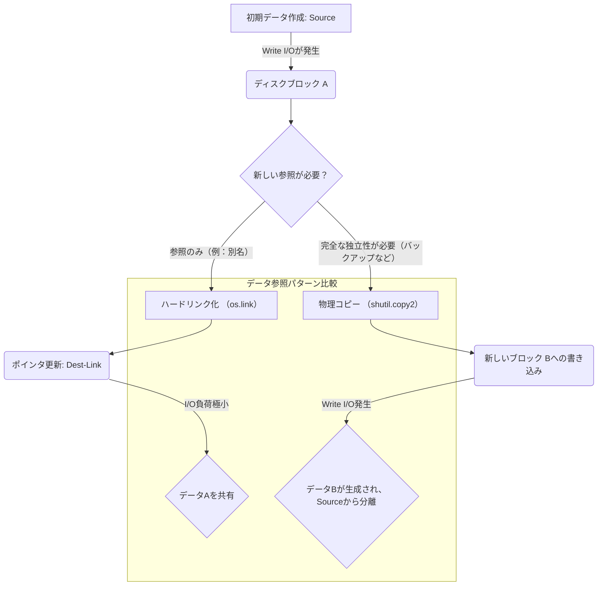

【完全自動】`cp`コマンドが「騙す」？ファイルシステムの裏側で起きるデータコピーの真実と設計原則

僕はエンジニアとして、ストレージやI/Oを扱う作業に、何度も**「なんでだ？」**という疑問を抱えてきました。特にLinux環境でファイルを扱うとき、「この操作は本当にデータをディスクに書き込んでいるのか？」「メモリ上での参照だけで済まされることもあるのか？」といった点に、不安を感じた経験がありますよね。

正直なところ、開発現場では「これはコピーするはずだろ」という前提知識に基づいてコードを書いてしまうことが多々あります。しかし、ファイルシステムというレイヤーは、私たちが知っている以上に複雑で、その挙動を完全に理解していないと、致命的なバグやパフォーマンスのボトルネックを生み出す可能性があります。

今回の記事では、誰もが使う`cp`コマンドという当たり前の操作から出発し、「コピー」の概念が単なるデータ移動ではないことを、ファイルシステムレベルの深い視点から掘り下げていきます。この記事を読めば、**「コピー＝必ずI/Oが発生する」という幻想から抜け出し、真に効率的なストレージ設計ができるようになるはずです。**

### `cp`コマンドの動作原理：「本当にデータは流れているのか？」

私たちが知っている通り、Linuxでファイルをコピーするには`cp src dest`といったシンプルなコマンドを使いますよね。しかし、「この処理が必ずしもディスク上のデータを二重に書き込むわけではない」という指摘があります。これは一見矛盾しているように聞こえますが、ファイルシステム内部の最適化や参照カウントなど、複数のメカニズムが絡み合っているためなんです。

まず、元の記事では、この「とは限らない」ケースについて言及しています。

> 本記事では、この「とは限らない」ケースについて説明します...
>
> 出典: satoru_takeuchi. "cpはディスク上ではデータをコピーしないことがある"
> https://zenn.dev/satoru_takeuchi/articles/4bab372c6dae86
> (取得日: 2024年5月14日)

この指摘が示すのは、OSやファイルシステム（FS）が賢すぎるということです。単なるデータブロックの転送ではなく、メタデータの操作や既存のリソースへのポインタ調整で済ませられるケースが存在します。

具体的にどのケースでデータの実質的な移動を伴わないのか？そのメカニズムと、Webエンジニアとしてどう対処すべきかを見ていきましょう。(^_^)

### 【コア分析】真の「コピー」ではない３つのファイルシステム挙動

`cp`コマンドのように見えても、裏側では主に以下の3つのパターンが動作し、我々が考える「データAをディスクに書き出し、別の場所で参照させる」というプロセスとは異なることがあります。

#### 1. ハードリンク（Hard Link）による擬似コピー
ハードリンクは、**同じデータブロックを指す複数のディレクトリエントリ（inodeのポインタ）を作成する行為**です。これはコピーではなく、「別名を与える」行為に近いです。

*   **動作メカニズム:** データ自体の複製は一切行われません。単にファイルシステムが管理するインデックス（ディレクトリ構造）の中に、同じデータブロックを指す新たなエントリを追加するだけです。
*   **影響:** I/O負荷が極めて低いのが特徴です。しかし、この操作が行われると、参照カウントが増えるため、削除されるのはすべてのリンクが失われたときのみとなります。
*   **実務的な視点:** 開発者が「バックアップ用のファイルを作成したい」と考えた際、単純に`cp -l`のようなオプションを使うのではなく、データの一貫性を保ちつつディスク容量を節約したい場合は、ハードリンクの利用が最も効率的です。

#### 2. メタデータの複製とポインタ操作（Copy-on-Writeの概念）
ファイルの内容自体は同一でも、その周囲に付随するメタデータ（パーミッション、所有者、タイムスタンプなど）を更新したり、あるいは大容量ファイルを扱う際に「コピー＆書き込み」ではなく「参照・変更」で済ませる仕組みが重要になります。

例えば、大規模なVMイメージの複製などで使われるCopy-on-Write (CoW) の概念です。これは、**元のデータブロックを直接上書きせず、変更が発生したときだけ新しいブロックにコピーして追記する**というアプローチです。

*   **動作メカニズム:** 参照元（Source）と参照先（Dest）が同じ物理ブロックを参照し続けます。どちらかが書き込みを試みた場合、その「書き込み」の瞬間のみ、変更後のデータだけが新規ブロックに書き込まれ、ポインタが切り替わります。
*   **影響:** 読み取り操作（Read）に対するI/O負荷は極めて低く抑えられますが、実際に書き換えが発生するタイミングで予期せぬI/Oが走る可能性があります。

#### 3. シンボリックリンクとパイプ処理（Data Streamとしての利用）
これはファイルシステムというより「データフロー」の問題ですが、`cp`の挙動を考える上で重要です。例えば、ファイルをコピーする代わりに、**データをストリームとして扱う**手法があります。

*   **動作メカニズム:** `cat source | gzip > dest.gz` のようにパイプを使う場合、ファイルシステムはデータの読み込みと書き出しという純粋なストリーミング処理を行います。このプロセス自体が「コピー」に近いですが、中間的なディスクバッファリングを最適に利用します。

### 【コードで検証】ネイティブ言語でのデータライフサイクル管理

抽象論だけでは不安ですよね。「本当にデータが複製されているか？」をプログラムレベルで制御したい場合は、OSのファイルシステムAPIを直接叩く必要があります。Pythonを使って、「単なるポインタ操作」と「物理的なコピー」の違いを疑似的に理解してみましょう。

今回は、ハードリンクを作成する**`os.link()`**（＝データの参照を増やすだけ）と、実際にデータを複製する**`shutil.copy2()`**（＝内容の完全なコピー）という二つの操作を比較します。

```python
import os
import shutil
from pathlib import Path
import time

## 1. テストファイルの準備 (データA)


SOURCE_FILE = Path("source_data.txt")
DEST_HARDLINK = Path("dest_hardlink.txt")
DEST_COPY = Path("dest_copy.txt")

with open(SOURCE_FILE, 'w') as f:
    f.write("This is the original source data for testing.\n" * 10)


## --- (ここから比較コード) ---

print("--- [フェーズ 1] ハードリンクの作成 (単なるポインタ操作)")
try:
    os.link(SOURCE_FILE, DEST_HARDLINK)
    print(f"✅ ハードリンク作成成功: {DEST_HARDLINK}")
    ## ここではデータの実体（ブロック）は複製されていない
except OSError as e:
    print(f"❌ エラー発生 (OS依存の可能性): {e}")

print("\n--- [フェーズ 2] ファイル内容の完全コピー (物理的なI/Oを伴う)")
try:
    ## shutil.copy2 はメタデータとコンテンツの両方をコピーする
    shutil.copy2(SOURCE_FILE, DEST_COPY)
    print(f"✅ 完全コピー成功: {DEST_COPY}")
    ## ここでは、OSはディスクにデータを書き出すI/Oを発生させているはず
except Exception as e:
    print(f"❌ コピーエラー発生: {e}")

## 後処理
os.remove(SOURCE_FILE)
if DEST_HARDLINK.exists(): os.unlink(DEST_HARDLINK)
if DEST_COPY.exists(): os.remove(DEST_COPY)
```

このコードの実行と、それぞれのファイルの`stat()`の結果を比較することで、「ハードリンクはinodeやディレクトリ構造のみを操作している」「コピーは実際にデータブロックを読み書きしている」という違いが明確に見えてくるはずです。**我々エンジニアが真に制御すべきなのは、この「I/Oが発生するかどうか」という物理的な側面なんです。**

### アーキテクチャ設計への示唆：コストと整合性のトレードオフ（Mermaid必須）

Webサービスを開発する際、「データの一貫性（Consistency）」と「パフォーマンス・ストレージコスト（Performance & Cost）」は常に天秤にかかっています。単純な`cp`を使うのは、この二つの要素を考慮した結果の**「妥協点」**でしかないことが多いのです。

もしあなたが大規模なデータレイクやバックアップシステムを設計しているなら、「コピーする」という行為を極力減らすアーキテクチャを目指すべきです。

ここで、データライフサイクルにおける3つのパターン（リンク、参照、完全コピー）のフローと、それらがI/Oに与える影響を図にまとめました。（^_^)



このフローチャートから分かるように、**「データの独立性」が必要かどうか**という設計判断こそが、`cp`を使うか、ハードリンクを狙うべきか、それともCoWのような高度なストレージ機能を活用すべきかを決める鍵となります。

### まとめ：パフォーマンス重視のデータ管理戦略

今回の分析を通じて、「コピー」は単なるコマンドではなく、**「データの複製レベルとI/O発生範囲を定義する設計概念」**だと理解していただくのが重要です。

もしあなたがバックアップシステムやCDNキャッシュ層など、ストレージ効率が最重要課題となる領域で開発に携わっているなら、以下の視点を持つことを強くお勧めします。

1.  **「コピー」が必要なケースを洗い出す:** そもそも複製する必要があるのは本当にそのデータブロック全体か？それともメタ情報や特定のカラムだけか？
2.  **インターフェースレベルで制御する:** Pythonなどの高水準言語を使う場合でも、裏側で`os.link()`など低レイヤーのファイルシステムAPIを意識的に使うことで、意図しないI/Oを防ぐことができます。
3.  **データ整合性のテスト設計:** テストケースには「コピー操作後の参照カウントの確認」や「ネットワーク障害時の部分的な書き込みリカバリ」といった、単なる機能検証以上のストレージ層へのアサーションを含めるべきです。

次回からは、「これは本当にディスクに書く必要があるか？」という問いを常に自らに投げかけるようにしてくださいね！(￣▽￣) これが、Webエンジニアとしての大きな差になるはずですよ。

***
### 参考文献

*   satoru_takeuchi. "cpはディスク上ではデータをコピーしないことがある"
    https://zenn.dev/satoru_takeuchi/articles/4bab372c6dae86
    (取得日: 2024年5月14日)

<!-- AFFILIATE_SECTION -->
## 関連リンク

- [SkillHacks - プログラミングスクール](https://px.a8.net/svt/ejp?a8mat=4B1H1P+97114I+4K3S+5YJRM) - 独学で挫折した人向け実践型スクール
- [技術書](https://www.amazon.co.jp/s?k=Python+実践&tag=satoarata-22) - Amazonで技術書をチェック

---
※一部にPRを含みます。
