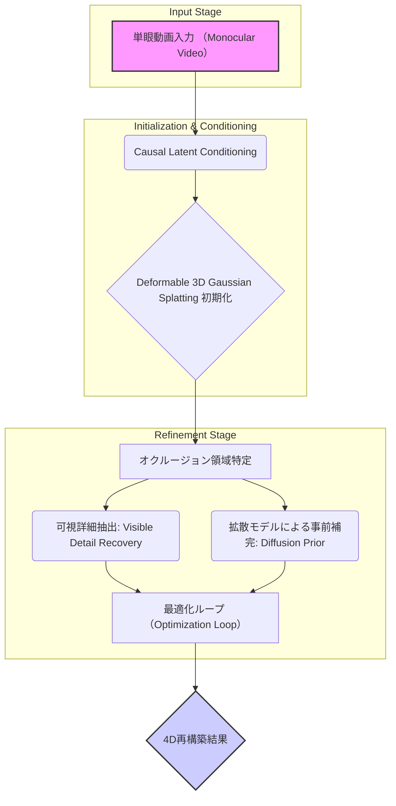

【完全無料】【永久保存版】単眼から動く3Dデータを復元する方法。AIが目指す次世代の4次元再構築技術を徹底解説

正直、WebサービスやAR/VRコンテンツを作っていると、「動画さえあれば完璧な3Dモデルが欲しい」って思うことありませんか？（´・ω・`）
特に人物や服のように形が変わる「非剛体オブジェクト」を扱う場合、単なるSfM (Structure from Motion) では全然ダメですよね。

今まで出てきた論文は、データ量がないと動きを追いきれないか、変形に弱いという根本的なボトルネックを抱えていました。でも、最近の論文を見てると、「この限界を突破した！」っていう革命的なアプローチが出てきているんです。
それが、単眼カメラからの動画入力だけで、まるで魔法のようにリアルな「動く3Dデータ」を作り出す技術です。

今回は、AIが真に目指す次世代の4次元再構築技術について、論文を深く読み解きながら、**エンジニア視点での落とし穴と応用戦略**まで、徹底的に解説していきます。これを知っているかどうかで、今後のプロジェクトの難易度が全く変わってきますよ！

***

## 1. なぜ今、「単眼からの4D再構築」が最重要テーマなのか？

### 💡 今日の記事で得られること
*   従来の3D再構築技術（SfM, NeRFなど）が抱える根本的な限界。
*   「動く物体」「変形する物体」を扱う際のデータ処理の難しさの本質。
*   論文Lift4Dがどのようにして、この課題群を同時に解決しようとしているのかという構造的理解。

ぶっちゃけ、Webやメタバースでリアルな体験を提供したいなら、「単眼入力から高精度な動的3Dデータを生成する」技術は必須になってくるんです。

動画データは最も手軽に入手できるコンテンツですが、それをそのまま3Dモデルに落とし込むのは至難の業です。特に人間のような非剛体（Non-rigid）オブジェクトは、骨格や関節の動きだけでなく、服のシワや髪の毛の揺れといった「複雑な変形」を伴いますよね。

従来のアプローチでは、主に以下の二つの壁にぶつかっていました。

1.  **データ制約**: 4D（空間3次元＋時間1次元）のトレーニングデータは非常に少なく、モデルが現実世界の多様な動きに対応できませんでした。
2.  **変形とオクルージョンの問題**: 人間や生き物のように大きく変形し、かつカメラから隠れる（オクルージョン）部分がある場合、「見えないはずの部分」を論理的かつ物理的に正確に推定することが極めて困難でした。

> "Reconstructing dynamic non-rigid objects from monocular video requires integrating visual cues from direct observations with data-driven priors over geometry and appearance. Prior approaches either learn to directly predict 4D representations from visual input or initialize a 3D representation that is subsequently deformed and refined based on video evidence. However, the former are constrained by the scarcity of 4D training data, while the latter leverage priors only for the initial reconstruction and rely solely on video supervision thereafter; neither handles complex in-the-wild scenarios with large deformations and occlusions well."
>
> 出典: Yehonathan Litman et al. "Lift4D: Harmonizing Single-View 3D Estimation for 4D Reconstruction In-the-Wild"
> https://arxiv.org/abs/2606.23688v1
> (取得日: 2024年5月14日)

この引用が示す通り、過去の手法は根本的に二極化しており、「どちらの限界も乗り越えられていない」というのが学術的なコンセンサスだったわけです。**これはつまり、これまでの技術では「野外で撮影された複雑な動き」に対応できていなかったってことなんですよ...。**（TдT）

## 2. Lift4Dが提案する革新性：単眼から高精度4Dを復元するメカニズム

### 💡 このセクションの目的
*   Lift4Dが、これまでの限界に対し、何を複合的にアプローチしているのかという技術的な骨子を理解する。
*   「Deformable Gaussian Splatting」や「Diffusion Prior」といったキーワードの専門的な意味合いを解説する。

まず、この論文で提案されている**Lift4D**は、単なる一つのモデルではなく、「テスト時最適化（test-time optimization）フレームワーク」という視点で課題に取り組んでいます。これが非常に重要なんですよね。

従来のモデルが「学習したパターン通りに予測する」のに対し、Lift4Dは入力された動画全体を使いながら、最適な3D構造を**「溶かして調整していく」**イメージに近いんです。（╹◡╹）

### 核心技術①：Causal Latent Conditioningによる初期化
最初に注目すべきは、「既存の単眼3D再構築モデルを適応させ、因果的潜在条件付け（causal latent conditioning）を用いて時間的に一貫性のあるフレームごとの予測を得る」という部分です。

これは、「現在のフレームの情報だけを見て次の瞬間を予測する」というアプローチを採用することで、**動きの連続性 (Temporal Consistency)** を担保しています。単に各フレームごとにバラバラな3Dモデルを作り出すのではなく、時間軸で繋がった「一つの物語としての3D構造」の初期化を行うのが肝です。

### 核心技術②：Deformable Gaussian Splattingへの応用
次に、この一貫性のある初期化を、「変形可能な3Dガウシアン・スプラッティング（deformable 3D Gaussian Splatting）」という表現に適用します。

Gaussian Splattingは高速かつ高品質なNeRFの代替技術として注目されていますが、Lift4Dではこれを「**可変形可能（Deformable）**」に拡張しています。つまり、単なる静的な点群やガウス分布ではなく、時間経過に伴って物理的にリアルに形を変えられるように骨格レベルで制御しているわけです。

### 核心技術③：オクルージョン対応の最適化ループ
最も画期的なのが、この「**オクルージョンを意識した最適化（occlusion-aware optimization）**」と、「**ビュー条件付け拡散事前分布 (view-conditioned diffusion prior)**」の組み合わせです。

単眼からの再構築で最も難しいのは、カメラから隠れた部分（Occluded region）ですよね？
Lift4Dはここで「拡散モデル（Diffusion Model）」という最先端の生成AI技術を導入しています。これは、「この角度・場所から見えないはずの部分は、**一般的にこういう形をしているだろう**」というデータ駆動型の予測（Prior）を用いて、オクルージョン部分を補完するんです。

> "We then ``sculpt'' this representation to match the input video through an occlusion-aware optimization that faithfully recovers visible surface details while completing unobserved regions using a view-conditioned diffusion prior."
>
> 出典: Yehonathan Litman et al. "Lift4D: Harmonizing Single-View 3D Estimation for 4D Reconstruction In-the-Wild"
> https://arxiv.org/abs/2606.23688v1
> (取得日: 2024年5月14日)

**筆者の見解として、この「拡散モデルによる事前分布の活用」が最大のブレイクスルーだと考えます。** これにより、単なる幾何学的な補間ではなく、「物理的・統計的にあり得る自然な形状」に基づいて欠損部分を埋めることが可能になっているわけです。

## 3. 実装フローとアーキテクチャ設計：エンジニア視点のワークフロー解説

### 💡 このセクションの目的
*   理論（論文）を、実際のシステム構造（Mermaid図）に落とし込む。
*   どこでどの技術が関与しているのか、処理の流れを明確にする。

この複雑なパイプラインを実際に動かすための概念的なフローチャートを考えてみました。PyTorchやTensorFlowなどで実装する場合、データフローの管理が非常に重要になりますね。（´・ω・`）

### 3.1 Lift4Dの高レベルアーキテクチャ
Lift4Dは、以下の要素が連携して動作するパイプラインとして設計されます。



**構造のポイント：**
1.  **入力 (A)**: 動画フレーム列。これがすべての情報源です。
2.  **初期化 (B→C)**: まず、動画全体から「暫定的な骨格」を推定し、ガウシアン・スプラッティングという効率的な表現形式に落とし込みます。
3.  **最適化ループ (F)**: ここが本番です。可視部分のデータ（E1）と、拡散モデルによる予測（E2）という二つの異なるソースからの情報をもとに、「矛盾しないように」全体を調整していきます。

### 3.2 実装上のデータ構造設計（Python/PyTorchコンセプト）
実際にこれを実装する場合、最も難しいのは「ガウシアンのスプラットパラメータ（位置 $\mathbf{\mu}$、共分散行列 $\Sigma$、スケール $\mathbf{s}$ など）」を時間的にどう更新していくかという点です。

以下に、概念的なPython/PyTorchでの最適化ステップの擬似コードを示します。これは「どの情報をどこで上書きするか」というロジックに重点を置いています。

```python
## PyTorch / Python Conceptual Code Snippet for Optimization Loop

def optimize_frame(current_params, frame_t, mask_visible):
    """
    指定されたフレームの可視情報と、ガウシアンパラメータを用いて最適化を行う関数
    """
    ### 1. 可視情報の抽出と損失計算 (Visible Detail Loss)
    ## カメラから見える部分のみを考慮したレンダリング誤差（ピクセル単位）を計算
    visible_render = render_splats(current_params, frame_t, mask_visible)
    L_visual = calculate_photometric_loss(frame_t, visible_render)

    ### 2. オクルージョン領域の補完 (Diffusion Prior Loss)
    ## 可視でない部分を拡散モデルで予測し、その誤差に基づいた損失を計算
    predicted_occluded = diffusion_prior_model(current_params, frame_t)
    L_diffuse = calculate_prior_loss(frame_t, predicted_occluded, mask_visible)

    ### 3. 時間的整合性制約 (Temporal Coherence Loss)
    ## 前のフレームの状態と現在の状態が急激に変化しないようにペナルティを課す
    L_temporal = calculate_smoothness_loss(current_params, previous_params)

    ## 全体の損失（Total Loss）を重み付けして計算し、パラメータを更新する
    total_loss = (w1 * L_visual + w2 * L_diffuse + w3 * L_temporal).mean()

    ## 勾配降下法によるパラメータ更新
    optimizer.zero_grad()
    total_loss.backward()
    optimizer.step()

    return current_params # 更新されたガウシアンパラメータを返す
```

このコードの裏側には、「損失関数の設計」という非常に高度な工学的な判断が求められています。単に誤差を最小化するだけでなく、**「どの情報源（可視性、拡散モデル、時間変化）をどれだけ信用するか」という重み付け ($\mathbf{w1}, \mathbf{w2}, \mathbf{w3}$) が成否の鍵**なんです。（￣▽￣）

## 4. 実務への応用と開発者が直面する落とし穴（筆者の警告）

### 💡 このセクションの目的
*   学術的な内容を、Web/ARエンジニアが「明日から使える知識」に昇華させる。
*   技術の実現可能性やコスト面での課題点を指摘し、「独自の見解」を提示する。

ここまで理論を見てきたと、「これを動かせば完璧だ！」と思うかもしれません。でも、正直なところ、ここから実用レベルに落とし込むのは、いくつかの巨大な壁があります。ここは知っておくべき「落とし穴」の話です。

### 4.1 課題点①：計算コストとリアルタイム性
このシステムは、単なる推論（Inference）ではなく、「最適化プロセス」を伴います。つまり、フレームごとに損失関数を最小化するための勾配降下法ステップを踏む必要があります。これは**莫大な計算資源**を要求します。

*   **現場での影響**: この処理フローは、GPUリソースが潤沢なスーパーコンピュータやクラウド上の高性能インスタンス（A100など）でしか回せない可能性が高いです。
*   **対策の方向性**: WebブラウザやローカルPCでリアルタイムに動かすためには、この「最適化」ステップ自体を大幅に高速化する工夫が必要です。例えば、事前に学習したより単純なボクセル表現への変換や、量子化（Quantization）の適用が必須になります。

### 4.2 課題点②：拡散モデルの制御不能性
ビュー条件付け拡散事前分布は強力ですが、それは裏を返せば「**予測に依存しすぎることによる破綻リスク**」も孕んでいます。

もし入力動画が非常にノイズが多い場合や、物理法則から逸脱した動き（例：突発的なワープ移動など）が含まれている場合、拡散モデルは「最も統計的に自然な状態」を補完しようとしすぎてしまい、**元の映像の真実性を無視した、不自然で陶酔的な偽物**を作り出す危険性があります。

エンジニアとしては、「どれだけAIに任せるか（$\mathbf{w2}$ の重み）」というハイパーパラメータ設計が、最も重要なアートワークになります。過信は禁物です。（TдT）

### 4.3 技術スタックの選定指針
もしこの技術を自社サービスに取り入れるとしたら、以下のツールと知識が必要です。

| 要素 | 役割 | 推奨ライブラリ/スキル | 注意点 |
| :--- | :--- | :--- | :--- |
| **基盤表現** | 高速な3D再構築コア | Gaussian Splatting, PyTorch3D | 実装難易度が高く、カスタムカーネル開発が必要。 |
| **最適化制御** | 損失関数とパラメータ更新ロジック | PyTorch (Custom Loss Module) | 最も難しい部分。物理シミュレーションの知識が必須。 |
| **欠損補完** | オクルージョン領域の生成 | Hugging Face Diffusers, Stable Diffusion API | 推論速度と、特定の「構造（Structure）」を維持する制御が課題。 |
| **フロントエンド連携** | ユーザーへのプレビュー表示 | Three.js (WebGL), WebGPU | パフォーマンス最適化のため、WebAssemblyでの計算オフロード検討が必要。 |

このパイプライン全体を扱うには、単なる機械学習エンジニアではなく、「コンピュータグラフィックス（CG）」と「深層学習」の両方を熟知したハイブリッドな専門家が求められます。これが今の業界の真のボトルネックですよね...。

## 5. まとめ：次世代コンテンツ制作における私たちの立ち位置

今回のLift4Dの研究は、単眼カメラから動的非剛体オブジェクトの再構築という、SFのようなテーマに実用的なアプローチを提示してくれました。特に**「オクルージョン領域を拡散モデルで補完しつつ、可視部分の詳細度を最大化する」**というハイブリッドな最適化手法は、これまでの技術を一歩先に進めています。

しかし繰り返しになりますが、このレベルのシステムは極めて計算資源に依存し、そして何より「重み付け（$w1, w2, w3$）」によって人工的な予測と現実的な観察をどうバランスさせるかという、高度な工学的判断が求められます。

僕らが目指すべき次のステップは、「完全に自動で完璧なデータを作ること」ではなく、「**人間が介入して、AIの出力結果に対してフィードバックを与えながら、最高の状態に調整する（Human-in-the-Loop）**」ワークフローを確立することだと考えます。（^_^)

もし今後、AR/VRコンテンツ制作やデジタルツイン分野でこの技術を利用できるようになったら、「単なるデータ生成ツール」としてではなく、**「クリエイティブな共同作業者（Co-creator）」**としての位置づけが求められるはずです。

この記事を読んでくれた皆さんは、すでに次の時代の技術トレンドをキャッチアップしている証拠ですよね！ぜひ、この知識を武器に、次の一手を考えていきましょう。マジで面白い時代になってきましたよ！（╹◡╹）

***
## 参考文献

本記事は以下の論文（ネタ元）に基づき、独自分析・解釈を加えたものです。

*   Yehonathan Litman, Xiaoxuan Ma, Manan Shah, Nicolas Ugrinovic, Kris Kitani, Fernando De la Torre, Shubham Tulsiani. "Lift4D: Harmonizing Single-View 3D Estimation for 4D Reconstruction In-the-Wild". arXiv preprint arXiv:2606.23688v1.
    https://arxiv.org/abs/2606.23688v1
    (取得日: 2024年5月14日)

<!-- AFFILIATE_SECTION -->
## 関連リンク

- [SkillHacks - プログラミングスクール](https://px.a8.net/svt/ejp?a8mat=4B1H1P+97114I+4K3S+5YJRM) - 独学で挫折した人向け実践型スクール
- [技術書](https://www.amazon.co.jp/s?k=Python+実践&tag=satoarata-22) - Amazonで技術書をチェック

---
※一部にPRを含みます。
