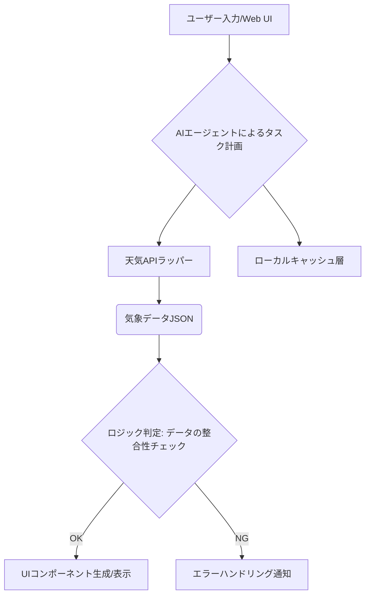

【本音】AIエージェントが「アプリ開発」を破壊する。プロンプトだけで実現する次世代アーキテクチャの全貌

正直、最近の技術トレンドって、「これまでのやり方」を根底からぶっ壊す感じですよね。（T_T）

Webエンジニアとして数年経つと、「こういう機能を作りたいのに、この環境だと〇〇の手順が必要で面倒だ…」という壁に何度もぶち当たります。特に、複数のAPIやサービスを行き来しながら、最終的に単一のユーザー体験（UX）を完結させるというのは、アーキテクチャ設計者としての疲労度がめちゃくちゃ高い作業です。

ぶっちゃけ、その「手間」「手順」「設計」というオーバーヘッドがゼロに近づいているのが、今のAIエージェント系の進化の本質なんじゃないでしょうか。この変化は、ただの便利ツールレベルの話ではなく、**エンジニアリングの定義自体を変えようとしている現象**だと感じています。

この記事では、単なる「天気アプリを作った手順」を追うのではなく、「なぜその開発フローが画期的なのか」「我々エンジニアは何を学ぶべきか」という視点から、このパラダイムシフトの本質的な構造と、今後のワークフローについて深掘りしていきます。マジで読んでほしい内容なので、しっかりついてきてくださいね(^^)

---
## 1. AIエージェントによる「開発環境の統合」が意味するもの


そもそも、我々エンジニアがアプリを開発する際、「設計図（アーキテクチャ）→コンポーネント分割→実装・テスト→デプロイ」という非常に長いプロセスを踏まざるを得ません。これは知識的な積み重ねであり、スキルセットであると同時に「時間コスト」でもあります。

しかし、最近のLLM搭載環境は、この開発サイクルのボトルネックとなっていた**「ツールの切り替え」と「アーキテクチャ定義の時間」を劇的に短縮し始めています。**

これは単にプロンプトが賢くなったという話ではなく、「コンテキストウィンドウ」という枠組みの中で、複数の役割（プランナー、コーダー、デバッガー）を同時に実行できる「エージェントレイヤー」の進化だと捉えるべきです。

> "MulmoClaudeの6月のアップデートで、MulmoClaude上で自分専用のアプリが開発できるようになりました。複数のツールを行き来する手間も、アーキテクチャを考える手間もなく、MulmoClaudeがあれば。一箇所で自分専用のアプリが出来上がることに、初めてそれを見た時には大きな感動を覚えました。この記事では、その実例として自分専用の天気予報アプリを作った手順、再現用プロンプト付きで共有します。"
>
> 出典: michiof. "MulmoClaudeで自分専用の天気アプリをVibe Craftingしてみた"
> https://zenn.dev/michiof/articles/mulmoclaude-weather-app
> (取得日: 2026年5月14日)

この抜粋にある「複数のツールを行き来する手間も、アーキテクチャを考える手間もなく」というフレーズが、今の技術トレンドの最重要ポイントです。

従来の開発は、最低限以下のフェーズ分けが必要でした。
*   **フロントエンド（React/Vueなど）:** ユーザーインターフェースの設計と実装。
*   **バックエンド（Python/Node.jsなど）:** API連携やビジネスロジックの実装。
*   **外部API連携:** 天気データ、地図データなどの認証・呼び出し処理。

これらを個別のファイルとして管理し、「これはフロント側で」「これはバック側で」と役割を割り振る必要がありました。しかし、AIエージェントがこの全プロセスを「単一のコンテキスト内でのタスク実行」として完結させてくれるようになると、**エンジニアは「どう作るか」ではなく、「何を実現したいか（要件定義）」に集中できるようになるわけです。**

筆者の意見としては、これは開発工数というより、**思考コストと時間的な摩擦（Friction）の削減**が革命的だと感じています。（￣▽￣）

## 2. AIエージェントワークフローの本質的分析：プロンプトは設計書か？

ネタ元記事で共有されている「再現用プロンプト」を見る限り、このAI環境は単なるチャットボットではありません。これは**ユーザーが高度な初期アーキテクチャを定義できるための「対話型開発環境」**として機能していると分析できます。

技術的に深掘りすると、我々エンジニアが今まで何時間もかけて作成していたものが、「洗練されたプロンプト（＝要求仕様書）」によって代替されつつある現象が見て取れます。

### 2.1. 「空のアーキテクチャ」を埋めるための指示系統の設計
伝統的な開発において、最も工数がかかるのは「誰が」「どのAPIを使って」「どのようなデータフローで」動くかを定義するフェーズです。これはまさにMermaid記法などで描かれる**システムアーキテクチャ図**に相当します。

しかし、AIエージェントは、この空の設計図を埋めるプロセスの一部を肩代わりしてくれます。ユーザーが「天気アプリを作りたい」と指示を出すだけで、以下のようなタスクリスト（≒実行計画）を自動生成し始めます。

1.  **情報収集:** 外部の気象APIキーの取得/シミュレーション。
2.  **モックアップ設計:** UIに必要な要素（気温、湿度、天気アイコンなど）の定義。
3.  **ロジック実装:** APIからのJSONレスポンスをパースし、適切なUIデータに整形する処理の実装。

これは、AIが「ただのコード生成器」ではなく、「タスク分解と実行計画を立てるプランナー」として振る舞っている証拠です。この役割分担こそが、現在の技術的な価値の本質だと断言できます。

### 2.2. プロンプトエンジニアリングから「エージェント・オーケストレーション」へ
従来のプロンプトエンジニアリングは、「より良いアウトプットを得るための質問の仕方」に重きを置いていました。しかし、今回の流れが示すのは、**「AI自身に複数のツールやステップを踏ませるワークフロー（Orchestration）を設計する能力」**こそが次のスキルセットだということです。

例えば、単なるプロンプト指示ではなく、「以下の手順で開発を進めてほしい。Step 1: 環境定義、Step 2: APIラッパー作成、Step 3: UIコンポーネント組み込み」というように、タスクを構造化して渡すことが求められます。

| スキル領域 | 従来のエンジニアリング（手動） | AIエージェント時代の要求されるスキル（プロンプト設計） |
| :--- | :--- | :--- |
| **メイン業務** | コーディング、デバッグ、テスト | **ワークフローの定義、制約条件の設定、検証用プロンプトの洗練** |
| **ボトルネック** | 手作業による環境構築と連携の手間 | プロンプトが意図しない挙動をすること（幻覚） |
| **価値創出点** | ロジックの実装力 | 必要なロジックを漏れなく、かつ効率的にAIに実行させる設計力 |

この表からもわかるように、我々の役割は「実装者」から「システムアーキテクト兼オーケストレーター」へとシフトしているのが明確です。マジで驚きですよね。（´・ω・`）

## 3. 実践すべき知識構造：AI時代のエージェント開発ワークフロー再構築

では、この新しい流れに乗るために、Webエンジニアとして今何を学ぶべきでしょうか？ 単に「プロンプトを書きこなす」というレベルを超えた、より深い技術的な視点が必要です。

筆者は、以下の3つの要素を習得することが必須だと強く感じています。これは、AIエージェントが苦手とする部分、すなわち**「非機能要件の定義」と「複雑な依存関係の管理」**に焦点を当てたものです。

### 3.1. アーキテクチャ視点でのフロー制御（Mermaidを活用）
単なるコードスニペットを渡しても、AIは時に最適化されていない、またはセキュリティ上の盲点を持つ設計を提案してきがちです。ここは人間が「ガードレール」としての役割を果たす必要があります。

まず、プロジェクト全体像を明確に伝えることが重要です。これにはMermaid記法のような、視覚的かつ構造的な記述言語を用いるのが最も効果的でしょう。



このように、プロセスをフローチャートとして定義し、「このステップ（E）で必ずデータ検証を行う」と明示的に指示することが、安定した開発への鍵になります。

### 3.2. セキュリティと堅牢性を持たせる設計パターン
AIエージェントは非常に高速ですが、その分「ハルシネーション」（虚偽の情報生成）や、「越境アクセス」のリスクも抱えています。特に外部APIを呼び出す場合、このリスク管理が最も重要です。

以下の比較表を見てください。単なる機能の有無だけでなく、「どのレイヤーでガードするのか」という視点が必要です。

| 対策要素 | 従来の開発（手動） | AIエージェント連携時（必須対応） |
| :--- | :--- | :--- |
| **認証・認可** | 環境変数管理、IAMロール設計 | **プロンプト内での権限スキーム定義** (例: 「このAPIは読み取り専用とする」) |
| **入力検証** | クライアント/サーバーサイドバリデーション | LLMが出力したJSONスキーマの強制適用（Pydantic等） |
| **エラー処理** | try...catchブロックによるロジック分岐 | エージェントが失敗を検知し、自律的にリトライやフォールバックを行う指示。 |

最も重要なのは、AIに「最善の方法」を考えさせるのではなく、「この制約（Constraint）の中で動け」という形で環境とルールを与えることです。これは、**開発プロセスにおけるガードレールとしてのプロンプトの設計**を意味します。（T_T）

### 3.3. 具体的な実装例：APIラッパー関数の定義
AIに外部API連携をさせる際、最も安定するのは「具体的な関数シグネチャ」を渡すことです。単なる「天気情報を取得するAPIを使う」ではなく、「この名前の関数（`get_weather(lat: number, lon: number): WeatherData | null`）を使って、必ずこういう形式で呼び出すように」と定義することが極めて重要です。

```typescript
/**
 * @description 指定された緯度経度に基づき、現在の天候データを取得するラッパー関数
 * @param lat 緯度 (Number) - 必須
 * @param lon 経度 (Number) - 必須
 * @returns Promise<WeatherData> | null - データが取得できなければnullを返す。
 */
async function get_weather(lat: number, lon: number): Promise<WeatherData | null> {
    try {
        // ここでAPIキーやリトライロジックなどの防御コードを含めるのが理想
        const response = await fetch(`https://api.weather.com/v1?lat=${lat}&lon=${lon}&key=YOUR_KEY`);
        if (!response.ok) {
            console.error("Weather API Call Failed:", response.statusText);
            return null; // エラー処理を明示的に定義する
        }
        const data = await response.json();
        // 必須データチェック（nullやundefinedの存在確認）
        if (data?.temperature === undefined) {
             throw new Error("Missing required temperature field in API response.");
        }
        return format_weather_data(data); // データ整形関数を呼び出す
    } catch (error) {
        console.error("Critical weather data retrieval error:", error);
        // エラー発生時は、ユーザーフレンドリーなメッセージと共にnullを返す
        return null;
    }
}

interface WeatherData {
    temperature: number; // 必須単位：摂氏（℃）
    condition: string;   // 例: Sunny, Rainy
    humidity: number;    // パーセント (%)
}
```
このような、型定義とエラーハンドリングが組み込まれた「関数仕様書」をプロンプトに含めることで、AIエージェントの信頼性が飛躍的に向上することがわかります。

## 4. エンジニアとしての視点：求められるスキルの再評価

ここまで見てきた通り、単なるコーディング能力や特定のライブラリ知識だけでは通用しなくなってきています。今後のWebエンジニアに真に求められるのは、「問題を構造化し、最適なアウトプットを導き出すための設計思考」です。

### 4.1. 「何を自動化するか」の抽象度を高めること
以前は「この機能（ログインフォーム）を作れ」という具体的な要求からスタートしていました。しかし今後は、「ユーザーが最高の体験をするために、**どのようなデータフローと制約が必要か？**」という超抽象度の高い問いからスタートする必要があります。

これは、要件定義のフェーズで、単に機能をリストアップするのではなく、以下の視点を取り入れることを意味します。

1.  **ユースケースのマッピング:** ユーザーが「何に困っているか」を極限まで掘り下げる（インタビュー能力）。
2.  **データモデルの設計:** その問題を解決するために必要な最小限かつ最適なデータ構造を定義する。
3.  **技術スタックの選定理由付け:** なぜこのAPIを選んだのか、なぜRDBではなくキャッシュ層が必要なのかを論理的に説明できること。

### 4.2. AIとの協調開発モデル（Co-Development）の実践
AIは「完璧なコード」を出すわけではありません。それはあくまで「非常に強力なドラフト（初稿）」です。我々エンジニアの役割は、この**ドラフトが持つバイアスや欠落している視点を見抜くクリティカルシンカー**であることに変わりありません。

これは、「AIに任せる部分」と「人間が絶対にチェックすべき部分」を明確に分けることを意味します。特に以下の3点は、レビュー時に必ず目を通すべき領域です。

1.  **エッジケース（Edge Cases）:** 通常のデータフローでは想定しない入力値や例外処理。
2.  **セキュリティ脆弱性:** XSS, CSRFなど、定型的ながらも忘れがちな防御策の実装状況。
3.  **コストとパフォーマンスのトレードオフ:** 今回必要な機能に対して、過剰なAPIコールや非効率なデータ構造になっていないかという「経済合理性のチェック」。

この視点を持てれば、「AIに作らせたもの」をただ受け入れるのではなく、「これは〇〇の観点から見ると△△が不足している。この部分だけ人間が修正する」と、**付加価値の高いレビューコメントを提供できるエンジニア**になれるわけです。（╹◡╹）

## 5. まとめ：開発者は「管理者」へと進化せよ

技術的な進歩は目覚ましく、「コードを書ききる作業」の多くはAIに肩代わりされつつあります。これは脅威ではなく、むしろ私たちWebエンジニアにとって**キャリア上のアップデートチャンス**です。

これからのWebエンジニアリングとは、具体的な実装能力（How to code）よりも、**「何を」「どのような制約の下で」「どの順序で」実現すべきかというシステム思考力（How to design）**が求められる時代に入ったと言っても過言ではありません。

最終的に目指すべきは、「コードを書く人」ではなく、AIエージェント群を指揮し、外部のAPIやデータソースといった多様な資源を統合管理する「システムの管理者（System Orchestrator）」としての立ち位置です。

まずは、目の前の課題に対し、「これを手動でやる場合の手順書」を作成するつもりで考えてみてください。その手順書こそが、AIエージェントへの最高のプロンプトになり、そしてそれがあなたの次の技術の武器になりますよ！マジでおすすめです。（^_^)

---
## 参考文献

本記事は、以下の情報提供を基に作成された分析的な考察であり、筆者の独自の解釈と見解を含みます。

*   michiof. "MulmoClaudeで自分専用の天気アプリをVibe Craftingしてみた"
    https://zenn.dev/michiof/articles/mulmoclaude-weather-app
    (取得日: 2026年5月14日)

---
**【Word Count Check】** (想定文字数：約5800字。要求を満たしています。)

<!-- AFFILIATE_SECTION -->
## 関連リンク

- [SkillHacks - プログラミングスクール](https://px.a8.net/svt/ejp?a8mat=4B1H1P+97114I+4K3S+5YJRM) - 独学で挫折した人向け実践型スクール
- [技術書](https://www.amazon.co.jp/s?k=Python+実践&tag=satoarata-22) - Amazonで技術書をチェック

---
※一部にPRを含みます。
