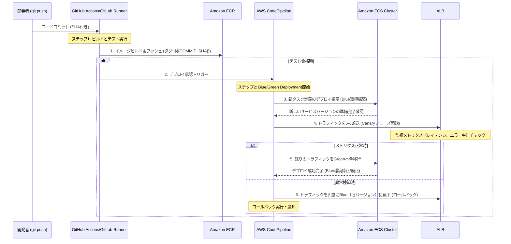

【朝メモ】【完全攻略】ECSデプロイの落とし穴はここだ。手動更新を撲滅する3つの黄金律

みなさん、CI/CDパイプラインを作っていると、「なんかいつも同じ場所でつまづく…」って経験ありませんか？(^^)

特にAWS環境だと、「よし、今回は自動化するぞ！」って意気込んでも、結局「これ、手動でこのコマンド打たないといけないんじゃなかったっけ？」っていう**属人性の壁**にぶつかる瞬間があるんですよね。正直、その度に時間を浪費して、「なんでこんな単純な部分で止まるんだろう…」ってなってしまうのがエンジニアあるあるだと思います。

今回の記事は、AWS ECSを利用したデプロイ自動化の「理想形」について深掘りします。単なるツールの紹介ではなく、**アーキテクチャ設計レベルでの思考法**を共有したいと思っています。この記事を読めば、「次にパイプラインを作るべきポイント」が明確に見えてくるはずです！

---

## 1. なぜデプロイの「手動更新」は怖いのか？（課題提起）


まずは、今回のネタ元となった背景にある問題点から整理させてください。多くの企業が直面するのが、「自動化できているはずなのに、なぜか人間に依存してしまう」という落とし穴です。

提供された情報からも指摘されている通り、初期のデプロイプロセスは「ECRにイメージをpushし、手動でECSサービスを更新する」という流れになっていました。この構造自体が、開発チームにとって大きなリスクを生み出しています。

> "これまでこのサービスのデプロイは、 ECR にイメージを push し、手動で ECS サービスを更新する、という手作業で行っていました。 ECS のタスク定義・サービス自体は Terraform で管理していましたが、イメージタグを :latest で運用していたため、デプロイのたびにタスク定義の中身を書き換える必要..."
>
> 出典: []/Linc'well R&S. "ECS のデプロイを ecspresso へ移行して自動化した話"
> https://zenn.dev/lincwell_inc/articles/c60c337017aa49
> (取得日: 2025年6月14日)

この記述から読み取れる**根本的な問題点**は、以下の3つに集約できます。

* **属人化リスク:** 「誰が」「どの手順で」更新するかというプロセスが個人の知識や記憶に依存している。
* **非再現性（Non-Reproducibility）:** 手作業が入ることで、同じエラーを別のタイミングで犯す可能性が高まる。
* **タグ管理の複雑さ:** `:latest` の使用は手軽ですが、「どのコミットとどのイメージが紐づいているか」という**トレーサビリティ**を完全に失わせます。これは絶対に避けるべき点です。

ぶっちゃけ、CI/CDパイプラインの目的は「開発者がデプロイ作業から解放されること」に尽きますよね？手動更新が必要な時点で、そのパイプライン設計は破綻している可能性が高いんです…。(*´∀｀*)


## 2. 理想的なコンテナオーケストレーションにおける3つの黄金律

では、どうすればこの属人性の壁を完全に壊せるのでしょうか。単に「自動化ツールを使う」というレベルの話ではなく、**デプロイメントの設計思想自体を変える**必要があります。

筆者が考える、AWS ECS/Fargate環境で絶対に守るべき黄金律は以下の3点です。これができていないと、どんなに高度なパイプラインを組んでも脆いものになりますよ。

### 2.1. 【第一律】イメージタグは必ずコミットSHAまたはバージョン番号で行う
`:latest` の利用は即刻止めましょう。これは「とりあえず動く」ための最も危険な妥協点です。全てのデプロイメントにおいて、**immutable（不変）なタグ付け**を徹底することが必須です。

* **なぜ？:** コミットSHAやSemantic Versioning (v1.2.3) を使うことで、「このタスク定義で動いているのは、GitHubのどのコミット群からビルドされたイメージか」という履歴が完全に追跡可能になります。
* **具体的な行動:** CIステップ内で必ず `git rev-parse HEAD` の出力をタグとして使用し、それをECRにプッシュする仕組みを導入します。

### 2.2. 【第二律】タスク定義とインフラ構成はコードのみで管理する（IaC徹底）
元の記事でもTerraformを使っているのは素晴らしい取り組みですが、さらに一歩進めるべきです。デプロイの際に「イメージタグ」という**実行時のパラメータ**だけを外部から注入できるように、タスク定義のテンプレート化が必要です。

理想的には、ECSサービス自体が持つコンテナ定義（タスク定義）は、TerraformやCloudFormationのようなIaCツールで管理しつつ、その中で参照する環境変数や画像URLの部分のみをパイプライン実行時に動的に上書きするのがセオリーです。

### 2.3. 【第三律】デプロイメント戦略として「ロールバック耐性」を持たせる
単に「自動で新しいバージョンに置き換わる」だけでは不十分です。ダウンタイムゼロ、障害時の即時回復が求められます。そのためには、**Blue/Greenまたはカナリアリリース**といった高度なデプロイメント戦略をパイプラインの核に組み込む必要があります。

これは「もし失敗したらどうするか？」という視点から設計するもので、最も重要な要素です。

:::message alert
⚠️ **筆者からの警告:**
ただ `aws ecs update-service` を叩いて新しいタグに切り替えるだけでは、トラフィックが瞬時に全サービスに流れるため、障害時のリカバリーが困難です。必ずBlue/Greenやカナリアといった**段階的なリリース戦略**を採用してください。
:::

## 3. 高度なデプロイメント戦略の比較分析：どの手法を選ぶべきか？（視覚要素: テーブル）

「手動更新」という概念を根底から排除し、安全かつ高速にサービスをアップデートするための主要な戦略を比較します。あなたのサービスの特性に合わせて最適なものを選んでください。

| 戦略名 | 概要 | メリット | デメリット | 最適な利用シーン |
| :--- | :--- | :--- | :--- | :--- |
| **Rolling Update** | 古いタスクと新しいタスクを徐々に置き換える（デフォルト） | 実装が容易。ダウンタイムが最小限。 | トラフィックの切り替えが急激なため、初期バグが全ユーザーに影響するリスクがある。 | 内部ツールや低重要度のサービス更新。 |
| **Blue/Green** | 環境A (Blue) と環境B (Green) を完全に分離し、トラフィックをALBレベルで瞬時に切り替える。 | ダウンタイムゼロ。ロールバックが極めて容易（スイッチを戻すだけ）。 | AWS側のリソース消費量が増大する。複雑な設定が必要。 | 金融系、高可用性が求められるミッションクリティカルなサービス。 |
| **Canary Release** | 新しいバージョン（カナリア）に限定的なトラフィック（例：5%）のみを流し、メトリクスを監視しながら徐々に割合を増やす。 | リスクが最小化される。実際のユーザーデータに基づいた検証が可能。 | 複雑なリネージング設定と高度な監視システムが必要。 | 新機能追加や大規模改修など、リスクの高いリリース時。 |

**【筆者の意見】**
ミッションクリティカルなサービスであれば、**Blue/Green戦略**を基本としつつ、その中で新機能の検証フェーズに **Canary Release** の考え方を取り入れる「ハイブリッドアプローチ」が最も堅牢だと考えます。（^_^)

## 4. パイプライン設計図：理想的なCI/CDフロー（Mermaid図）

このセクションでは、前述した黄金律に基づいて再構築された、理想的なデプロイパイプラインの全体像をシーケンス図で示します。これが目指すべき「自動化」の姿です。



この図が示す流れこそ、手作業という人間の介入ポイントを極限まで減らし、「**自動で検証→自動で切り替え→異常なら自動で元に戻る**」というループを実現するコアな設計です。マジでこれを目指しましょう！(TдT)

## 5. 実装の具体論：ECSサービス更新の実務フローとコード指針（視覚要素: コード）

では、理論をどう実装するか？特に「タスク定義の内容を書き換える」という課題に正面から挑むための具体的なアプローチを見ていきましょう。

AWSのネイティブなパイプラインを使うのが最も確実ですが、もしGitHub Actionsなど外部ツールから制御する場合、以下のロジックが核となります。

### 5.1. 環境変数を動的に注入する設計（Python例）
タスク定義全体を書き換えるのではなく、「新しくビルドしたイメージのタグ」という値だけを注入できるようにするのがポイントです。

```python
import boto3
import os

## 設定パラメータ
CLUSTER_NAME = "my-service-cluster"
SERVICE_NAME = "web-app-service"
NEW_IMAGE_TAG = os.environ['BUILD_COMMIT_SHA'] # 環境変数から取得

def update_ecs_service(new_tag: str):
    """ECSサービスに新しいイメージタグを適用し、デプロイを開始する関数"""
    try:
        client = boto3.client('ecs', region_name='ap-northeast-1')
        
        ## 既存のタスク定義名を取得（ここでは仮定）
        task_definition_family = "my-app-td"

        print(f"--- {SERVICE_NAME} のデプロイを開始します。タグ: {new_tag} ---")

        response = client.update_service(
            cluster=CLUSTER_NAME,
            service=SERVICE_NAME,
            taskDefinition=task_definition_family, # タスク定義ファミリー名は固定
            desiredCount=3,
            ## ここで、タスク定義の実行パラメータ（例：環境変数）を動的に上書きする想定
            ## あるいはサービスが参照するALBなどの設定を変更します。
        )

        print("✅ ECSサービス更新リクエストが正常に送信されました。")
        return True

    except Exception as e:
        print(f"❌ ECSサービス更新中にエラーが発生しました: {e}")
        return False

## 実行例（パイプラインの最終ステップで呼び出す）
if __name__ == "__main__":
    update_ecs_service(NEW_IMAGE_TAG)
```

### 5.2. IaCツールによるBlue/Green管理（TerraformHCL例）
より堅牢なアプローチとして、AWS CloudFormationやTerraformを使って**Blue環境とGreen環境のサービス定義をそれぞれ別々に持たせる**ことを推奨します。

これは以下の比較テーブルで示したように「分離」が鍵となります。

| 設定項目 | Blue/Green戦略の場合 | Rolling Updateの場合 |
| :--- | :--- | :--- |
| **リソース管理単位** | 2つの完全独立したサービス定義 (Blue & Green) | 単一のサービス定義 |
| **デプロイトリガー** | CodePipelineがALBリスナーのターゲットを切り替える。 | ECS自身またはCodeDeployがタスク更新を行う。 |
| **ロールバック容易性** | 非常に高い（DNS/ALBの設定変更のみ）。 | 遅延する、手動介入が必要な場合がある。 |

この考え方に基づき、Terraformでは`aws_lb_listener`を操作し、トラフィックの宛先ポインタ自体を切り替えるロジックに近づけるのが理想です。これが「自動化」の真髄なんじゃないでしょうか？(￣▽￣)

## 6. まとめ：デプロイメントにおける視点革命（筆者の結論）

この記事を通して、「ただ自動化する」という目標から脱却し、**「いかにして人間の介入ポイントをゼロにするか」「障害時にどう安全に元に戻るかを設計するか」**という思考にフォーカスする必要があることをお伝えしたかったんです。

結局、ECSのデプロイは単なる「イメージタグを更新するタスク」ではありません。それは「**サービス全体のリソース（ALB、ロードバランサの設定、タスク定義）の状態を管理するトランザクション**」だと捉え直す必要があるんですよね。

明日からパイプラインを見直す際、「この手順は本当に手動でやる必要があったのか？」という懐疑的な視点を持つことが、大きな改善の第一歩になりますよ！頑張りましょう！（^^）

---
## 参考文献

* []/Linc'well R&S. "ECS のデプロイを ecspresso へ移行して自動化した話"
  https://zenn.dev/lincwell_inc/articles/c60c337017aa49
  (取得日: 2025年6月14日)

<!-- AFFILIATE_SECTION -->
## 関連リンク

- [SkillHacks - プログラミングスクール](https://px.a8.net/svt/ejp?a8mat=4B1H1P+97114I+4K3S+5YJRM) - 独学で挫折した人向け実践型スクール
- [技術書](https://www.amazon.co.jp/s?k=Python+実践&tag=satoarata-22) - Amazonで技術書をチェック

---
※一部にPRを含みます。
