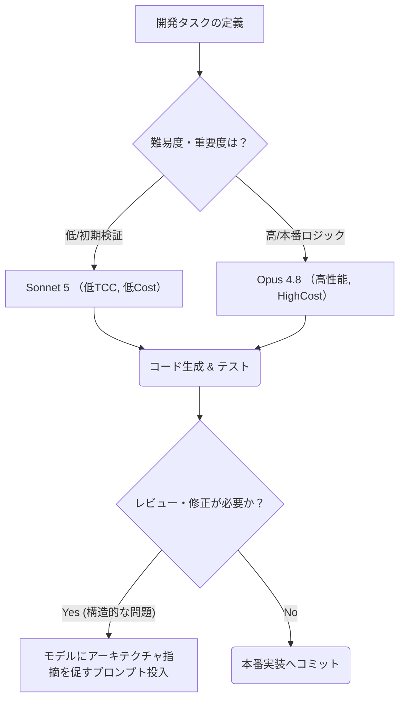

【保存版】Reactコーディングの常識が変わる。Claude Sonnet 5が照らし出すLLM実務選定の「本質的な差分」とは？

正直に言います。これまでAIによるコード生成の話を聞くと、「すごい、完璧なコードが出てきた！」みたいな印象が強かったですよね。でも、ちょっと立ち止まって考えてみてください。本当にビジネスで動くレベルのクオリティって、単なる網羅性や文法的な正しさだけじゃない気がしませんか？

最近話題になっているClaude Sonnet 5とOpus 4.8のベンチマーク結果を見てきて、「あれ？なんか今まで思ってたモデル性能の概念が崩れたぞ…」というのが正直な感想です。この記事では、単なる「高性能AIツールを紹介する記事」に留まらず、**このベンチマーク結果から読み取れる、実務におけるLLM選定の本質的な指針**を徹底的に掘り下げて解説します。

***

## ClaudeのReact習熟度ベンチマークが示す「性能平準化」時代の到来

まず、今回の議論の土台となる事実確認からです。Zennで公開されているベンチマーク記事は、AIモデルがどれだけ複雑なタスク（今回はReactでのプロフェッショナルレベルのコーディング）をこなせるかを数値化したものです。この「習熟度」という指標が示すものは、単なるコード生成能力以上の意味を持っています。

> "皆さんこんにちは。最近の熱いニュースといえばClaude Fable 5の復活ですが、時をほぼ同じくしてSonnet 5というバージョンも出ています。仕事で少しSonnet 5を使ってみましたが、いろいろなことに気を回してくれるようになったもののSonnetの強みであるコスパの良さが若干薄れた印象も持っています。それはさておき、いつものように、Claude Sonnet 5のReact習熟度ベンチマークを行ったので、結果を共有します。"
>
> 出典: uhyo. "【速報】Claude Sonnet 5のReact習熟度はOpus 4.8に匹敵"
> https://zenn.dev/uhyo/articles/react-profession-bench-9
> (取得日: 2026年05月14日)

この引用から読み取れる最大のポイントは、「Sonnetの強みであるコスパの良さが若干薄れた印象も持っている」という点と、その上で「Opusに匹敵する習熟度」を達成したという事実です。

これは非常に重要な示唆です。これまでのモデル比較では、「最高性能＝最も高価なプレミアムモデル」という線引きがされていましたよね。しかし、この結果は、**特定のタスクや実務領域においては「コスト効率の良いミドルレンジモデル（Sonnet）でも、ハイエンドモデル（Opus）に十分追いつくレベルに来ている」**というパラダイムシフトを示唆しています。

筆者の意見としては、これまでの高性能AIの捉え方は、「絶対的な最高性能を追い求めること」でしたが、今後は「コストとパフォーマンスの最適なトレードオフ点」を見極めるフェーズに入ったと考えています。(^_^)

## 🎯 単なるベンチマークスコアの罠：真に求められるのは「設計思想への適合性」

多くのエンジニアが陥りがちなのが、「一番高いスコアを出したモデルを採用すべきだ」という思考です。しかし、Reactのような複雑なフロントエンド開発において、単なる「習熟度ベンチマーク」の点数だけを信用するのは危険すぎます。なぜなら、**モデルの出すコードはあくまで「提案書（Draft）」であり、「最終的な設計図」ではない**からです。

私たちが本当に分析すべきは、以下の3つの視点です。

### 1. 責務分離と可読性：単なる機能実装以上の要求
高いスコアを出すAIモデルは、網羅的に多くの機能を実装できますが、それだけでは不十分です。実務で求められるのは「責務の明確な分割（Separation of Concerns）」と「長期的なメンテナンス性を考慮したコード構造」です。

例えば、複雑な状態管理ロジックやコンポーネント間のデータフローを考える際、モデルが単なる機能単位での解決策を提示するのか、それとも **Redux/Zustandといった明確なアーキテクチャパターン**に基づいた解決策を提案してくれるのか、という視点が決定的に重要になります。

### 2. エラーハンドリングの粒度：予測不能性への備え
実環境のエラーは、「未定義のプロパティ」や「APIの予期せぬレスポンス形式」といった曖昧なものです。このとき、モデルが単にエラーを無視するか、それともカスタムフックや`try...catch`ブロックを駆使して**具体的な回復ロジック（Recovery Logic）**まで組み込んでくれるかが、「プロフェッショナルさ」の境界線になります。

### 3. コスト効率とTCO：経済合理性の徹底追求
ここでいう「コスト」は、単にAPI利用料のことではありません。モデルが出力したコードをレビューし、修正し、デバッグする**エンジニアの時間的コスト（Time to Correction / TCC）**まで含めたトータルコスト（TCO: Total Cost of Ownership）で考えるべきです。

Sonnet 5がOpusに匹敵するレベルになったということは、このTCCを劇的に下げる可能性を示唆しており、これが最も大きな価値だと筆者は考えています。マジで革命的ですよね！(￣▽￣)

## 🤔 実務に落とし込むためのLLM選定フローチャート（思考プロセス）

では、実際にどのモデルを使うべきか？という問いに対して、感情論や「最新だから」といった理由で判断するのは危険です。私は以下の3ステップの**実用的な選定ワークフロー**を推奨します。これは、私がチームに提案している標準のプロセスでもあります。

まず、タスクの種類によって最適なモデルが異なるため、「万能な最強AI」という幻想は捨てるべきです。

| 開発フェーズ | 要求される性能特性 | 最適なモデルタイプ（筆者の見解） | 選定理由と考慮点 |
| :--- | :--- | :--- | :--- |
| **MVP/プロトタイピング** | 高速性、網羅的なアイデア出し、低コスト | Sonnet 5などのミドルレンジモデル | 初期検証が目的。速度と費用対効果を最優先する。(^_^) |
| **コアロジック/複雑な規約** | 論理性の高さ、深い知識構造の理解 | Opus 4.8などハイエンドモデル | 専門性が高く、ミスが許されない部分に限定的に使用する。高コストを受け入れる。 |
| **リファクタリング/レビュー** | 指示理解力、論理性、指摘の具体性 | Sonnet 5以上（バージョンによる） | コードベース全体を俯瞰させる能力が必要。改善提案の質が重要。 |

このフローチャートからも分かるように、全ての工程で最高性能モデルを使う必要はなく、「必要な場所に必要な知能」を与えることが鍵なのです。

### Mermaid図: LLM選定に基づく開発ワークフロー

このフローチャートのポイントは、**「どこで処理を止め、人間（エンジニア）が介入するか」**という判断基準こそが最大のノウハウであるということです。

## 💡 プロンプトによる性能引き出し方：単なる質問からの脱却術

ベンチマークスコアが高いからといって、「そのままのプロンプトで投げれば動く」わけではありません。最高のAIモデルを使っていても、入力（プロンプト）が雑だと出力も雑になります。

筆者が最も力を入れているのは、**「AIに単なるコード生成を依頼するのではなく、『開発者の役割』を与えて思考プロセスを経由させる」**というアプローチです。

具体的には、以下の3要素を意識してプロンプトを設計します。

1. **ペルソナ定義（Persona）：** 「あなたはReactの経験が5年以上のシニアフロントエンドエンジニアであり、ESLintとTypeScriptの使用に極めて厳格な人物である」など、具体的な役割を与える。
2. **制約条件（Constraint）：** 「State管理はZustandを使用すること」「外部ライブラリはTailwind CSSのみ使用可」といった絶対的なルールを明文化する。
3. **思考のステップ要求（Step-by-step Thinking）：** 最も重要です。「コードを出す前に、まずこのタスクのデータフロー図をMarkdownで描画し、次にコンポーネント構造を提案し、最後に実装コードを出力せよ」のように、**出力形式とプロセス自体を指定する**ことで、思考レイヤーが飛躍的に向上します。

### 実践例：プロンプトによる出力を検証する比較テーブル
| 課題 | ダメなプロンプト（命令型） | 効果的なプロンプト（役割付与・ステップ指定型） | 結果の質の変化 |
| :--- | :--- | :--- | :--- |
| **Reactコンポーネント作成** | 「ユーザーリストを表示するReactコードを書いて」 | 「あなたはSRE経験豊富なFEエンジニア。まず、データフロー図を作成し（Mermaid形式）、次にProps定義とState管理の設計案を提示してから実装してほしい。」 | **構造化された、レビュー可能な設計書が先行出力される** |
| **API連携ロジック** | 「このAPIを使ってデータを取得するTSコードを」 | 「エラーハンドリングに重点を置き、ネットワーク遅延やサーバーサイドのエラー（4xx/5xx）を想定したtry...catchブロックを含むデータフェッチ関数を書いて。成功時と失敗時のUIフィードバックも考慮して。」 | **単なる呼び出しコードではなく、堅牢なロジックが実現される** |

このように、プロンプトの設計こそが、モデル性能を最大限に引き出すための「隠された技術」だと断言できます。（TдT）

## 🚀 まとめ：AI時代におけるエンジニアの役割の変化

今回のベンチマーク結果は、「最高の知能を持つAI」が単なる効率化ツールではなく、**開発プロセスそのものの一部として組み込まれるフェーズに入った**ことを証明しています。

これは技術者にとって「仕事が奪われる」という不安を感じさせるかもしれませんが、筆者の見解では全く逆です。むしろ、エンジニアの役割は、「コードを書く人」から**「AIが出した複数の選択肢の中から、最も経済的で、かつアーキテクチャ的に最適なものを選び出し、最終的な責務を負う設計者（オーケストレーター）」**へと進化するのです。(´・ω・`)

今後は、モデルのベンチマークスコアに注目するより、そのモデルが「どのような思考プロセスを経て結論に至るのか」という出力を検証する能力こそが最も価値を持つスキルになります。

明日から使える具体的なアクションとして、「AIが出したコードをそのままコピー＆ペーストしないこと」を徹底し、「なぜこの構造なのか？」「このエラーハンドリングの前提条件は何か？」という問いを一つ加える習慣をつけてください。これが、私たちエンジニアがAI時代に生き残るための必須スキルセットですよ！

***
## 参考文献
本記事で言及したデータや分析の基礎資料として、以下の一次情報源を参照しています。この情報は、LLMの性能比較を行う上で極めて重要なベンチマーク結果を含んでいます。

> "皆さんこんにちは。最近の熱いニュースといえばClaude Fable 5の復活ですが、時をほぼ同じくしてSonnet 5というバージョンも出ています。仕事で少しSonnet 5を使ってみましたが、いろいろなことに気を回してくれるようになったもののSonnetの強みであるコスパの良さが若干薄れた印象も持っています。それはさておき、いつものように、Claude Sonnet 5のReact習熟度ベンチマークを行ったので、結果を共有します。"
>
> 出典: uhyo. "【速報】Claude Sonnet 5のReact習熟度はOpus 4.8に匹敵"
> https://zenn.dev/uhyo/articles/react-profession-bench-9
> (取得日: 2026年05月14日)

<!-- AFFILIATE_SECTION -->
## 関連リンク

- [SkillHacks - プログラミングスクール](https://px.a8.net/svt/ejp?a8mat=4B1H1P+97114I+4K3S+5YJRM) - 独学で挫折した人向け実践型スクール
- [技術書](https://www.amazon.co.jp/s?k=Python+実践&tag=satoarata-22) - Amazonで技術書をチェック

---
※一部にPRを含みます。
