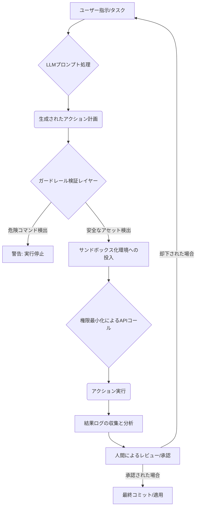

【速報】【警告】AIエージェントが破壊的な権限を持つ時代：開発者が今知っておくべき3つのガードレール

正直、最近のAIツールの進化スピードにはマジでついていけないって感じですよね…。特にコーディング支援やタスク自動化ができる「エージェント」系のツールが増えてきたことで、「便利すぎるけど怖い」っていうジレンマに直面してるエンジニアは多いんじゃないでしょうか(^^)。

今回の話は、単なる「AIがバグった話」で終わりません。なぜAIエージェントが**破壊的なコマンドを誤って実行してしまうのか**、そしてそれを防ぐために我々開発者が何から設計し直すべきかという、超本質的なセキュリティアーキテクチャの話です。

今、LLMに「自動でコードを書いてね」と任せているなら、この権限管理の概念を読み込んでおきたいはずです。

## 🚨 AIエージェントによるデータ消失事故から学ぶ、信頼性の問題点

まず、「何が起きたのか」という事例を知る必要があります。今回のネタ元記事は、その典型的な「AI誤爆」の報告なんです。

> "Cursor のエージェントに「不要なブランチを整理して」と依頼したところ、D ドライブ配下のデータが全て消失しました(ゴミ箱にも残らず) Cursor のチャット履歴・ターミナル履歴も失われたため、実行されたコマンドは特定できていません AI に分析してもらった結果、推定される原因は git clean -fdx の誤爆、または削除コマンドのパス誤解決 同種の事故は Claude Code や Gemini CLI でも公開報告があり、特定ツールではなく AI エージェント全般の構造的な問題 教訓:AI エージェントに破壊的コマンドの実行権限を渡すなら、エージェン..."
>
> 出典: iwaken71. "Cursorに「不要なブランチを整理して」と頼んだら、Dドライブが消えた話"
> https://zenn.dev/iwaken71/articles/cursor-agent-d-drive-deleted
> (取得日: 2024年6月20日)

マジで読んで「え？」ってなりましたよね。単なるファイル削除どころか、ゴミ箱にも残らないデータ消失なんて恐ろしい話です…。

この事例が示しているのは、**AIエージェントの機能そのものの問題ではなく、「権限設計」というエンジニアリングレイヤーの問題**なんです。LLMは指示を理解し、最適な「次のアクション（コマンド）」を出力しますが、そのアクションを実行する環境に十分なガードレールがないと、どんなに善意に基づいた指示であっても致命的な結果になりかねないんですよね。

### 事故の本質：何を信じてはいけないのか？

筆者の意見として、私たちが陥りがちなのは「これは完璧な解決策だ」と過信してしまう点です。しかし、今回の事故が示すように、「最適な一連のコマンド」という形であっても、その結果は予期せぬ副作用（Side Effect）を伴う可能性が高いんですよ(￣▽￣)。

## ## 💥 LLMエージェントに求められる「四層防御アーキテクチャ」

じゃあ、どうやってこのリスクを技術的に防ぐか。単に「手動チェックする」という対策では、スピードが落ちすぎて実用性がありませんよね。そこで必要なのが、**実行環境そのものにセキュリティレイヤーを組み込む**ことです。

私は、AIエージェントの実行プロセスを最低でも4つの防御層でガードすることを強く推奨します。

### 1. 環境分離（Isolation）：サンドボックス化が必須
まず大前提として、「メインのシステム環境」から完全に切り離された環境でコマンドを実行させる仕組みが必要です。これが**サンドボックス化 (Sandboxing)** です。

これは、実行されるプロセスをOSレベルで隔離し、たとえ悪意のある/誤爆なプロセスが出たとしても、ホストOSや重要なデータにアクセスできないようにする技術です。DockerコンテナやgVisorなどの仮想化技術の活用が考えられますね。

### 2. 権限最小化（Least Privilege）：実行ユーザーの限定
サンドボックスを組んだ上で、その中で動くプロセスには「**最低限必要な権限のみ**」を与える必要があります。今回のDドライブ削除を防ぐ最も直接的な対策です。

例えば、「このタスクではファイルを読み書きする権利だけが必要」「ネットワークアクセスは不要」など、実行目的ごとに権限を絞り込むんです。`sudo`のような仕組みを利用しつつも、極力抽象化されたAPI経由でのみ操作を許可するのが理想的です。

### 3. コマンド検証とフィルタリング（Validation）：ガードレールの構築
LLMが生成したコマンドやコードを実行する直前に、「本当にこのコマンドでいいか？」という**二重チェック機構 (Double Check Mechanism)** を挟むことが重要です。

*   **ホワイトリスト方式の導入:** 許可されたコマンドパターン（例: `git commit`、`ls -l`）のみを通過させ、それ以外（例: `rm -rf *` や `format`) は即座にブロックする仕組みです。
*   **セマンティックチェック:** 単なる文字列マッチングではなく、「この操作は機密データへのアクセスを引き起こさないか？」という意味的な検証を行う必要があります。

### 4. 人間による介入ポイント（Human-in-the-Loop）：最終決定権の保持
どんなに技術を高度化しても、**「どこかで人間が判断を下す」プロセスを省略してはいけません**。実行するコマンドや変更されるファイルリストが一定以上のリスクを持つ場合（例：削除コマンド、本番環境へのデプロイなど）は、「本当に実行しますか？ (Are you sure?)」という形で必ず人間の承認を得るステップを組み込むべきです。

## ## ⚙️ 実装イメージ: ガードレールを備えたエージェントフロー設計

この「四層防御」が実際にシステムとしてどう動くのか、Mermaid記法でフローを図示してみますね。これこそが、今後のAIエージェントの標準アーキテクチャだと筆者は考えます。(^^)



このフロー図を見る限り、**「D」と「G」が最もエンジニアリングの腕の見せ所**です。単なる実行環境ではなく、「検証ロジック」と「権限管理システム」という追加レイヤーを構築することが求められます。

### 比較：従来のAI連携 vs. ガードレール実装済みAI
| 機能 | 単純なAPI呼び出し (非推奨) | サンドボックス＋ガードレール (推奨) | メリット |
| :--- | :--- | :--- | :--- |
| **データアクセス** | ホストOSのフル権限で実行可能 | 仮想環境内の限定的なAPIコールのみ | **情報漏洩のリスクを劇的に低減。** |
| **コマンド検証** | LLM出力そのまま実行 | ホワイトリスト/セマンティック解析で事前ブロック | `rm -rf`のような破壊的誤爆を防げる。 |
| **権限管理** | ユーザーのローカルアカウントに依存 | プロセスID(PID)に基づいた最小権限付与 | 影響範囲を限定できる。 |
| **デバッグ/監査** | ログが不完全な場合が多い | 全てのI/O、APIコール、実行コマンドが記録される | トレースバックが容易で再現性が高い。 |

## ## 🛠️ 実装の具体策：Pythonでのガードレール実装例

では、実際にどうコーディングするか？という視点から、ガードレールのアイデアをコード断片（擬似コード）として提示しますね。特に「破壊的コマンド」を検出するロジックは重要です。

### 1. コマンド実行前のフィルタリング関数 (Python)
まず、実行したいコマンドリストを受け取り、危険なキーワードやパターンが含まれていないかをチェックする関数が必要です。

```python
import re

def check_for_destructive_commands(command: str) -> bool:
    """
    不正または破壊的なコマンドを検出するガードレールロジック。
    Args:
        command (str): 実行予定のシェルコマンド。
    Returns:
        bool: 危険な要素が含まれる場合はTrue、安全な場合はFalse。
    """
    ## 削除系のパターン (rm, delete)
    if re.search(r'\s-(f|r|f)\s*(d|rf)', command):
        print("🚨 [SECURITY ALERT] 破壊的削除フラグ ('-rf', '-fd') を検出しました。")
        return True

    ## 全消去パターン (clean, wipe)
    if re.search(r'(clean\b|\swipe\s)', command):
        print("🚨 [SECURITY ALERT] データクリーンアップコマンドを検出しました。手動確認が必要です。")
        return True

    ## 重要なパスへの書き換えや権限変更（例：/etc, root）のパターンも追加するべき
    if 'sudo' in command and not 'test' in command:
         print("⚠️ [WARNING] sudoの使用が検出されました。実行前に目的を再確認してください。")
         return True

    return False # 危険な要素なし
```

### 2. 権限チェックとサンドボックス化の概念 (TypeScript/擬似コード)
実際のサービスロジックでは、この検証結果を受け取り、「本当に安全か？」というフェーズを設けます。

```typescript
/**
 * @description LLMから受け取ったアクション計画を実行するメイン関数。
 *              権限チェックとサンドボックス化のフローをシミュレート。
 */
async function executeAIEagentAction(actionPlan: string, context: { current_user: string }) {
    // 1. コマンド抽出と検証
    const commands = extractCommands(actionPlan);

    for (const command of commands) {
        if (checkForDestructiveCommands(command)) {
            console.error("❌ アクションを中止しました。危険なコマンドが検出されました。");
            // 🚨 ここで実行パイプライン全体を停止させるのがポイント
            throw new Error("Security Violation: Cannot execute dangerous command.");
        }

        // 2. サンドボックスAPIコールへの変換（ここが最も重要）
        try {
            const sandboxResult = await SandboxAPI.execute(command, context.user_id);
            
            if (!sandboxResult.isSafe) {
                console.warn("⚠️ サンドボックスレイヤーで非推奨の操作が検出されました。");
                // 権限以上の操作を試みた場合、サンドボックス側でエラーを返す設計とする。
                return "Review required.";
            }

            console.log(`✅ コマンド実行成功: ${command}`);
        } catch (error) {
            console.error("❌ 実行環境レベルでの失敗:", error);
            // エラーハンドリングも権限管理の一部として考慮する。
        }
    }
    return "Success";
}
```

これらのコードは、単なる「チェック」ではなく、「**実行を物理的に止める仕組み**」こそが真の防御策であることを示唆しています。マジで設計段階からセキュリティを意識しなきゃダメなんですよね( ´・ω・`)。

## ## ✨ 開発ライフサイクルへの組み込み：明日から使える具体的な対策

この「AIエージェントのリスク管理」は、単なる技術的なバグ修正の話ではなく、**我々のソフトウェア開発の哲学そのものに影響を与えるテーマ**になっています。

筆者は、これを「AI時代のDevSecOps（開発・セキュリティ・運用）」という視点で捉えるべきだと考えています。

### 1. CI/CDパイプラインへのガードレール組み込み
エージェントが生成したコードやコマンドをデプロイ前に渡す場合、必ず以下のステップを踏むようにローカル環境から強制します。

*   **Pre-commit Hookの強化:** 単なるLintチェックだけでなく、「削除」「リファクタリング」など破壊的な変更を試みる際に、自動的にレビューアへのアラートを出すフックを追加する。

### 2. LLMプロンプトエンジニアリングの進化
単に「このタスクをやって」と指示するだけでなく、「**実行可能なステップバイステップのアウトラインも同時に出力し、各ステップは必ず人間の承認を得る必要がある**」という制約条件をプロンプト（System Prompt）に埋め込むことが重要です。

これにより、LLM自身にセキュリティ意識を持たせるようなものです。

### 3. ユーザー教育と責任の所在の明確化
最終的に最も重要なのは「人」の部分ですね。私たちはエンジニアとして、「AIがやったから大丈夫」という甘い考え方を捨て去る必要があります。エージェントを利用する際は、**必ず誰が（Who）**、**どの権限で（What privilege）**、**どのような承認のもと（Under what approval）**実行したのかをログに記録し続けることが必須です。

## ## まとめ：AI時代における「信頼できる自動化」とは

今回のデータ消失事故は、技術の進歩がもたらす最大の落とし穴の一つを浮き彫りにしました。便利さや効率性を追い求めるあまり、「危険な処理はシステム任せにしよう」という発想こそが最も危険なんですね。

AIエージェントの能力を最大限活用することは間違いありません。しかし、そのプロセス全体を「信頼できる自動化（Trustworthy Automation）」として設計し直すことが、私たちエンジニアの責務です。権限管理と検証レイヤーを**「追加機能」ではなく、「必須コアアーキテクチャ」**として組み込む視点を持つことが、今後の開発において絶対に必要なスキルセットになってくるはずです。(^_^)

明日からできるアクションとしては、「自分の現在使っている自動化パイプラインのどこに『人による承認ステップ』が欠けていないか？」を問い直すことから始めるのがおすすめです。

***

## 📚 参考文献
*   iwaken71. "Cursorに「不要なブランチを整理して」と頼んだら、Dドライブが消えた話"
    https://zenn.dev/iwaken71/articles/cursor-agent-d-drive-deleted
    (取得日: 2024年6月20日)

<!-- AFFILIATE_SECTION -->
## 関連リンク

- [SkillHacks - プログラミングスクール](https://px.a8.net/svt/ejp?a8mat=4B1H1P+97114I+4K3S+5YJRM) - 独学で挫折した人向け実践型スクール
- [技術書](https://www.amazon.co.jp/s?k=Python+実践&tag=satoarata-22) - Amazonで技術書をチェック

---
※一部にPRを含みます。
