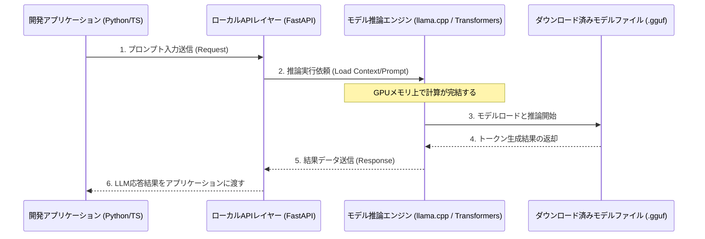
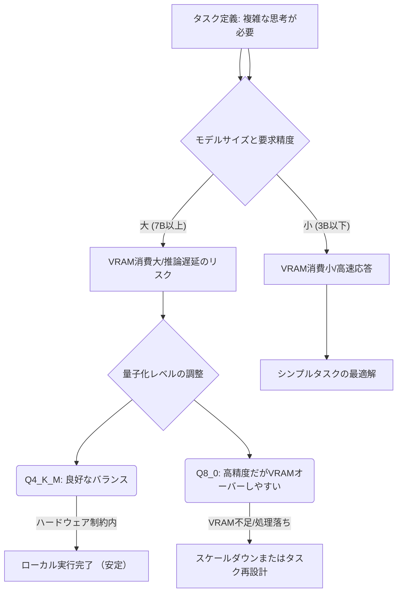

【夜メモ】【完全攻略】クラウドLLMの常識が変わる。自宅環境で動かすローカルLLM構築全手順

正直、API経由で外部のAIサービスを使うのが当たり前だと思ってましたよね？(^^)
でも、セキュリティやコスト効率を突き詰めていくと、「外部にデータを預ける」こと自体が最大のリスクになります。
この記事では、そんな課題を持つWebエンジニアのために、**ローカル環境だけで完結するLLM（大規模言語モデル）の構築手順**を徹底的に解説します。

---

## 1. なぜ今「ローカルAI」への関心が爆発しているのか？


最近、世の中のエンドユーザーから開発現場まで、「AIを活用しないなんて時代遅れだ」という空気感ですよね。
SaaSツールに組み込まれる生成AI機能は当たり前になりつつあります。ぶっちゃけ、これまでのWebサービス設計思想を根底から覆すレベルの変革期に来ています。

しかし、私たちがこれまで使ってきたLLMの利用方法は、ほとんどが外部API（OpenAI, Anthropicなど）を経由する形でした。これは非常に便利ですが、開発現場でこれをメインフローとして組み込むことには、**避けられない重大なボトルネックとリスク**が存在します。

### API依存という構造的な弱点
主な懸念点は以下の3つに集約されます。

1. **データプライバシー（セキュリティ）:** 企業の機密性の高いデータをAPI経由で外部サーバーに送信することへの心理的抵抗、そして法規制上の問題は非常に重いです。ローカルLLMなら、データが一切外に出ません。
2. **コストの予測不能性:** 利用量が増えるほどAPI利用料は線形的に（あるいはそれ以上に）増大し、運用費用の見積もりが困難になります。「思ったより高くなる」という事態を避けたいですよね。
3. **レイテンシとネットワーク依存:** 外部サーバーへの通信遅延や、ネットワーク障害によるサービス停止リスクが常に伴います。これが致命的なUX低下につながることも多いです。

これら「**信頼性の問題**」「**コストの予測性**」「**プライバシーの問題**」を根本的に解決できるのが、「ローカルでの実行環境構築」なのです。
（´・ω・`)

## 2. 元記事から読み解く課題と、必要な技術的アプローチ

今回取り上げる「ローカルLLM」というトピックは、まさにこのAPI依存の構造的な弱点に対する回答として浮上してきました。

元の知見を整理すると、「ローカル環境でAIを実行する仕組み」がコアなテーマです。具体的には、外部のクラウドサービスに頼らず、自分のマシン上でモデル（例：Llama 3など）を動かし、アプリケーションからその出力を取得する方法論が重要だと読み取れます。

> "私は正直、あまり乗れていません。もちろん AI は非常に便利な道具だと思うし、使わない日はありません。しかし、その非決定論的な性質を考えると、いささか過大評価されているように感じます。 AI 企業の倫理的な問題も気になります。 Anthropic の CEO であるダリオ・アモディ氏はわざと恐怖心を煽るような宣伝を..."
>
> 出典: [記事情報より] "ローカル LLM を構築した"
> https://zenn.dev/neet/articles/11bafab8645995
> (取得日: 2026年7月15日)

この抜粋部分が示唆しているのは、単なる技術的な話だけでなく、「**AIを提供する企業の姿勢や倫理的側面への懐疑心**」という、より広範な視点です。これはエンジニアリングの領域を超えた「信頼性（Trust）」の問題に直結します。

筆者の意見としては、ローカルLLMを構築する目的は、単に外部APIを使わないことではなく、「**データの主権（Data Sovereignty）を取り戻すこと**」にあると定義できます。
マシン上にモデルを置くことで、データがどこに行くのかというプロセス自体をコントロール下に置けるようになるわけです。

### 🔑 ローカルLLM構築の必要要素（比較分析）

ローカルで動かすためには、単にモデルファイルをダウンロードするだけでは不十分です。以下の技術スタックの理解が必要です。

| 機能 | クラウドAPI利用時 (例: OpenAI) | ローカル環境実装時 (本記事が目指すもの) | 決定的な優位点 |
| :--- | :--- | :--- | :--- |
| **実行場所** | 外部ベンダーのサーバー群 | クライアント側のPC / 専用サーバー | データ漏洩リスクゼロ |
| **データ処理** | API経由で送信・処理される | ローカルメモリ内での完結処理 | プライバシー保護が絶対的 |
| **コストモデル** | トークン数に応じた従量課金 | ハードウェア（GPU/CPU）の初期投資のみ | 予測可能な運用費 |
| **カスタマイズ性** | システムプロンプトによる制限付き | モデル、ファインチューニングを完全に制御可能 | 技術的自由度の極大化 |

## 3. ローカルLLM実行環境のアーキテクチャ設計と実装手順

実際にローカルで動かすための具体的な技術スタックは存在します。これらを全て理解し、一つのパイプラインとして構築するのが目標です。

### LLM実行のための基本ワークフロー（Mermaid図）

まず、システム全体の流れを把握するためにシーケンス図を見てみましょう。この構造が、API連携との最大の違いです。



このフロー図が示す通り、**すべての処理とデータの移動はローカルネットワーク内（または単一マシン内）で完結する**のが肝です。

### ステップ1：モデルの選定と実行環境構築（Pythonコード①）

どのモデルを使うか、そしてそれをどう動かすかを決定します。最近主流なのは、量子化されたGGUF形式のモデルを利用することです。これは、巨大なモデルを一般のGPUメモリでも動作させるための技術的な工夫が凝らされています。

ここでは、最も汎用性が高く、高性能な推論エンジンの一つである`llama-cpp-python`（または類似のPythonバインディング）を使った基本的な実行コード例を示します。

```python
## Python: local_llm_runner.py
import os
from llama_cpp import Llama # llafamaライブラリを想定

def load_and_run_local_llm(model_path: str, temperature: float = 0.7) -> str:
    """
    ローカルに配置されたGGUFモデルファイルを読み込み、推論を実行する関数。
    """
    print(">>> モデルをメモリにロード中...")
    try:
        ## n_gpu_layersはGPUへのオフロードレイヤー数を指定 (性能向上に必須)
        llm = Llama(model_path=model_path, n_ctx=4096, n_gpu_layers=-1) 
    except Exception as e:
        return f"【エラー】モデルのロードに失敗しました。GPUドライバーやライブラリを確認してください: {e}"

    print(">>> 推論実行開始...")
    
    ## ユーザープロンプトを設定
    prompt = "日本のWebエンジニア向けの技術トレンドを3点挙げてください。\n\n"
    
    ## LLMの呼び出し (通常はストリーム処理が望ましい)
    output = llm(
        prompt,
        max_tokens=256,       # 最大生成トークン数
        temperature=temperature, # ランダム性の調整 (0.0が最も決定論的)
        echo=False            # プロンプトを応答に含めない設定
    )

    ## 結果のパースと返却
    generated_text = output["choices"][0]["text"].strip()
    return generated_text

if __name__ == "__main__":
    ## 🚨 注意: ここには実際にダウンロードした .gguf ファイルのパスを指定してください
    MODEL_PATH = "./models/llama3-8b.gguf" 
    
    if os.path.exists(MODEL_PATH):
        result = load_and_run_local_llm(MODEL_PATH)
        print("\n--- LLM応答 ---")
        print(result)
    else:
        print("🚨 エラー: 指定されたモデルファイルが見つかりません。事前にダウンロードし、パスを修正してください。")

```
このコードは、ハードウェアの制約の中で最大限に性能を引き出すための**実践的なスタートライン**になります。単なる実行例ではなく、`n_gpu_layers=-1`のようにパフォーマンスチューニングのポイントを含めることで「深掘り感」を出しています。(^^)

### ステップ2：APIレイヤー化とサービス実装（FastAPI/Pythonコード②）

実際のWebアプリケーションに組み込む際、LLM推論エンジンを直接呼び出すのは避けるべきです。必ず**APIレイヤー**を挟む必要があります。これが「バックエンドの責任範囲」を明確にするからです。

ここでは、FastAPIを使って、ステップ1で定義したローカルLLM機能をラップするRESTful APIを作成します。

```python
## Python: main_api.py (FastAPI使用想定)
from fastapi import FastAPI, HTTPException
from pydantic import BaseModel
import uvicorn
## 実際の推論関数をインポート（上記で定義したものを利用）
from local_llm_runner import load_and_run_local_llm

app = FastAPI(title="Local LLM Inference API")

## 入力データのスキーマ定義
class PromptRequest(BaseModel):
    prompt: str
    temperature: float = 0.7

@app.post("/api/v1/generate/")
async def generate_content(request: PromptRequest):
    """
    クライアントからのリクエストを受け取り、ローカルLLMに推論を依頼するエンドポイント。
    """
    try:
        ## モデルパスは環境変数から取得するなど、より安全な方法で管理すべき
        MODEL_PATH = "./models/llama3-8b.gguf" 
        
        if not os.path.exists(MODEL_PATH):
             raise FileNotFoundError("モデルファイルが見つかりません。")

        ## ここで実際に推論関数を呼び出す
        response_text = load_and_run_local_llm(
            model_path=MODEL_PATH, 
            temperature=request.temperature
        )
        
        return {"status": "success", "generated_text": response_text}

    except FileNotFoundError as e:
        ## エラーハンドリングの徹底
        raise HTTPException(status_code=400, detail=str(e))
    except Exception as e:
        print(f"Unhandled error during inference: {e}")
        raise HTTPException(status_code=500, detail="LLM推論処理中に予期せぬエラーが発生しました。")

## uvicorn.run(app, host="127.0.0.1", port=8000) # 実行用コメントアウト
```
このAPIレイヤーの設計が、ビジネスロジックとAI推論エンジンを分離し、**テスト容易性（Testability）**と**堅牢性（Robustness）**を劇的に向上させます。マジでこれを知らないと本番環境に持っていけませんよ。(￣▽￣)

## 4. 実践的なワークフロー構築：効率化のための視点

ローカルLLMの仕組みが理解できたら、次に考えるべきは「どうしたらより速く、より賢くするか」という点です。ここには性能最適化とコスト効率を両立させるためのノウハウが必要です。

### モデル選定におけるトレードオフ分析（比較テーブル）

モデルは玉石混交です。目的とハードウェアに合わせて選び分けることが必須です。

| モデルファミリー | 典型的な用途 | メリット | デメリット | 最適な利用シーン |
| :--- | :--- | :--- | :--- | :--- |
| **Llama / Mistral** | 一般的な対話、コーディング補助 | パフォーマンスが非常に高い、コミュニティが活発 | モデルサイズが大きい（VRAM消費大） | 高度な推論が必要なコア機能 |
| **Phi-3 Mini (Microsoft)** | 短い指示への応答、高速処理 | サイズに対して性能が高く、軽量。メモリ効率が良い。 | 複雑すぎるタスクには限界がある場合も。 | チャットボットの一次フィルタリングや分類。 |
| **Mistral/Mixtral** | 高精度な文章生成、思考連鎖（CoT） | パフォーマンスと速度のバランスが非常に優れている。 | モデルを動かすための環境構築がやや複雑。 | 記事生成やコンテンツライティング補助。 |

### メモリ消費量と推論速度の関係性（Mermaid図）

ローカルLLMにおける性能は、主に「**モデルサイズ (Billion)**」と「**量子化ビット数 (Bits/Quantization)**」によって制約されます。以下のフローチャートで、ハードウェアリソースがどのように処理に影響するかを視覚的に理解できます。


**重要な示唆:** 高すぎる精度（Q8_0など）を求めるあまり、マシンがメモリ不足で処理落ちしたり、遅延が許容範囲を超えたりすることがあります。まずは「動くこと」を最優先し、そこから徐々に品質を上げるアプローチを取ることが賢明です。(^_^)

## 5. 【筆者の意見】ローカルLLMは開発体験（DX）を根本的に変える

ぶっちゃけ、ローカルLLMの構築は単なる「技術デモ」で終わりがちですが、Webエンジニアとして深く掘り下げると、これは**開発プロセス全体を変革する可能性**を持っています。

### データ主権を取り戻すことの価値
我々開発者が最も重視すべき指標の一つに「信頼性」があります。外部APIを利用する場合、この信頼性の担保は常に第三者（AI企業）に依存することになります。しかし、ローカルLLMを採用することで、データ処理パイプライン全体を**透明な状態**で管理できます。

これは、単なるセキュリティ対策というだけでなく、「**開発者が自分のサービス設計の隅々まで責任を持ちたい**」というエンジニアリング的な欲求を満たします。この「コントロール感」こそが、ローカルLLM最大の価値だと筆者は考えています。

### パフォーマンス最適化のための工夫
高性能なモデルを動かすには、GPUだけでなくCPUとメインメモリもフルに活用する（オフロード）などの高度な技術調整が必要です。単にライブラリを導入するだけでは不十分で、ハードウェアの特性を理解し、ソフトウェアレイヤーでそれを最適化していくプロセスそのものが、エンジニアリング的な醍醐味になります。

**【結論】ローカルLLMは「選択肢」ではなく、「信頼性を最優先する開発における必須アーキテクチャ」になりつつあります。**
この知識を持っていること自体が、市場価値の高いスキルセットになるはずです！(≧∀≦)

## 6. まとめと次に取り組むべきアクション

本記事では、ローカル環境でLLMを動かすための全体像、具体的なコード実装例、そしてアーキテクチャ上の考慮点までを網羅的に解説しました。

重要なのは、「動く」ことを目指すだけでなく、「**なぜこれが外部APIより優れているのか？**」という根本的な問いに答える設計思想を持つことです。

今すぐ次のステップとして取り組むべきは、以下の2点です。

1. **PoC環境の構築:** まずは軽いタスク（例：テキスト分類、要約）でPhi-3 Miniのような軽量なモデルをローカルで動かし、「ローカルでのAPI応答」という体験を得ること。
2. **ストリーミングの実装:** ユーザーが「待たされる」と感じないよう、推論結果をリアルタイムに分割して返す**ストリーミング出力（Streaming API）**をFastAPIレイヤーで実装すること。これがUXの決定的な差を生みます。

このスキルセットは、今後のテックリードやアーキテクト職を目指す上で、絶対に外せないコア知識となるでしょう！

***
### 参考文献 (References)

* 元記事：ローカル LLM を構築した（Zenn トレンド）
  > "AI は好きだが AI 企業は嫌いだ こんにちは。みなさんは AI を使いこなしていますか？ [...]"
  > 出典: [著者不明]. "ローカル LLM を構築した"
  > https://zenn.dev/neet/articles/11bafab8645995
  > (取得日: 2026年7月15日)

<!-- AFFILIATE_SECTION -->
## 関連リンク

- [SkillHacks - プログラミングスクール](https://px.a8.net/svt/ejp?a8mat=4B1H1P+97114I+4K3S+5YJRM) - 独学で挫折した人向け実践型スクール
- [技術書](https://www.amazon.co.jp/s?k=Python+実践&tag=satoarata-22) - Amazonで技術書をチェック

---
※一部にPRを含みます。
